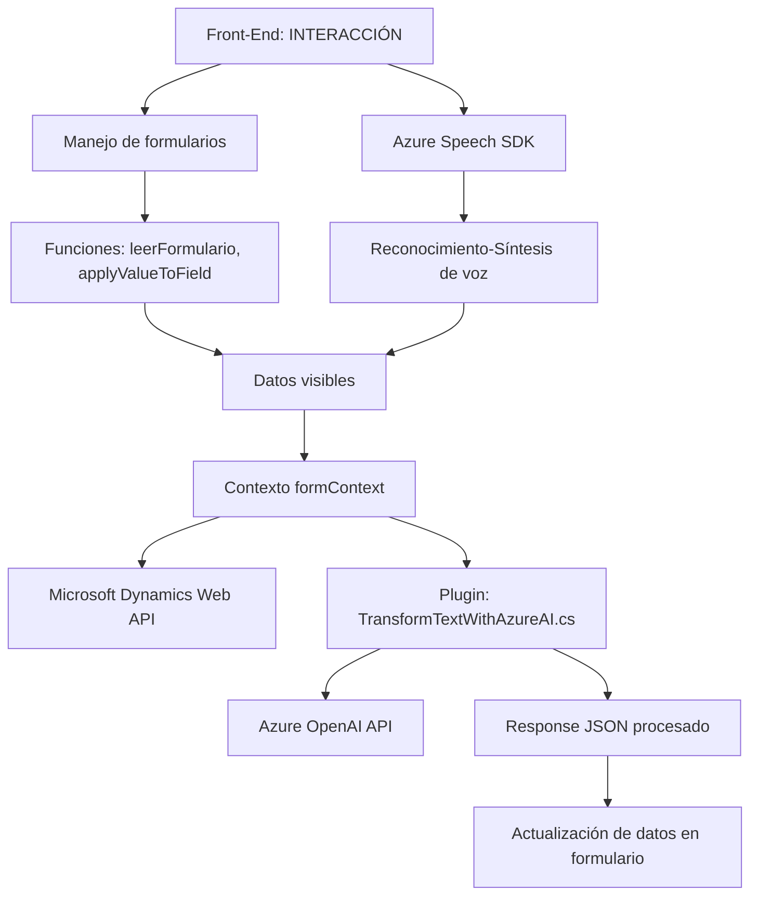

### Breve resumen técnico
El repositorio implementa una solución basada en interacción por voz utilizando reconocimiento y síntesis de voz con Azure Speech SDK, integración con Dynamics CRM para formularios, y procesamiento de texto avanzado mediante la API de Azure OpenAI. Cada componente está especializado en tareas específicas: interacción con usuarios (front-end), lógica de reconocimiento y síntesis (scripting/modular JavaScript), y procesamiento de texto mediante un Dynamics Plugin.

---

### Descripción de arquitectura
La arquitectura principal del repositorio es **n-capas**, compuesta por un **frontend basado en interacción por voz (Azure Speech SDK)**, una capa lógica para procesamiento de datos (JavaScript), y un plugin orientado al backend donde se integran funcionalidades con Dynamics CRM y la API de Azure OpenAI. 

En cuanto a patrones:
- **Responsabilidad única** (SRP): Cada función y clase está claramente definida para ejecutar una tarea específica, separando responsabilidades entre síntesis, reconocimiento, y análisis de texto.
- **Integración externa**: Uso de servicios y SDKs, como Azure Speech, Dynamics CRM Web API, y Azure OpenAI API, ejemplificando patrones como **API Gateway** y **cliente HTTP**.
- **Modularidad y reutilización**: Existe reutilización a través de métodos utilitarios para procesamiento de campos y datos.

---

### Tecnologías usadas
1. **Front-End**:
   - Lenguaje: JavaScript (ES6+).
   - Framework SDK: Azure Speech SDK.

2. **Back-End**:
   - Lenguaje: C# (.NET).
   - Dynamics CRM plugin (implementación con `IPlugin`, Microsoft Dynamics SDK).

3. **Servicios Externos**:
   - Azure Speech (para síntesis y reconocimiento).
   - Azure OpenAI API (GPT para transformar texto en JSON).

4. **Librerías**:
   - `Newtonsoft.Json`, `System.Net.Http`, y `System.Text.Json` en C#.
   - Carga dinámica de Azure Speech SDK en JavaScript.

---

### Diagrama Mermaid válido para GitHub

---

### Conclusión final
El repositorio describe una solución integrada para interacción por voz, manejo de datos de formularios, y análisis avanzado de texto. La arquitectura está optimizada para modularidad, con separación de tareas esenciales entre frontend, scripting lógico, y procesamiento backend. El uso de SDKs externos como Azure Speech y OpenAI, junto con Dynamics CRM, potencia la solución, facilitando la lógica asincrónica y la interacción fluida con servicios en la nube. 