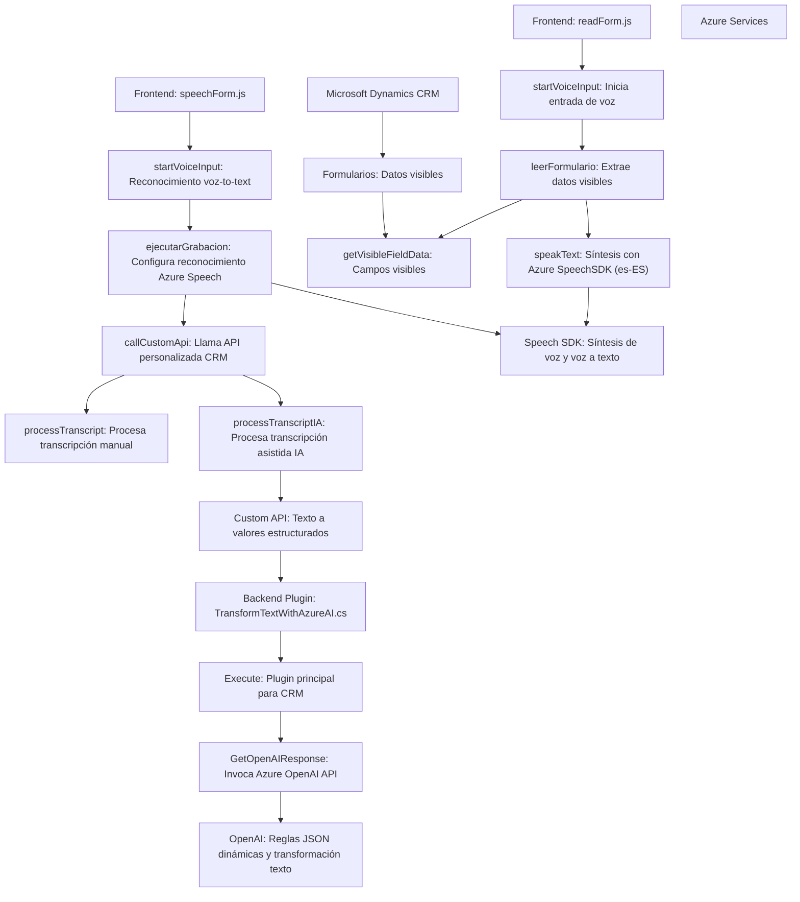

### Breve resumen técnico:
El repositorio contiene varios archivos con funcionalidades específicas que integran diferentes tecnologías: entrada y síntesis de voz, transcripción, procesamiento de texto y transformación de datos. Los archivos están organizados principalmente en torno a la integración entre Dynamics 365 y servicios en la nube de Azure (Azure Speech SDK y Azure OpenAI).

---

### Descripción de la arquitectura:
La solución sigue una **arquitectura de n capas** en combinación con patrones de integración de servicios externos (Azure Speech SDK y Azure OpenAI). Los archivos en el repositorio tienen diferentes propósitos:

#### 1. **Frontend/JS:**
- Funcionalidades relacionadas con la entrada de voz, lectura de formularios y su transformación/síntesis mediante Azure Speech SDK.
- Modularización por función.
- Uso del DOM para manipular elementos visibles del formulario de Dynamics 365.
- Dependencia dinámica de SDKs donde el código carga y utiliza en tiempo de ejecución el servicio de reconocimiento/síntesis de voz de Azure.

#### 2. **Plugins/TransformTextWithAzureAI.cs:**
- Backend para Dynamics CRM implementado como un plugin que ejecuta operaciones específicas mediante la API de Dynamics.
- Integración de Dynamics CRM con el servicio de transformación de texto mediante **Azure OpenAI API** utilizando HTTP REST.
- Uso de DTOs y patrones de diseño como `Adapter` y `Encapsulación modular`.

En conjunto, esta solución se basa en un modelo **cliente-servidor (web)** con capas que separan la lógica frontend (JS) y backend (C#). Las tecnologías y servicios se organizan en módulos autónomos que interactúan mediante APIs y SDKs, siendo un ejemplo de aplicación en n capas que utiliza servicios distribuidos en la nube.

---

### Tecnologías y frameworks utilizados:
1. **Frontend:**
   - HTML, JS.
   - **Azure Speech SDK**: Para reconocimiento y síntesis de voz (soporte en navegador).
   - Dynamics CRM SDK (interacción con el sistema de formularios de Dynamics).
   - DOM API (manipulación del frontend).

2. **Backend:**
   - **Microsoft Dynamics CRM Plugin SDK**.
   - **Azure OpenAI Service** mediante RESTful API para transformación y generación de texto JSON.
   - `System.Net.Http`, `System.Text.Json`, `Newtonsoft.Json.Linq` para manejo de HTTP y JSON en C#.

3. **Patrones de diseño:**
   - **Adapter**: Para integrar los formularios y SDKs externos (Azure Speech y OpenAI).
   - **Encapsulación Modular**: Organización del código en funciones separadas por responsabilidades.
   - **Dependencia Dinámica**: Uso de la carga dinámica de SDKs en el navegador.
   - **N Capas**: Separación de lógica cliente y servidor.

---

### Diagrama Mermaid:

---

### Conclusión Final:
La solución parece ser un ecosistema dinámico enfocado en la interacción entre usuarios y formularios en Dynamics CRM, potenciando la entrada de voz y transformación de texto mediante tecnologías avanzadas como **Azure Speech SDK** y **Azure OpenAI**. Tiene una arquitectura de **n capas**, con una clara separación entre las responsabilidades del frontend y backend, y se encuentra bien estructurada con respecto a encapsulación y modularidad. Es una solución centrada en integrar servicios en la nube, mejorando la experiencia de usuario en sistemas CRM mediante IA.