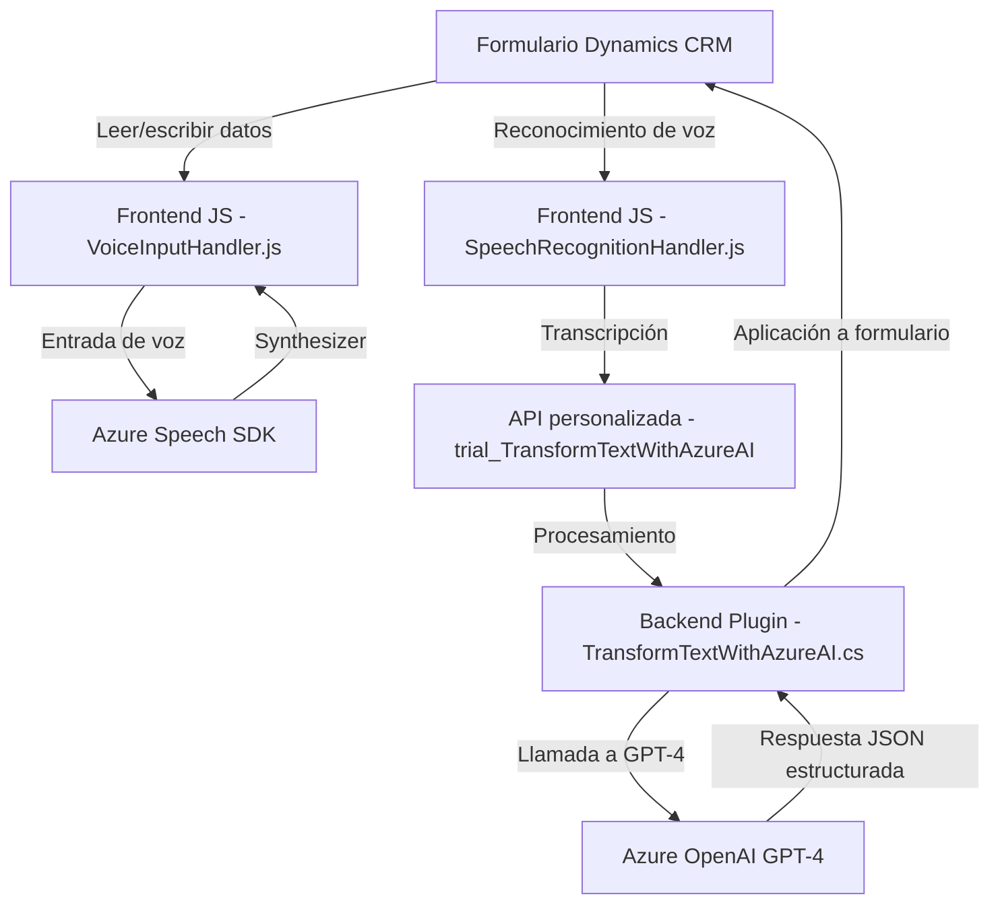

### Breve resumen técnico:
El repositorio presenta una solución que integra **Azure Speech SDK**, **Azure OpenAI GPT-4** y **Microsoft Dynamics 365 CRM**. Está orientada a enriquecer los formularios de Dynamics 365 con capacidades avanzadas de voz y procesamiento de texto. Se utilizan componentes frontend junto con plugins para el backend del sistema CRM.

---

### Descripción de arquitectura:
La arquitectura de la solución es **modular por capas**. Cada aspecto del flujo interactivo, sea en el cliente (frontend) o en los complementos del servidor (plugins en Dynamics), está diseñado para cumplir responsabilidades específicas:
1. **Frontend JS**: Provee funcionalidad de entrada y síntesis de voz usando **Azure Speech SDK**, además de algoritmos para leer y escribir datos en formularios.
2. **Plugin de Dynamics 365 (.NET)**: Procesa texto y lo transforma mediante **Azure OpenAI GPT-4**, generando JSON estructurado según reglas definidas por el usuario.
3. **Integración basada en API**: El sistema intercambia datos entre componentes utilizando APIs personalizadas y comunicación REST.

---

### Tecnologías usadas:
1. **Frontend**:
   - **Azure Speech SDK**: Para captura y síntesis de voz.
   - **Microsoft Dynamics Web API**: Para operaciones de lectura y escritura en formularios CRM.
   - **JavaScript**: Lenguaje base de las funcionalidades del cliente.
2. **Backend/Plugins**:
   - **Azure OpenAI (GPT-4)**: Procesamiento avanzado de texto.
   - **Microsoft Dynamics SDK (.NET)**: Para desarrollo de plugins.
   - **Newtonsoft.Json / System.Text.Json**: Serialización y deserialización de datos.
3. **Patrones arquitectónicos**:
   - Modularidad: Separación en funciones específicas.
   - Integración Cliente-Servidor: Comunicación RESTful entre cliente y backend.
   - Event-driven: Uso de callbacks para el SDK y el reconocimiento de voz.

---

### Diagrama **Mermaid**:

---

### Conclusión Final:
Esta solución es claramente un sistema **Cliente-Servidor modular en capas** con integración de componentes de software modernos (Azure Speech y OpenAI) sobre el núcleo de **Microsoft Dynamics CRM**. Los plugins actúan como extensiones específicas de Dynamics, mientras que el frontend gestiona las interacciones del usuario con funcionalidades adicionales de reconocimiento y síntesis de voz. La arquitectura muestra buena separación de responsabilidades y extensibilidad, siendo ideal para empresas que usan Dynamics 365 y quieren incorporar herramientas inteligentes basadas en IA y voz.