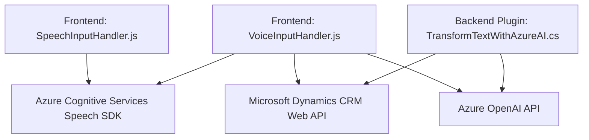

### Breve resumen técnico
El repositorio describe una solución que incorpora tanto componentes de frontend como de backend para trabajar con servicios de voz y texto utilizando **Azure SDK y Azure OpenAI API**. La funcionalidad principal incluye la conversión de texto en voz, análisis de datos transcritos, y transformación de texto mediante inteligencia artificial. Las tecnologías y patrones aplicados muestran una solución híbrida entre cliente-servidor y plug-ins que interactúan con servicios externos.

---

### Descripción de arquitectura
La arquitectura es un **cliente-servidor** que utiliza una combinación de Frontend (en JavaScript) y Backend (C#) plug-ins para integrar un sistema CRM (Dynamics 365). La solución permite que el frontend realice tareas como síntesis de voz y transcripción, mientras que el backend extiende funcionalidades del CRM mediante la integración con la **Azure OpenAI API**.

La arquitectura utiliza la combinación entre:
1. **Frontend:**
   - Un sistema modular basado en funciones específicas (división en responsabilidades).
   - Carga dinámica de librerías externas como el **Azure Speech SDK** para interactuar con servicios de conversión de texto a voz y reconocimiento de voz.

2. **Backend:**
   - Un enfoque de plugin con el **Plugin Pattern** para la ejecución de eventos dentro de la arquitectura de Dynamics CRM.
   - Comunicación con servicios externos (como API REST de OpenAI) para realizar transformaciones avanzadas de texto en tiempo de ejecución.

### Características de la arquitectura:
- **Modularidad:** Separación clara de funcionalidades en el frontend mediante múltiples funciones especializadas.
- **Integración con servicios de terceros:** Uso del Azure Speech SDK y Azure OpenAI API para tareas avanzadas.
- **Escalabilidad:** Posibilidades de ampliar la funcionalidad con otros servicios de Azure.
- **Low latency interaction:** Operaciones diseñadas para ejecutarse dinámicamente en el front y el back.

### Tecnologías, frameworks y patrones involucrados
- **Frontend:**
  - Lenguaje: JavaScript.
  - Integración: Azure SDK (Speech SDK) para síntesis y transcripción de voz.
  - Framework orientado al cliente: Probablemente basado en Dynamics CRM u otra solución integrable.
  - Patrones aplicados:
    - *Delegation Pattern*: Lógica distribuida en funciones con roles definidos.
    - *Dynamic loading*: Verificación y carga dinámica del SDK.
    - *Single Responsibility*: Cada función cumple con un propósito claro.

- **Backend:**
  - Lenguaje: C#.
  - Framework: Dynamics CRM (Microsoft), utilizando `IPlugin`.
  - Integración: Azure OpenAI API mediante solicitudes REST.
  - Patrones aplicados:
    - *Plugin Pattern*: Para la ejecución de lógica en eventos de Dynamics CRM.
    - *Service-Oriented Architecture (SOA)*: Enfocado en la interacción directa con APIs externas.
    - *Dependency Injection*: Uso de `IServiceProvider` en la gestión de dependencias internas del plugin.

---

### Dependencias o componentes externos
1. **Azure Speech SDK**: Utilizado en el frontend para síntesis y transcripción de voz.  
   - URL: `https://aka.ms/csspeech/jsbrowserpackageraw` (cargado dinámicamente).  

2. **Azure OpenAI API**: Utilizada en el backend para la transformación de texto en un formato estructurado basado en normas personalizadas.  

3. **Microsoft Dynamics Web API (`Xrm.WebApi`)**: Integración directa con el sistema CRM del cliente usando servicios REST para manipulación de formularios y datos.  

4. **JSON Libraries:**  
   - `System.Text.Json` y `Newtonsoft.Json.Linq` para operaciones de serialización y manipulación de JSON.  

5. **HttpClient** (*System.Net.Http*): Para realizar solicitudes HTTP hacia APIs externas.  

---

### Diagrama Mermaid

---

### Conclusión final
La solución es una integración de **Frontend y Backend** para sistemas de autoservicio, probablemente basada en **Microsoft Dynamics CRM**. Utiliza herramientas y servicios avanzados como **Azure Speech SDK** para síntesis y transcripción de voz, así como **Azure OpenAI API** para transformar el texto utilizando inteligencia artificial.

La arquitectura híbrida, combinando módulos frontales en JavaScript y un backend basado en plugins de Dynamics CRM en C#, se adapta a sistemas corporativos que necesitan procesamiento de lenguajes naturales y síntesis de voz para mejorar la interacción del usuario con formularios y datos.