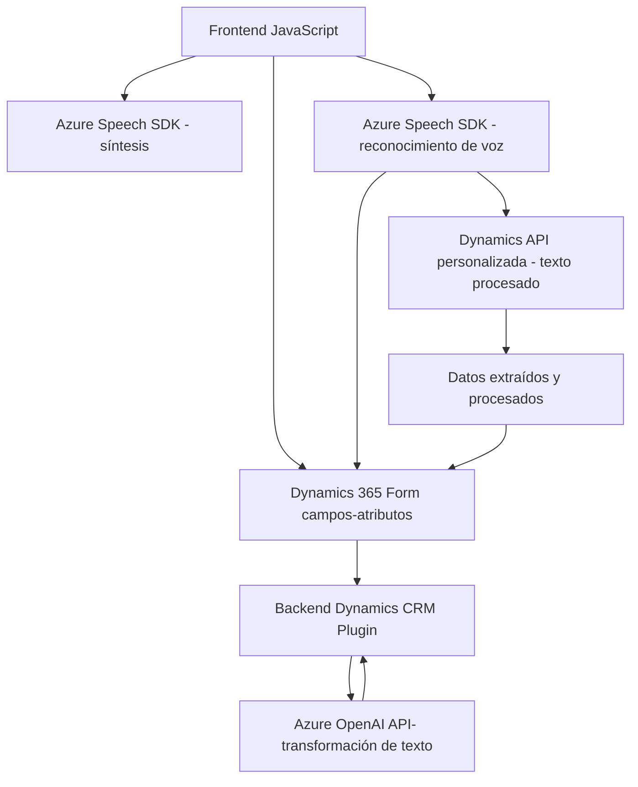

**Breve resumen técnico:**

El repositorio contiene una solución para realizar reconocimiento y síntesis de voz utilizando **Azure Speech SDK** y manipulación de formularios en Dynamics 365. Adicionalmente, utiliza un plugin de Dynamics CRM para integrar capacidades de procesamiento de texto basado en **Azure OpenAI**.

---

### **Descripción de la arquitectura:**

La solución es una integración entre una **frontend en JavaScript**, que interactúa con formularios en Dynamics 365, y un **backend basado en plugins de Dynamics CRM**, que utiliza capacidades de IA (Azure OpenAI) para transformar texto. A grandes rasgos:

1. El frontend (JavaScript):
   - Implementa la **reconocimiento y síntesis de voz** mediante **Azure Speech SDK**.
   - Procesa formularios y campos de datos en **Dynamics 365**.
   - Puede interactuar con APIs personalizadas de Dynamics CRM para realizar transformaciones basadas en inteligencia artificial.

2. El backend (C# Plugin):
   - Se ejecuta dentro del contexto de Dynamics CRM y actúa como un integrador con **Azure OpenAI** para procesar texto.
   - Utiliza servicios HTTP para interactuar con el servicio de AI alojado en Azure.
   - Retorna los resultados transformados al contexto de Dynamics CRM.

La arquitectura general es una mezcla de capas n-lógicas (frontend-API/servicio-crm-plugin) y de comunicación cliente-servidor asíncrona.

---

### **Tecnologías usadas:**
1. **Frontend:**
   - **JavaScript**: Lenguaje principal para desarrollar la lógica del cliente.
   - **Microsoft Dynamics 365 SDK**: Para manipular formularios y campos del CRM.
   - **Azure Speech SDK**: Herramienta principal para el reconocimiento y síntesis de voz.
   - Comunicación asíncrona mediante Promises y callbacks.
  
2. **Backend:**
   - **C#/.NET Framework**: Implementación del plugin utilizando el Framework .NET.
   - **Microsoft Dynamics CRM SDK**: Para integrar con la plataforma de Dynamics CRM.
   - **Azure OpenAI Service**: Servicio externo para operar modelos de lenguaje, usando una API HTTP.

3. **Software Patterns:**
   - **Patrón Plugin (Dynamics CRM)**: Integración directa con eventos y datos de CRM.
   - **Patrón Observador**: Empleado en el frontend con el método `ensureSpeechSDKLoaded`.
   - **Patrón de capa de abstracción**: Uso de SDKs y APIs para encapsular la lógica del reconocimiento y síntesis de voz.
   - **Operaciones asíncronas (Promises & Callbacks)**: Usadas extensivamente en la interacción con APIs y servicios web.

---

### **Diagrama Mermaid**:

---

### **Conclusión final:**
La arquitectura está basada en una solución híbrida donde el **frontend** implementa funcionalidades de audio (reconocimiento y síntesis de voz) utilizando **Azure Speech SDK**, integrándolo inteligentemente con datos en los formularios de **Dynamics 365**. Por otro lado, el **backend**, implementado como **plugin** en Dynamics CRM, utiliza el modelo **Azure OpenAI Service** para realizar transformaciones inteligentes en el texto.

Este sistema soporta operaciones asíncronas, es modular, y está preparado para escenarios de interacción entre usuarios, herramientas de IA (para transformación de texto y generación de voz) y plataformas empresariales como **Dynamics 365**.