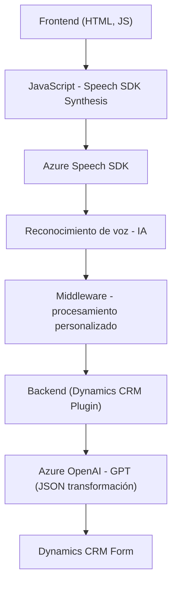

### Breve resumen técnico
Los archivos presentados son parte de un sistema complejo que integra formularios dinámicos en un entorno CRM (como Dynamics 365) con tecnologías de reconocimiento de voz (Azure Speech SDK) y procesamiento de texto (Azure OpenAI). Este sistema permite convertir inputs vocales en datos estructurados dentro de un formulario, y además transforma texto en JSON usando capacidades de IA.

---

### Descripción de arquitectura

#### Arquitectura identificada:
1. **Multicapas (n-capas)**:
    - El sistema separa claramente las responsabilidades mediante capas: capa de frontend (interacción con el usuario), capa intermedia (reconocimiento de voz y procesamiento) y capa backend (plugins y comunicación con APIs como Azure).

2. **Integración de servicios externos**:
    - Utiliza servicios externos como:
        - Azure Speech SDK: Para reconocimiento y síntesis de voz en el frontend.
        - Azure OpenAI: Para la transformación de texto en JSON mediante un plugin Dynamics CRM en el backend.

3. **Event-driven y modularidad**:
    - La solución utiliza eventos como el disparador principal (e.g., grabación de voz, carga dinámica del SDK) y organiza los procesos en módulos altamente especializados.

#### Flujo arquitectónico:
1. _Frontend_: Recibe inputs vocales e interactúa con SDKs y APIs.
2. _Procesamiento Intermedio_: Reconoce voz/transcribe texto en el navegador, extrae datos visibles del formulario, aplica reglas en el flujo.
3. _Backend_: Transformación del texto y aplicación a un formulario CRM mediante interacción profunda con Dynamics SDK y Azure OpenAI (utiliza un plugin).

---

### Tecnologías usadas

#### Listado de tecnologías, frameworks y servicios:
1. **Frontend**
   - **JavaScript**: Base para interacción dinámica con formularios y SDK.
   - **Azure Speech SDK**:
     - Para síntesis de voz y reconocimiento de voz.
     - Cargado dinámicamente mediante una URL externa.
2. **Middleware**
   - Promesas y HTTP APIs: Para llamada a servicios como OpenAI o SDK.
   - JSON parsing/lógica dinámica en frontend y backend.
3. **Backend**
   - **Dynamics CRM**: Interacción directa mediante plugins integrados.
   - **Azure OpenAI (GPT)**: Procesamiento de texto avanzado en el backend.
   - **.NET Framework**:
     - Plugins escritos en C# dentro del ecosistema CRM.
   - Librerías específicas:
     - `Newtonsoft.Json` y `System.Net.Http`: Manipulación de datos en backend.
4. **Patrones arquitectónicos**
   - Modularidad: Cada archivo representa un módulo funcional específico.
   - Microservicios: Comunicación entre servicios externos (Speech SDK y OpenAI JSON).

---

### Diagrama Mermaid

---

### Conclusión final
Este repositorio presenta una **solución modular y multinivel para integración avanzada de voz e IA en entornos CRM**, permitiendo automatizar el procesamiento de datos dinámicos mediante la combinación de Azure Speech SDK y Azure OpenAI. La arquitectura del sistema es **multicapas con integración externa**, ideal para escenarios de automatización empresarial.