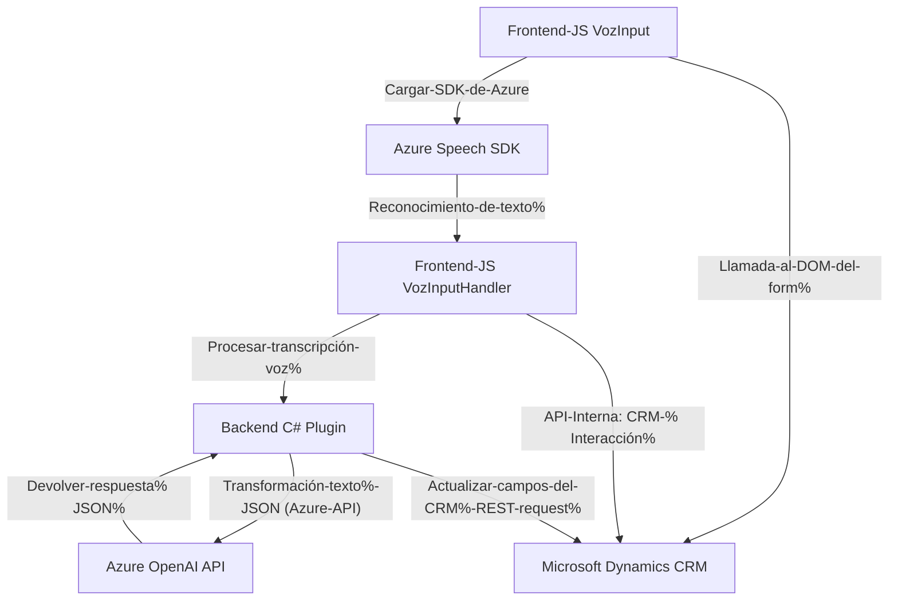

### Breve resumen técnico

Este repositorio es una solución híbrida que integra procesamiento basado en voz con interfaces en formularios web y plugins para plataformas CRM. Utiliza servicios externos como **Azure Speech SDK** y **Azure OpenAI** para proporcionar interacción por voz y análisis de texto avanzado. La solución se presenta como una integración de funcionalidad backend y frontend, diseñada para entornos corporativos como **Microsoft Dynamics CRM**.

---

### Descripción de arquitectura

La arquitectura parece ser **n-capas** o **orientada al dominio**:  
1. **Capa de interfaz usuario** (Frontend): Contiene JavaScript para comunicación entre el formulario y el SDK de voz.  
2. **Capa lógica de negocio** (Middleware): Plugins en C# para procesamiento avanzado del texto y asignación de datos en el CRM.  
3. **Capa servicios externos**: Usa **Azure Speech SDK** para síntesis y reconocimiento de voz, y **Azure OpenAI API** para transformación de texto.  

Además, utiliza el patrón **Adapter** para la conversión y procesamiento de datos y una integración directa con APIs REST.

---

### Tecnologías usadas

1. **Frontend y Integración**:
   - JavaScript.
   - Azure Speech SDK (voz y reconocimiento de texto).
   - DOM Manipulation y Context APIs (Dynamics CRM).

2. **Plugins**:
   - C#.
   - Microsoft Dynamics CRM SDK (Xrm APIs).
   - Repositorio REST para comunicación con Azure AI.

3. **Servicios externos**:
   - Azure Speech SDK: Procesamiento de voz.
   - Azure OpenAI API: Transformación de texto en formato estructurado JSON.

4. **Patrones de diseño**:
   - Callback pattern: Carga asíncrona del SDK.
   - Adapter pattern: Formateo entre diferentes estructuras de datos.
   - Plugin pattern: Integración con servicios internos de CRM.
   - REST API pattern: Consumo de servicios externos.

---

### Dependencias o componentes externos

1. **Azure Speech SDK**: 
   Utilizado en los archivos de JavaScript para reconocimiento y síntesis de voz.

2. **Azure OpenAI API**: 
   Requiere conexión y credenciales (clave y región) para consumir servicios de transformación de texto.

3. **Microsoft Dynamics CRM SDK**:
   Componentes como `Xrm.WebApi` y el contexto de ejecución CRM son esenciales para gestionar los formularios y los datos contextuales del cliente.

4. **Bibliotecas .NET**:
   - `System.Net.Http` y `System.Text.Json` para interacción con APIs REST.
   - Opcional: `Newtonsoft.Json.Linq`.

---

### Diagrama Mermaid válido para GitHub

---

### Conclusión final

La solución combina capacidades de síntesis y reconocimiento de voz, inteligentemente integradas con formularios CRM. Los archivos de frontend realizan operaciones con el **Azure Speech SDK**, mientras que los plugins en C# implementan lógica de negocio más profunda en la interacción con el CRM y procesamiento textual a través de **Azure OpenAI API**. Su diseño modular y orientado a servicios asegura una escalabilidad óptima, ideal para sistemas empresariales que requieren adaptabilidad y necesidad de procesamiento avanzado como Dynamics CRM. 

La arquitectura n-capas utilizada organiza bien las responsabilidades, pero también hay una dependencia notable en servicios externos (Azure), por lo que la solución es susceptible al estado de las APIs y su disponibilidad.