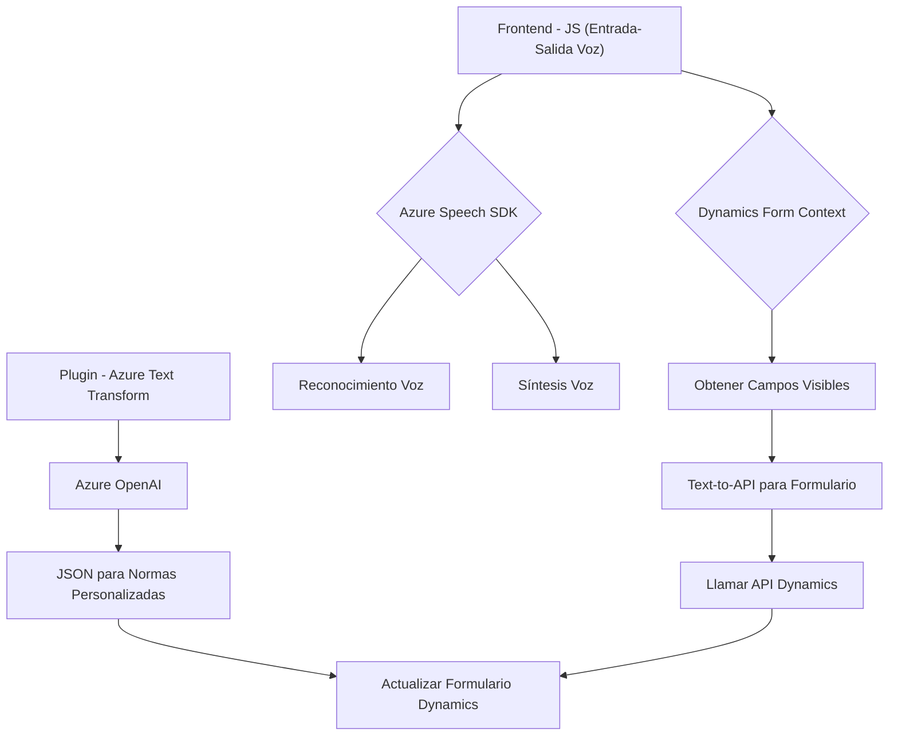

### Breve Resumen Técnico
El repositorio contiene scripts JavaScript para frontend y C# para a lógica del backend en Microsoft Dynamics CRM. La solución principal se basa en el uso del SDK de Azure Speech para **reconocimiento de voz** y **síntesis de voz**, junto con **Azure OpenAI** para transformación de texto mediante IA. Está diseñada como una solución que integra servicios cloud (Azure) y manipulación de datos en tiempo real dentro de formularios de Dynamics 365.

---

### Descripción de la Arquitectura
1. **Componentes principales**:
   - Frontend: Scripts que implementan reconocimiento de voz, síntesis y manipulaciones dinámicas sobre formularios de Dynamics 365.
   - Backend: Plugins personalizados para Dynamics CRM con integración directa hacia el servicio **Azure OpenAI GPT**.

2. **Arquitectura**: 
   - **Microservicios**: La solución se divide en piezas funcionales donde cada parte (scripts de frontend y plugins de backend) se orienta a una tarea específica.
   - **Integración híbrida**: Se conecta la arquitectura de Microsoft Dynamics CRM con servicios externos como **Azure Speech SDK** y **Azure OpenAI**, utilizando dinámicamente el frontend y backend.

3. **Organización modular**:
   - **Capa de presentación**: Los scripts de frontend se encargan de recoger la entrada (voz), procesar datos, mostrarlos y regresar el resultado al usuario (salida de voz o formulario actualizado).
   - **Capa de integración**: Los plugins actúan como conectores entre Dynamics CRM y Azure OpenAI, manteniendo una lógica limpia para aumentar la escalabilidad y eficiencia.
   
---

### Tecnologías Usadas
1. **Frontend**:
   - **JavaScript/HTML** para el manejo de datos dinámicos.
   - **Azure Speech SDK**: Reconocimiento y síntesis de voz.
   - **Microsoft Dynamics 365 SDK**: Manejo de objetos del formulario y operaciones sobre entidades.
   - **Concepto de módulos**: Separación de funcionalidades como extracción, transformación y presentación.

2. **Backend**:
   - **C# .NET**: Lógica de plugins personalizados.
   - **Azure OpenAI** (GPT API): Transformación de texto y operaciones con lenguaje natural.
   - **HttpClient**: Para comunicarse con servicios remotos.
   - **System.Text.Json**: Serialización y deserialización de JSON.

3. **API y Servicios**:
   - **External APIs**:
     - `Azure Speech SDK` y `Azure OpenAI GPT`.
   - **Internal APIs**:
     - APIs personalizadas de Microsoft Dynamics para formularios y operaciones.

4. **Customers and Context Management**: Uso extensivo de `executionContext` para formularios dinámicos y gestión del **Shared Context**.

---

### Diagrama Mermaid

---

### Conclusión Final
La solución está configurada como una arquitectura **híbrida con enfoque en microservicios**, que integra herramientas avanzadas de inteligencia artificial como **Azure OpenAI** y funcionalidades de entrada por voz vía **Azure Speech SDK**. Esta estrategia facilita el procesamiento y interpretación de datos en tiempo real, manteniendo modulares las partes del frontend y backend con patrones claros como **SDK Wrapper** y **Plugin-based Architecture**.

Recomendaciones para la mejora continua:
1. **Seguridad**: Migrar el manejo de claves API hacia sistemas seguros como **Azure Key Vault** o variables de entorno protegidas.
2. **Escalabilidad**: Modularizar los plugins y migrar hacia sistemas manejados por eventos, como **Azure Functions** o mecanismos de mensajería (e.g., Service Bus).
3. **Optimización idiomática**: Incorporar servicios de traducción en tiempo real para ampliar la compatibilidad con otros idiomas.