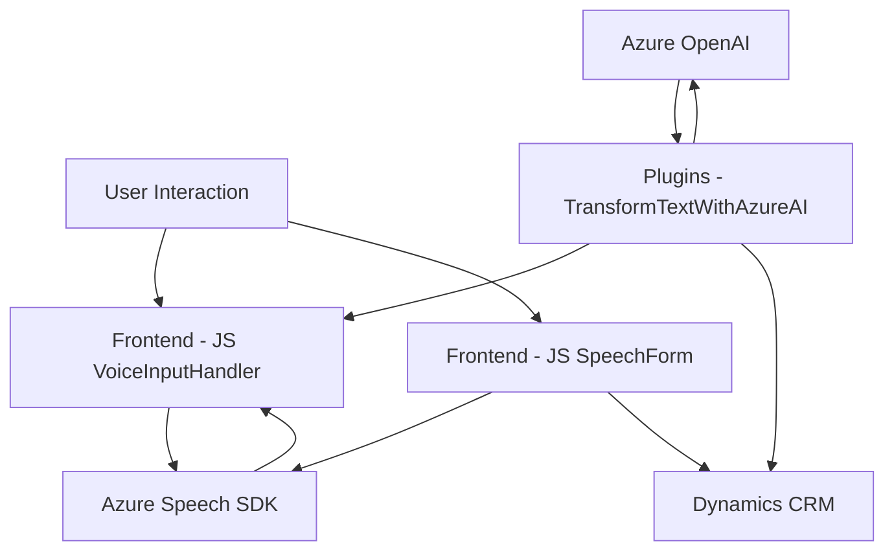

### Breve Resumen Técnico
El repositorio ejecuta procesos relacionados con interacción humana, reconocimiento de voz, síntesis de voz y procesamiento avanzado de texto para formularios en **Dynamics CRM** mediante tecnologías como **Azure Speech SDK** y **Azure OpenAI API**. Incluye funcionalidad para lectura y escritura en formularios usando voz y un plugin que procesa transformaciones avanzadas de texto vía inteligencia artificial, configurado como interacción nativa en Dynamics CRM.

---

### Descripción de Arquitectura
La solución está basada en una arquitectura **modular** de tipo **n capas**, donde cada capa tiene una responsabilidad específica:
- **Capa de presentación:** JS/Frontend que manipula el SDK de Azure Speech para interacción directa de los usuarios con formularios mediante audio.
- **Capa de aplicación:** Plugin en Dynamics CRM (C#) que integra el procesamiento avanzado de datos mediante reglas personalizadas aplicadas con Azure OpenAI API.
- **Capa de servicios externos:** Uso de servicios de terceros como Azure Speech y OpenAI para reconocimiento, síntesis de voz y procesamiento inteligente de texto.

#### Componentes principales:
1. **Frontend/JS:** Ejecuta reconocimiento de voz, síntesis y mapeo entre texto y campos en el formulario.
2. **Plugins:** Procesa el texto transcrito mediante interacción con servicios de IA en Azure OpenAI.
3. **Integraciones:** Azure Speech SDK y Dynamics Web API para operar formularios; solicitudes HTTP a Azure OpenAI.

---

### Tecnologías Usadas
1. **Lenguajes:** 
   - **JavaScript** (frontend/SDK/DOM interaction).
   - **C#** (Dynamics CRM plugin).
   
2. **Frameworks y SDKs:** 
   - **Azure Speech SDK**: Para reconocimiento de voz y síntesis.
   - **Azure OpenAI API**: Procesamiento avanzado de texto.
   - **Microsoft.Xrm.Sdk**: Para plugin de Dynamics CRM.

3. **Patrones de arquitectura:**
   - **Event-Driven Programming:** Uso extenso de callbacks y eventos para manejar flujos asíncronos en el frontend.
   - **Adapter Pattern:** Transformación/modificación de datos provenientes de Azure Speech SDK y OpenAI antes de integrarlos en formularios.
   - **Single Responsibility Principle:** Cada función/método está diseñada para cumplir un propósito único.
   - **Layered Architecture (n capas):** Separación por capas para mantener lógica modular.

---

### Dependencias/Componentes Externos
1. **Azure Speech SDK**:
   - Usado para reconocimiento de voz y síntesis de voz.
   - Necesita credenciales: Azure Key y Región.

2. **Azure OpenAI API**:
   - Usado por el plugin para transformar texto y recibir un JSON estructurado.

3. **Dynamics Web API**:
   - Interacción con entidades y campos del CRM.

4. **C#.NET Libraries**:
   - `System.Net.Http` para solicitudes REST API.
   - `Newtonsoft.Json.Linq` y `System.Text.Json` para manejo de JSON.

---

### Diagrama Mermaid **100 % compatible con GitHub Markdown**

---

### Conclusión Final
La solución es una **modularización con una arquitectura de n capas**, enfocada en aprovechar servicios externos de reconocimiento de voz, síntesis, y procesamiento de texto avanzado vía IA de Azure. Las tecnologías y patrones empleados buscan desarrollar funcionalidad eficiente, altamente desacoplada y escalable, permitiendo interacción natural entre usuarios y formularios, además de incorporar inteligencia avanzada en soluciones estándares de Dynamics CRM.