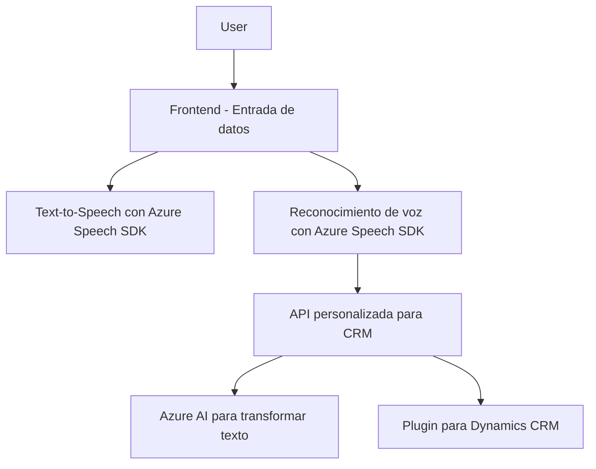

# Análisis y Descubrimientos
---

### **Breve Resumen Técnico**

El repositorio contiene una solución para integrar funcionalidades avanzadas de reconocimiento y síntesis de voz, así como transformación de texto mediante inteligencia artificial con un sistema CRM basado en Dynamics 365. La solución está organizada en tres capas principales: un frontend (JavaScript), un sistema de integración de servicios de Azure (JavaScript para Speech SDK y APIs para Text Transformation), y un complemento (plugin) para Dynamics CRM implementado en C#.

---

### **Descripción de Arquitectura**

1. **Arquitectura global:**
   - Esta solución combina **arquitectura de microservicios** con una orientación hacia **SOA (Service-Oriented Architecture)**.
   - El sistema implica múltiples capas interconectadas, incluyendo un frontend para interacción con formularios, la integración de SDKs/API externas, y un backend plugin que utiliza una arquitectura típicamente usada en entornos de Dynamics CRM.

2. **Componentes principales:**
   - **Frontend:** Extensiones de JavaScript para formularios de CRM basadas en módulos funcionales claros, interactúan con SDK y API usando programación asíncrona.
   - **Backend/Plugin:** Lógica de negocio implementada directamente en Dynamics CRM a través de un plugin. Provee integración directa con Azure OpenAI mediante peticiones HTTP y realiza transformaciones de texto.

3. **Patrones aplicados:**
   - **Patrón modular:** Las funciones y clases están organizadas con una única responsabilidad, lo que facilita pruebas unitarias y cambios en componentes específicos.
   - **Event-driven architecture (EDA):** Uso de eventos en formularios y contextos CRM para activar el reconocimiento/síntesis de voz y generación de texto.
   - **Microservicios:** Uso del Azure Speech SDK y OpenAI GPT como servicios desacoplables y escalables.

---

### **Tecnologías Usadas**

1. **Lenguajes:**
   - **JavaScript:** Para las extensiones frontend y comunicación con servicios.
   - **C#:** Para implementar un plugin en el backend de Dynamics CRM.

2. **Frameworks/Librerías:**
   - **Azure Speech SDK:** Para reconocimiento y síntesis de voz.
   - **Xrm.WebApi:** Para integración directa con Dynamics CRM.
   - **Newtonsoft.Json**: Para manejo ordenado de datos JSON.
   - **Azure OpenAI:** Como servicio de transformación de texto y asistencia de IA.

3. **APIs y Servicios Externos:**
   - **Azure Speech Service**: Text-to-speech y reconocimiento de voz.
   - **Azure OpenAI API**: Procesamiento avanzado de texto mediante GPT.

---

### **Dependencias o Componentes Externos**

1. **Azure Speech SDK**: Cargado dinámicamente en los archivos de frontend con una URL fija.
2. **Azure OpenAI API**: Integración usada en el backend/pasarela personalizada para Dynamics CRM.
3. **APIs propias de Dynamics CRM**: Xrm WebApi y métodos para manipulación de formularios (atributos, controles, etc.).
4. **Newtonsoft.JSON**: Biblioteca de manipulación JSON usada en código C#.
5. **Web API personalizada**: API definida internamente que utiliza servicios de Azure para extensión en CRM.

---

### **Diagrama Mermaid**

---

### **Conclusión Final**

La solución descrita integra tecnologías frontend y backend con servicios avanzados de Azure para mejorar la funcionalidad de un CRM basado en Dynamics. La arquitectura muestra una tendencia hacia un modelo **microservicio**, dado que las principales tareas son delegadas a servicios externos (Azure Speech SDK y Azure OpenAI). Se aplican varios patrones de diseño, como Modularización y SOA, asegurando escalabilidad y la posibilidad de extender su funcionalidad en el futuro. Es una solución bien estructurada que aprovecha la nube y las capacidades de inteligencia artificial para crear una experiencia de usuario más rica y eficiente.