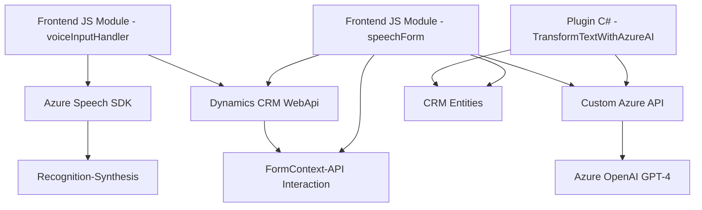

### Breve resumen técnico
El repositorio presentado contiene módulos para la síntesis de voz y captura de entrada por voz en formularios, junto con un plugin para Dynamics CRM que usa Azure OpenAI GPT-4 para transformar texto en formato estructurado (JSON). Estos componentes se integran para ofrecer capacidades de IA y procesamiento avanzado en un entorno empresarial, específicamente Dynamics CRM.

---

### Descripción de arquitectura
Este repositorio adopta una arquitectura modular y basada en eventos para ofrecer capacidades altamente específicas. Los módulos JavaScript funcionan como componentes autónomos que se integran en formularios de Dynamics 365. El plugin utiliza un enfoque basado en microservicios para interactuar con Azure OpenAI GPT-4, convirtiéndose en un complemento extensible en una arquitectura de **Dynamics CRM Plugin-Based**.

La solución no forma parte de una arquitectura monolítica; está diseñada para interactuar con un ecosistema distribuido, integrando:
1. **SDKs externos** como Azure Speech (para síntesis y reconocimiento de voz) y Azure OpenAI (procesamiento JSON estructurado).
2. **APIs internas y externas** que conectan servicios como Xrm.WebApi y Azure AI.

En cuanto al patrón de arquitectura:
- **Frontend JS** adopta un patrón de diseño por módulos funcionales, acoplados mediante eventos y callbacks (Event-Driven). La comunicación se ajusta al patrón **Integración API**.
- **Plugins/backend (Dynamics CRM)** emplea la **Plugin-Based Architecture**, con un enfoque en integración de servicios externos.

---

### Tecnologías usadas
1. **Frontend (JavaScript)**:
   - Azure Speech SDK: Para reconocimiento de voz y síntesis de texto.
   - Dynamics CRM WebApi (`Xrm.WebApi`): Interacción con formularios y entidades del CRM.
   - XMLHttpRequest: Llamadas a servicios externos.
   - Patrón Funcional: Organización modular mediante funciones específicas.

2. **Backend (C#, Dynamics CRM Plugin)**:
   - Azure OpenAI GPT-4: Procesamiento de texto avanzado.
   - Dynamics CRM SDK (`IPlugin`, `QueryExpression`, `Entity`): Extensión del comportamiento CRM.
   - API REST con acceso por credenciales (patrón External Service).

---

### Dependencias o componentes externos
El código depende de varias librerías y servicios externos:
- **Azure Speech SDK:** Se carga dinámicamente no integrado en el repositorio: (`https://aka.ms/csspeech/jsbrowserpackageraw`).
- **Azure OpenAI GPT-4:** Utilizado por el plugin como sistema de procesamiento de texto bajo los estándares configurados.
- **Dynamics CRM WebApi:** Para interacción con el CRM y acceso a datos de formularios y entidades.
- **.NET Libraries:** Librerías estándar como `Newtonsoft.Json` para manipulación de JSON y `Microsoft.Xrm.Sdk` para la interacción CRM.

El acceso a servicios externos requiere el manejo seguro de credenciales y claves API.

---

### Diagrama Mermaid

---

### Conclusión final
La solución presentada combina un enfoque altamente modular con la integración de servicios externos, particularmente Azure. La arquitectura está basada en eventos y plugins, lo que hace que sea escalable y fácil de extender. Los módulos proporcionan capacidades avanzadas de IA para reconocimiento de voz y procesamiento de texto en un entorno CRM, empleando prácticas modernas de composición modular. Sin embargo, es crucial manejar la seguridad de los endpoints (Azure Speech y OpenAI).