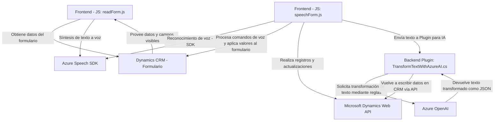

### Breve resumen técnico  
El repositorio incluye varios archivos funcionales que integran y gestionan el reconocimiento, síntesis y procesamiento de datos de texto utilizando **Microsoft Azure Speech SDK** y **Azure OpenAI**. La solución conecta formularios de **Microsoft Dynamics CRM** con servicios avanzados de voz e inteligencia artificial, optimizando la interacción mediante comandos de voz y automáticas transformaciones de texto en formularios.

---

### Descripción de arquitectura  
La arquitectura se presenta como una estructura **n-capas**, típica de sistemas corporativos que utilizan Dynamics CRM. La aplicación está organizada modularmente:  
- **Frontend**: Proporciona la lógica y las interacciones del usuario, incluyendo el reconocimiento de voz, mediante archivos JavaScript que manejan SDKs y APIs externas.  
- **Backend**: Consiste en un plugin de Dynamics CRM implementado en C# que extiende la funcionalidad del CRM al interactuar con Azure OpenAI para la transformación del texto.  

Patrones utilizados:  
1. **N-Capas**: La separación entre frontend y backend (lógica de cliente y servidor).  
2. **Service Layer**: En el backend, el plugin define puntos de entrada específicos para el procesamiento de texto con OpenAI.  
3. **Integration Gateway**: Los archivos interactúan con servicios externos como los SDK y APIs de Azure.  
4. **Facade Pattern**: `ensureSpeechSDKLoaded` oculta la lógica de carga dinámica del SDK del cliente.

---

### Tecnologías usadas  
1. **Microsoft Azure Speech SDK**: Para síntesis y reconocimiento de voz.  
2. **Microsoft Dynamics 365 Web API**: Integración con el CRM para manipulación de formularios dinámicos.  
3. **Azure OpenAI**: Transformación de texto con inteligencia artificial utilizando modelos GPT.  
4. **Librerías externas**: `Newtonsoft.Json` y `System.Net.Http` en el plugin C# para manejar JSON y solicitudes HTTP.  

---

### Diagrama Mermaid  

---

### Conclusión final  
La solución integra varios servicios de Microsoft (Dynamics 365, Azure Speech SDK, Azure OpenAI) con una estructura **n-capas** de frontend-backend para habilitar capacidades de interacción avanzada mediante voz e inteligencia artificial.  
El enfoque modular de los archivos JavaScript y la interacción directa con APIs y SDKs reflejan un diseño orientado a servicios y la integración de tecnologías de última generación. Además, el plugin en C# sirve de intermediario entre Dynamics CRM y servicios externos como **Azure OpenAI**, evidenciando un patrón de integración.  

Diseños futuros pueden considerar separación de preocupaciones mediante servicios específicos y mejoras en la gestión de dependencias (como SDK). Esto aumentará la escalabilidad, reutilización y adaptabilidad del sistema.