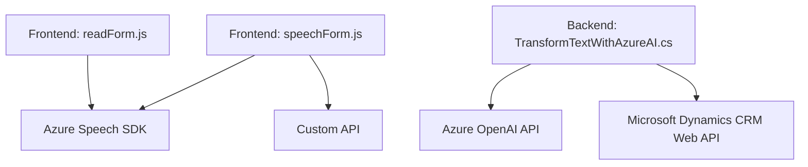

### Breve resumen técnico

El repositorio contiene tres archivos principales con funcionalidades relacionadas con interacción de voz, transcripciones y generación de datos con servicios de **Microsoft Dynamics CRM** y **Azure AI**. Estos archivos están enfocados en procesar textos (de formularios y entradas de voz), interactuar con APIs externas (Azure Speech SDK y Azure OpenAI), y manipular datos en entornos CRM.

### Descripción de la arquitectura

La arquitectura implementada es híbrida, basada en patrones de cliente-servidor y microservicios API. Los archivos de frontend (`readForm.js`, `speechForm.js`) trabajan bajo el patrón modular dirigido por eventos, utilizando el **Azure Speech SDK** para entrada de voz y comunicación con APIs externas. En el backend, el archivo `TransformTextWithAzureAI.cs` actúa como un **plugin para Microsoft Dynamics CRM**, realizando procesamiento de texto con acceso a servicios de Azure OpenAI. 

Debido a la integración con Azure y el CRM, la arquitectura se acerca al paradigma de **servicios distribuidos**, donde cada componente realiza acciones específicas y se comunica mediante APIs y SDKs.

### Tecnologías usadas

#### Frontend:
- **JavaScript**:
  - Modularidad basada en funciones.
  - Carga dinámica de SDKs.
- **Azure Speech SDK**:
  - Procesamiento de voz y generación de síntesis de texto a voz.
- **Microsoft Dynamics CRM Web API**:
  - Manipulación de datos mediante APIs del entorno CRM.

#### Backend:
- **C#**:
  - Implementación de plugins con la interfaz `IPlugin`.
- **Azure OpenAI**:
  - Consumo de un servicio REST para transformaciones avanzadas sobre texto.
- **Newtonsoft.Json**:
  - Serialización/deserialización de JSON.

#### Patrones:
- **Estructura basada en eventos**:
  - El SDK de Speech utiliza callbacks para operaciones asíncronas.
- **Integración de API Externa**:
  - Se delegan responsabilidades complejas a servicios como Azure Speech y OpenAI.
- **Plugin extensible**:
  - El backend usa extensiones de Dynamics para personalizar acciones.

#### Dependencias:
1. **Azure Speech SDK**: Cargado dinámicamente en el navegador.
2. **Azure OpenAI API**: Llamada desde el plugin de backend.
3. **Microsoft Dynamics CRM Web API**: Para manipulación de datos del formulario.
4. **Custom API**: Servicio adicional personalizado integrado desde frontend.

### Diagrama Mermaid

### Conclusión final

La solución presentada tiene un enfoque combinado de cliente-servidor y microservicios API, enfocado en la accesibilidad, interacción basada en voz, y manipulación de datos en entornos de Microsoft Dynamics CRM. La inclusión de SDKs y APIs externas como **Azure Speech** y **Azure OpenAI** hacen la arquitectura extensible y adaptable para aplicaciones empresariales. Los patrones empleados destacan modularidad, procesamiento de eventos y delegación de lógica hacia servicios externos, lo que reduce la complejidad interna del código y facilita el mantenimiento.