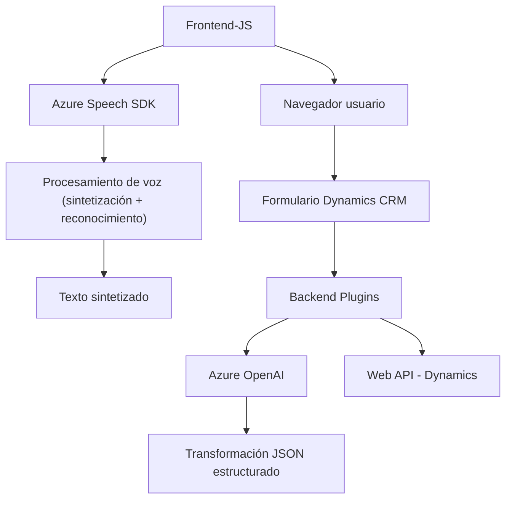

## Breve Resumen Técnico

El repositorio contiene archivos relacionados con funcionalidades que integran reconocimiento de voz, síntesis de voz y procesamiento de texto mediante servicios de **Azure Speech SDK** y **Azure OpenAI API**. La solución parece ser una integración de microservicios y plugins orientados a mejorar la accesibilidad y procesamiento avanzado de datos en formularios de Dynamics CRM.

---

## Descripción de Arquitectura

La arquitectura general combina:
1. **Frontend**: Módulos en JavaScript diseñados para procesar entrada/salida de voz, interactuar con formularios y llamar APIs externas como servicios de Microsoft Dynamics y Azure Speech SDK.
2. **Backend (Plugins)**: Uso de code-behind en C# que actúa como plugins en Dynamics CRM, procesando texto mediante llamadas REST a Azure OpenAI API.

La solución usa los siguientes patrones de diseño:
- **Capas N (Frontend + Backend)**: Cada capa maneja una responsabilidad específica, siendo complementaria:
  - Capa de interfaz: Usuarios interactúan con formularios y voz.
  - Lógica de negocios: JavaScript captura entradas y llama a APIs.
  - Persistencia y transformación: Plugins en el backend generan JSON estructurado.
- **Service Layer**: Interacción desacoplada con servicios externos como Azure Speech SDK y Azure OpenAI para encapsular su lógica y simplificar la integración.
- **Plugin-Based Architecture**: Utilizada en Dynamics CRM, donde funcionalidad específica se implementa como plugins que se ejecutan en contexto.

---

## Tecnologías Usadas

### Frameworks y API:
1. **Frontend**:
   - **JavaScript**: Manejando entrada/salida de voz y datos de formularios.
   - **Azure Speech SDK**: Reconocimiento y síntesis de voz.
   - **Dynamics Web API**: Para manipulación de datos de formularios en CRM.

2. **Backend (Plugins)**:
   - **C#** con .NET Framework: Manejo de reglas de negocio en Dynamics plugins.
   - **Azure OpenAI API**: Procesamiento de texto mediante modelos GPT-4.

3. **Tecnologías auxiliares**:
   - `HttpClient` y `Newtonsoft.Json` (serialización/deserialización).
   - `System.Text.Json` para manejo eficiente de JSON.

### Patrones:
- **Callback Asynchronous Pattern**: Carga dinámica del SDK con callbacks.
- **REST API Integration**: Comunicación con Azure OpenAI y Speech Services usando llamadas HTTP.
- **Encapsulación**: Modulación clara de tareas en funciones específicas.

---

## Diagrama Mermaid válido para GitHub

---

## Conclusión Final

La solución combina una experiencia frontend accesible, aprovechando síntesis y entrada de voz con **Azure Speech SDK**, con un backend robusto integrado en Dynamics CRM para procesar texto mediante **Azure OpenAI API**. Está diseñada para facilitar la interacción del usuario con formularios, automatizar la entrada de datos y aplicar inteligencia artificial en el procesamiento y transformación de texto. La arquitectura basada en capas y servicios desacoplados asegura escalabilidad y claridad en la modularidad del sistema.