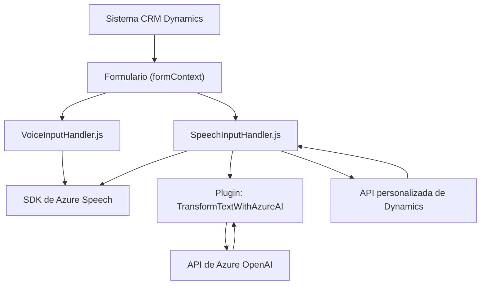

### Breve resumen técnico
El repositorio contiene una solución de software orientada a la gestión de formularios y procesamiento de datos de voz y texto mediante tecnologías como Azure Speech SDK para reconocimiento y síntesis de voz, y la API Azure OpenAI para transformación avanzada de texto basado en IA. La solución se encuentra dentro de un entorno vinculado a Dynamics CRM, utilizando plugins y APIs internas del CRM.

---

### Descripción de arquitectura
La arquitectura de la solución está orientada a la integración con APIs de terceros dentro de una estructura orientada al modelo de negocio del CRM, probablemente utilizando una arquitectura **n-capas**. Las interacciones están diseñadas para mantener Independencia de Módulos (modularidad), mientras que las responsabilidades se distribuyen de manera que el manejo de datos y la lógica del negocio estén desacoplados de las integraciones externas. Por otro lado, el uso de un plugin en el lado del servidor sugiere una extensión del comportamiento de Dynamics CRM mediante integración directa con servicios como Azure OpenAI.

---

### Tecnologías usadas
1. **Frontend**:
   - **Lenguaje:** JavaScript.
   - **Frameworks/Librerías:** 
     - Azure Speech SDK (para reconocimiento y síntesis de voz).
   - **Patrones:**
     - Modularidad y encapsulación.
     - Lazy loading del SDK (carga dinámica).
     - Callback para gestionar presentación y procesos asíncronos.

2. **Backend**:
   - **Lenguaje:** C# con .NET Framework (para plugins de Dynamics CRM).
   - **Frameworks/Librerías:** 
     - Microsoft XRM SDK (para interactuar con Dynamics 365).
     - Azure OpenAI API.
     - Newtonsoft.Json y System.Text.Json para manipulación de datos JSON.
   - **Patrones:**
     - Implementación de servicios externos (Azure OpenAI).
     - Facade para simplificar interacción con APIs.
     - Arquitectura de plugins (como un ejemplo del patrón de extensibilidad).

3. **CRM & Cloud**:
   - Framework específico de Dynamics CRM para gestión de formularios.
   - Integración con servicios de Azure (Speech SDK y OpenAI).

---

### Diagrama Mermaid válido para GitHub

### Conclusión final
Esta solución combina tecnologías punteras como el **Azure Speech SDK** y **Azure OpenAI API** para dotar a un sistema CRM como Dynamics de capacidades avanzadas de procesamiento de voz y texto. La arquitectura destaca por su modularidad, integración con servicios externos y adherencia a paradigmas establecidos en el desarrollo de plataformas CRM. 

Aunque la arquitectura es **n-capas**, la solución podría evolucionar hacia una arquitectura más moderna como **hexagonal** si se busca una mayor separación entre los modelos de negocio y las dependencias externas. Esto facilitaría la extensibilidad y el mantenimiento del software, especialmente en entornos donde se requiere alta flexibilidad y adaptabilidad frente a nuevas tecnologías.