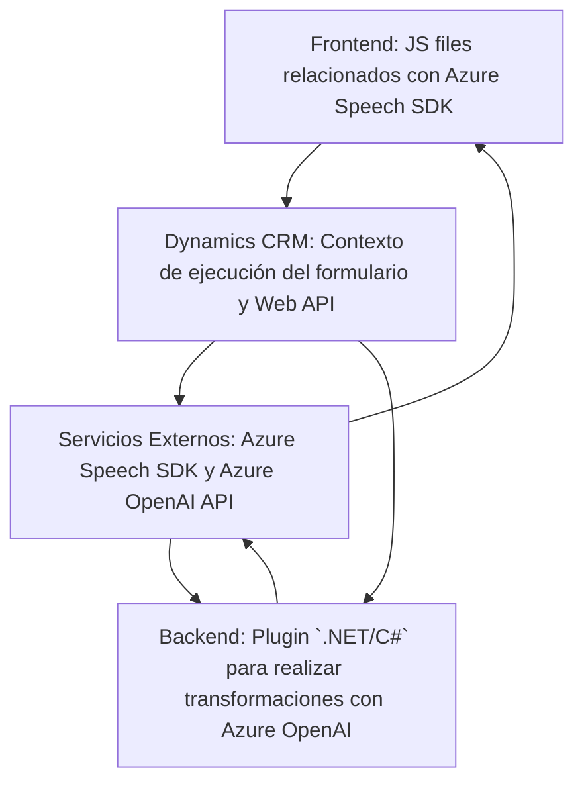

### **Breve Resumen Técnico**
El repositorio contiene soluciones relacionadas con la interacción entre Dynamics CRM y servicios externos como Azure Speech SDK y Azure OpenAI. Estos archivos implementan funcionalidades de síntesis y reconocimiento de voz utilizando el SDK, procesan texto con modelos de IA, y ejecutan transformaciones avanzadas por medio de plugins en Dynamics CRM.

---

### **Descripción de Arquitectura**
- **Tipo de Solución**: La solución combina backend y frontend orientado a Dynamics CRM. Frontend forma parte de las personalizaciones de formularios en Dynamics y Backend incluye plugins que interactúan con servicios externos como Azure OpenAI.
- **Arquitectura**: Se implementa una arquitectura basada en capas con interacciones API y plugin-based para Dynamics CRM. No se arman microservicios independientes, pero los componentes se comunican con servicios externos en el backend. Tiene principios de **hexagonal** (interacción con sistemas externos mediante adaptadores como Azure SDK).

---

### **Tecnologías, Frameworks y Patrones**
1. **Frontend (JavaScript)**:
   - **Tecnologías**:
     - Azure Speech SDK.
     - Dynamics CRM APIs (Xrm.WebApi).
   - **Patrones**:
     - Modularización por funciones (cada función tiene una tarea específica).
     - Cargador Dinámico de SDK (ensuring SDK dinamicamente con callbacks).
     - Encapsulación y separación de tareas (procesamiento de datos del formulario, integración SDK).

2. **Backend (.NET/C#)**:
   - **Tecnologías**:
     - Microsoft Dynamics SDK (IPlugin, IOrganizationService).
     - Azure OpenAI API.
     - Bibliotecas comunes: `System.Net.Http`, `System.Text.Json`.
   - **Patrones**:
     - Plugin-based architecture (propia de Dynamics CRM).
     - API Integration (http requests para modelos OpenAI).
     - Factory Pattern (uso de IOrganizationServiceFactory).

---

### **Dependencias o Componentes Externos**
1. **Azure Speech SDK**:
   - Para síntesis y reconocimiento de voz en el frontend.
   - Cargado dinámicamente desde el servidor de Azure.

2. **Azure OpenAI API**:
   - Para procesamiento avanzado de texto en el backend (via plugin C#).

3. **Dynamics CRM Web APIs**:
   - Para interacción entre el frontend y el contexto de datos de formularios en Dynamics CRM.

4. **Bibliotecas .NET** como `Newtonsoft.Json` para manipulación de JSON resultante de la API de OpenAI.

---

### **Diagrama Mermaid**

---

### **Conclusión Final**
La solución está diseñada para complementar las capacidades de Dynamics CRM con funcionalidades avanzadas de voz y procesamiento de texto. El frontend es responsable de la interacción directa con el usuario y datos del formulario, mientras que el backend utiliza plugins en .NET para conectarse con servicios en Azure. Se implementa una arquitectura basada en capas con componentes externos como SDKs y APIs que permiten ampliar las capacidades estándar de Dynamics CRM. El código está bien modularizado y sigue buenas prácticas de separación de responsabilidades. Sin embargo, se podrían mejorar algunos aspectos de seguridad, como la gestión de claves para las APIs.