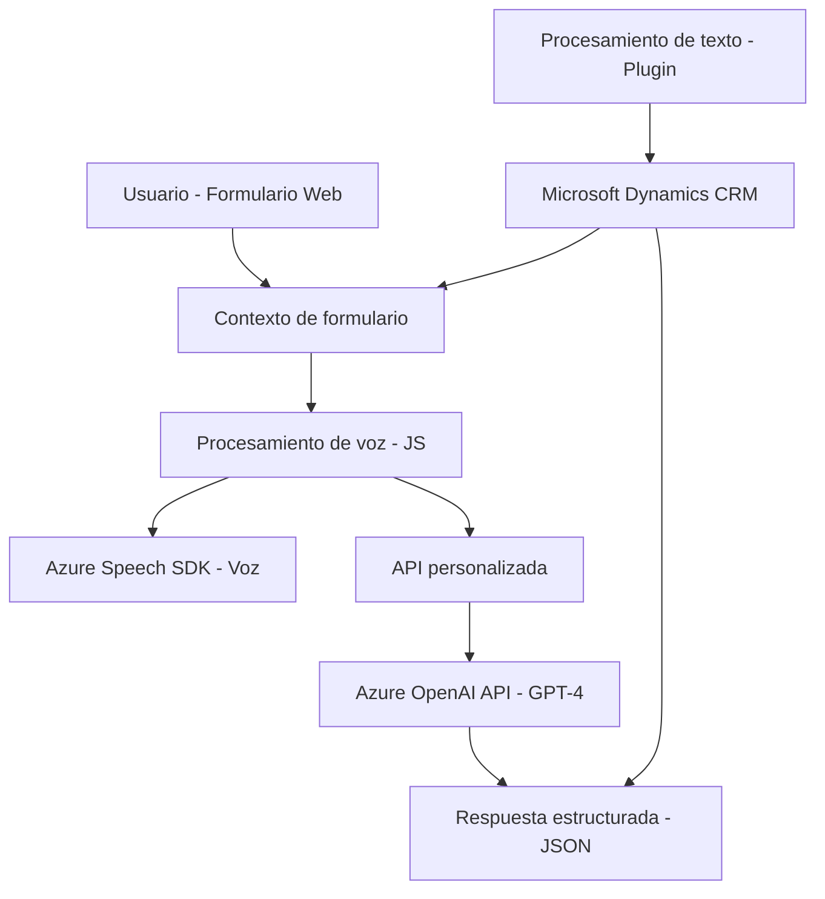

### Breve resumen técnico

El repositorio contiene una solución que integra servicios de Microsoft Dynamics CRM y Azure para un procesamiento avanzado de datos de formularios y capacidades de voz e inteligencia artificial. Este sistema realiza dos tareas principales: síntesis de voz (usando **Azure Speech SDK**) y procesamiento inteligente de datos (usando **Azure OpenAI GPT-4**) para formularios dinámicos.

---

### Descripción de arquitectura

La solución tiene una arquitectura basada en **event-driven programming** con componentes que interactúan de manera modular. 

- Para el frontend (Javascript), se utiliza una estructura semi-MVC donde las funciones están diseñadas como controladores para la lógica de negocio y presentación.
- La solución global sigue una **arquitectura n-capas** donde el frontend comunica mediante una API personalizada con los sistemas backend (Azure y Dynamics). 
- El backend implementa **Plugin Pattern**, que es específico para Dynamics CRM.

---

### Tecnologías usadas

#### Frontend:
1. **Azure Speech SDK**: Integrado para la síntesis de voz y reconocimiento.
2. **JavaScript** (ES6): Utilización de funciones básicas y avanzadas para la manipulación DOM y servicios.
3. **Microsoft Dynamics 365 Client APIs**: Utilizadas para contextualizar los datos en formularios.

#### Backend:
1. **Microsoft Dynamics SDK**:
   - **Plugins (IPlugin)** para extender las capacidades de negocio.
   - API **Xrm.Sdk.online**.
2. **Azure OpenAI GPT-4**:
   - Manejada para transformar textos al formato deseado utilizando inteligencia artificial.
3. **.NET Framework**:
   - Desarrollo del plugin usando entidades CRM y comunicación HTTP.

---

### Inferencia de dependencias y componentes externos

1. **Dependencias externas clave**:
   - **Azure Speech SDK** para servicios de voz.
   - **Azure OpenAI GPT-4** para procesamiento inteligente de texto.
   - **Dynamics 365 CRM API** para manipulación de datos en formularios y entidades.
2. **Conectividad requerida**:
   - Acceso a **Azure services** y sus credenciales: `azureKey`, `azureRegion` y `apiKey`.

---

### **Diagrama Mermaid**

---

### Conclusión final

La solución representa una integración moderna entre servicios externos de Azure y Microsoft Dynamics CRM en una estructura modular y escalable. Su arquitectura event-driven y n-capas permite dividir la responsabilidad del procesamiento de voz y texto entre el frontend y el backend. Las tecnologías seleccionadas son adecuadas para una solución empresarial, pero se recomienda verificar la seguridad en el manejo de credenciales de Azure para garantizar la integridad en producción.