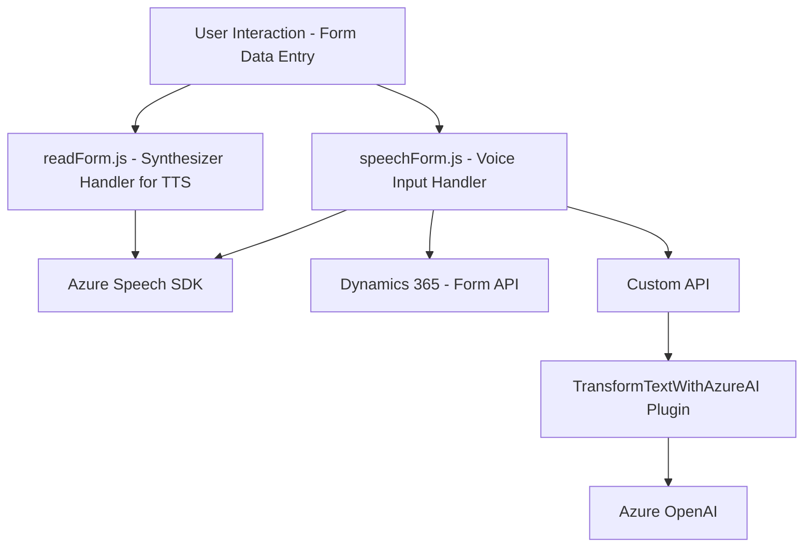

### Breve resumen técnico
El repositorio parece contener una solución que incluye funcionalidades relacionadas con la manipulación de formularios y procesamiento de datos en **Dynamics 365**, específicamente mediante la interacción de datos con servicios externos. Destaca la integración con el **Azure Speech SDK** para reconocimiento de voz y sintetización de texto a voz, y la relación con **Azure OpenAI** para transformación de texto mediante GPT-4. Además, se observan patrones clásicos de programación modular y arquitectura basada en servicios y plugins.

---

### Descripción de la arquitectura
La solución tiene una arquitectura **de microservicios** con integración de sistemas externos basada en API y SDK. Cada pieza se define como módulos o servicios separados:
- El frontend (archivos en `/FRONTEND/JS/`) proporciona funcionalidades de interfaz con el usuario, como la recopilación de datos de formularios visibles y la interacción con reconocimiento de voz.
- Un **plugin back-end** en C# (`Plugins/TransformTextWithAzureAI.cs`) se integra directamente con Dynamics 365 usando un diseño modular y centralizado para gestionar llamadas a servicios de Azure OpenAI.
- La conectividad a servicios de Azure (Speech SDK y OpenAI API) define un punto clave de integración con servicios de terceros, lo que permite escalar y delegar tareas complejas a servicios especializados.

---

### Tecnologías usadas
1. **Frontend:** 
   - **JavaScript:** Para lógica de ejecución en navegador y gestión de eventos de formularios.
   - **Azure Speech SDK:** Para funciones de sintetización y reconocimiento de voz.
   - **Dynamics 365 Form API:** Para extracción y manipulación de datos de formularios.

2. **Back-end:** 
   - **Microsoft Dynamics CRM Plugin (C#):** El archivo `.cs` implementa la interfaz `IPlugin` para interacción programática con Dynamics CRM.
   - **Azure OpenAI GPT-4 API:** Realiza procesamiento de texto avanzado en aplicaciones empresariales.
   - **Newtonsoft.Json y System.Text.Json:** Para manejar la serialización y deserialización de JSON.

3. **Integraciones:** 
   - **Azure Speech SDK** y **Azure OpenAI API** son servicios externos fundamentales para la solución.

---

### Diagrama Mermaid

---

### Conclusión final
La solución es una integración de frontend y backend dirigido a automatizar la interacción con los formularios en Dynamics 365, utilizando reconocimiento de voz y transformación de texto asistido por IA. Al ser modular, con comunicación directa entre módulos y servicios externos, la arquitectura refleja **microservicios**. Sin embargo, ciertos puntos como el manejo seguro de credenciales (API keys incrustadas) requieren atención para cumplimiento de buenas prácticas. Este diseño es una base sólida para un sistema extensible y capaz de manejar flujos de reconocimiento y sintetización entre el usuario, su interfaz, y servicios externos como Azure AI.