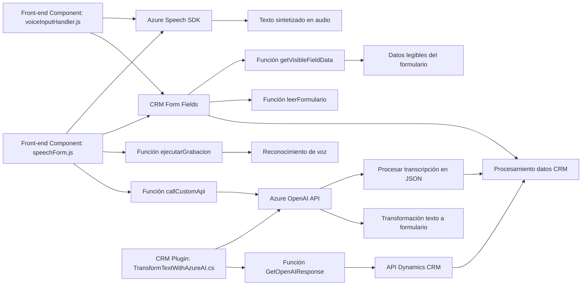

### Breve resumen técnico
El repositorio incluye:
1. **Front-end en JavaScript**, que implementa funciones para interacción dinámica con formularios mediante reconocimiento y síntesis de voz usando `Azure Speech SDK`.
2. **Plugins para Microsoft Dynamics CRM**, que integran capacidades de procesamiento de lenguaje natural a través de **Azure OpenAI**, transformando texto según normas específicas para CRM.

---

### Descripción de arquitectura
La solución sigue un diseño modular, con integración directa con servicios externos (`Azure Speech SDK` y `Azure OpenAI`). Aunque no utiliza microservicios, está alineada con conceptos de arquitectura n-capas, dividiendo claramente responsabilidades entre:
- **Capa de presentación**: Archivos JavaScript para la síntesis/reconocimiento de voz.
- **Capa de lógica de negocio**: Plugins de Dynamics CRM, que transforman el texto y manejan integraciones externas.
- **Capa de integración**: Comunicación con APIs externas de Azure.

La estructura general apunta a un estándar **orientado a eventos** y **servicios conectados**, optimizando los resultados para entornos como CRM.

---

### Tecnologías utilizadas
#### **Front-end**
- **JavaScript (ES6)**: Base del código presentado.
- **Azure Speech SDK**: Para reconocimiento de voz y síntesis de texto a voz.
- **Dynamics 365 APIs (internas)**: Métodos relacionados con la extracción/manipulación de datos en formularios CRM.

#### **Back-end Plugins**
- **C# (.NET Framework/C#)** para integración como plugin en CRM.
- **Azure OpenAI**: Para procesamiento y transformación de texto usando modelos GPT.
- **System.Net.Http**: Comunicación con APIs externas.
- **Newtonsoft.Json** y **System.Text.Json**: Manejo de datos JSON.

---

### Dependencias o componentes externos
1. **Azure Speech SDK**: Para el procesamiento de voz (dinámica de carga desde CDN).
2. **Azure OpenAI APIs**: Para transformación y procesamiento avanzado de texto.
3. **Microsoft Dynamics CRM SDK**: Proporciona modelos y métodos para manipular datos de CRM.
4. **CRUD APIs (Dynamics)**: Llamadas para actualizar formularios del sistema CRM.
5. **HTTP Client**: Comunicación con APIs remotas (Azure).

---

### Diagrama Mermaid válido para GitHub

---

### Conclusión final
La solución representada por este repositorio combina componentes de **presentación front-end**, **integración mediante plugins** y **servicios de terceros** como Azure, proporcionando una sólida estructura para extender la funcionalidad en entornos CRM. Destaca el uso avanzado de **Azure AI** para habla y texto, optimizando interacciones dinámicas y garantizando capacidades avanzadas dentro de Microsoft Dynamics.

Aunque utiliza **n-capas** como su base arquitectónica, los archivos están diseñados para un entorno específico (CRM) con extensiones y reglas específicas para integraciones. Las funciones están bien organizadas, con claras responsabilidades, pero podrían beneficiarse del uso de **variables de entorno** para claves y configuraciones dinámicas. Es una solución modular reutilizable, particularmente apta para mantenimiento y evolución posterior.