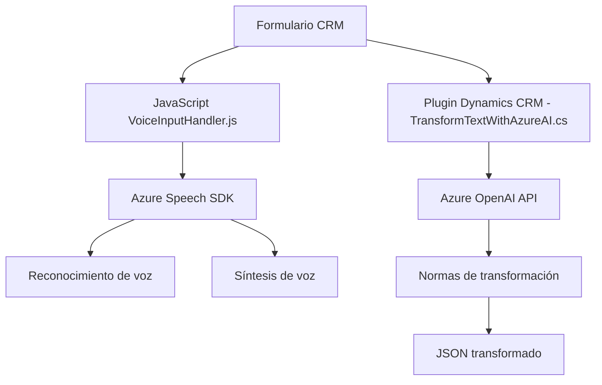

# Análisis técnico de repositorio

## Breve resumen técnico
El repositorio implementa una solución híbrida compuesta por un **frontend cliente dirigido a la interacción con formularios CRM**, un **plugin para Dynamics CRM** y servicios basados en **Azure** para funciones avanzadas como reconocimiento y síntesis de voz (Speech SDK) y transformación de texto con OpenAI.

Los principales objetivos son:
1. Capturar datos mediante voz, síntesis de texto a voz y transcripción.
2. Manipular formularios en base a comandos de voz y datos procesados.
3. Transformar texto dinámicamente en el servidor utilizando IA.

---

## Descripción de arquitectura
La arquitectura sigue un enfoque de **n capas**, incluyendo una separación clara entre los componentes:

- **Capa de presentación (Frontend)**: Responsable de las interacciones de usuario, con captura y procesamiento de voz utilizando SDK de Azure Speech.
- **Capa de negocio (Plugin)**: Gestiona la lógica de transformación de texto y manipulación de entidades en el sistema backend (Dynamics CRM). Utiliza Azure OpenAI para ofrecer capacidades de procesamiento avanzado.
- **Capa de servicios (Azure)**: Presenta una dependencia directa hacia los servicios en la nube (Azure Speech SDK y Azure OpenAI).

### Componentes detectados:
1. **Frontend (archivos JS)**: Provee funcionalidad de entrada de voz y síntesis hacia formularios. Utiliza `SpeechSDK`.
2. **Plugin de negocio (`TransformTextWithAzureAI.cs`)**: Integración con Dynamics CRM para manipulación avanzada basada en IA mediante Azure OpenAI.
3. **Servicios Azure**:
   - **Speech SDK**: Para el reconocimiento y síntesis de voz desde y hacia los formularios.
   - **OpenAI API**: Utilizado desde el plugin para procesar texto de manera avanzada.

---

## Tecnologías usadas
1. **Frontend**:
   - **Azure Speech SDK**
   - **JavaScript** para lógica y manipulación del DOM.
   - **Microsoft Dynamics CRM SDK** (en la interacción con formularios y APIs).

2. **Plugin (Backend)**:
   - **Microsoft Dynamics CRM (vía IPlugin)**: Proveer estructura y lógica a través de la API proporcionada.
   - **Azure OpenAI API**: Integración directa con servicios de IA para dinámicas avanzadas.
   - **C#** como lenguaje principal.
   - Librerías auxiliares: `Newtonsoft.Json`, `System.Text.Json`, y `System.Net.Http`.

3. **Patrones de diseño**:
   - **N capas**: Separación funcional (frontend, negocio, servicios).
   - **Callback/Event-driven Programming**: Extensivo uso en el frontend para captura dinámica.
   - **Singleton Pattern** en el plugin (factories de servicios CRM).
   - **Integración por Servicio**: En el frontend y backend mediante Azure Speech y OpenAI.

---

## Diagrama Mermaid

---

## Conclusión final
La solución presentada utiliza una **arquitectura de n capas** que combina **frontend dinámico**, **backend con lógica de negocio**, e integración con servicios de **Microsoft Azure**. Está enfocada principalmente en potenciar la interacción con formularios dentro de Dynamics CRM mediante herramientas como el reconocimiento de voz y la transformación textual usando IA avanzada.

### Principales fortalezas:
- Modularidad: Cada componente tiene responsabilidades claramente definidas.
- Uso de servicios avanzados de Azure para tareas específicas (voz, IA).
- Escalabilidad: La dependencia hacia Azure permite extender funcionalidad sin modificar los módulos principales.

### Posibles mejoras:
- Parametrización de claves y regiones en el frontend (para mayor flexibilidad y seguridad).
- Mejora de la independencia entre frontend y backend, reduciendo dependencias directas del CRM desde el cliente.

Este diseño tiene un balance sólido entre flexibilidad y funcionalidad, siendo adecuado para soluciones dinámicas en entornos empresariales como Microsoft Dynamics 365.