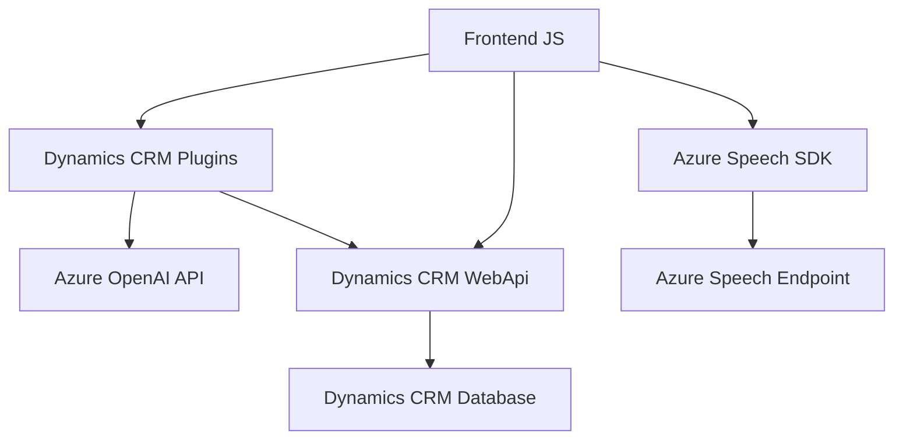

### **Resumen técnico**
Este repositorio contiene tres archivos que colaboran para brindar funcionalidades avanzadas de procesamiento de lenguaje natural y síntesis de voz. Los componentes interactúan con Microsoft Dynamics CRM y servicios de Azure, particularmente con Azure Speech SDK y Azure OpenAI, para procesamiento de formularios y transcripción/transformación de datos. El enfoque global de la solución apunta a mejorar la accesibilidad y la automatización de tareas al integrar distintas tecnologías en un entorno de CRM.

### **Descripción de arquitectura**
#### Tipo de solución
La solución es un sistema híbrido con un foco en **integración con plataformas externas** para ofrecer capacidades de IA como transformación de texto y síntesis de voz. Aunque la cantidad limitada de información dificulta discernir si se trata de un monolito o una arquitectura basada totalmente en microservicios, se puede intuir que tiene componentes que forman una **multicapa** basada en una arquitectura cliente-servidor, con el cliente como `frontend/JS` y el servidor en `Plugins/TransformTextWithAzureAI.cs`.

#### Arquitectura y patrones
1. **Arquitectura cliente-servidor**:
   - Hay dos principales componentes: `Frontend` (funcionalidades de procesamiento de voz en el lado cliente, a través de Azure Speech SDK) y `Plugins` (extensión de Dynamics CRM en .NET para integración con Azure OpenAI).

2. **Patrones comunes**:
   - **Plugin Pattern**: Usado en `TransformTextWithAzureAI.cs` como extensión de Dynamics CRM que se ejecuta en contexto de este sistema.
   - **Modularidad**: Los archivos JS dividen sus funcionalidades en pequeñas funciones autónomas que reducen el acoplamiento.
   - **API-based Communication:** La solución depende de llamadas API tanto hacia Azure Speech SDK como hacia Azure OpenAI.

3. **Acoplamiento externo**:
   - Muy ligado a sistemas de Microsoft, incluyendo Dynamics CRM, Azure Speech, y Azure OpenAI.

---

### **Tecnologías utilizadas**
1. **Javascript**:
   - Predomina en el frontend para la manipulación del DOM del formulario y la integración del Azure Speech SDK.
   - Dinámica en la carga del SDK a través de un paquete público en la URL: `https://aka.ms/csspeech/jsbrowserpackageraw`.

2. **Azure Speech SDK**:
   - Reconocimiento de voz y síntesis de texto hablado.
   - Funciones como lectura de formulario, transcripción y generación de audio.

3. **Azure OpenAI API**:
   - Procesamiento avanzado de texto a través de GPT-4.
   - Construcción de transformaciones en formato JSON, usado en el plugin de Dynamics CRM.

4. **Microsoft Dynamics CRM**:
   - Sistema central de CRM que actúa como backoffice para los datos procesados por Azure y la capa frontend.

5. **C# (.NET Framework)**:
   - Lenguaje y framework para codificar el plugin de Dynamics CRM con interfaces específicas (como `IPlugin`).

6. **Dependencia de API:** Utilización de integraciones externas como Microsoft Xrm.Sdk y Newtonsoft.Json para manejo de datos, junto con Azure Speech y OpenAI.

---

### **Diagrama Mermaid**

### **Conclusión final**
La solución está enfocada en proporcionar capacidades de accesibilidad mediante características de síntesis y reconocimiento de voz, además de manipulación automatizada de datos textuales usando procesamiento de lenguaje natural. La arquitectura es cliente-servidor con una estructura modular y grandes dependencias de APIs externas como Azure Speech SDK y Azure OpenAI. La integración con Dynamics CRM permite una relación directa entre el frontend y el backend. 

Sin embargo, dado el elevado acoplamiento con Azure y Dynamics CRM, la flexibilidad de la solución podría disminuir si se requiere integrar con otras plataformas o cambiar el proveedor de servicios de IA.