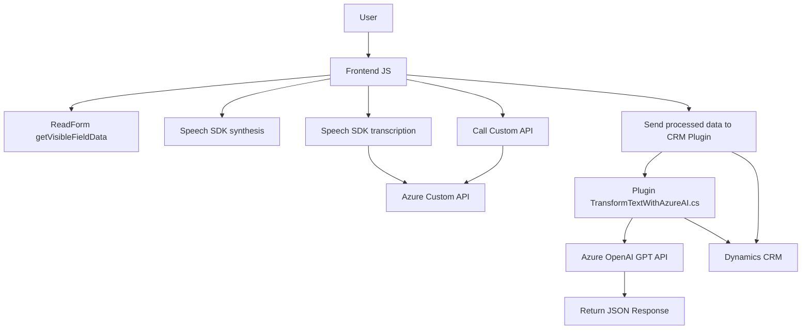

### Breve Resumen Técnico

La solución presentada consta de diferentes componentes que incluyen un **frontend** desarrollado principalmente en **JavaScript**, comunicándose con servicios externos como **Azure Speech SDK** para síntesis y captación de voz, y un **plugin backend** para **Microsoft Dynamics CRM** que utiliza **Azure OpenAI** para procesamiento avanzado de texto con inteligencia artificial. Se observan funcionalidades como lectura de formularios, interacción con APIs externas, y datos dinámicos vinculados a formularios de CRM.

---

### Descripción de la Arquitectura

1. **Arquitectura General**
   - Basada en un enfoque **n-capas** debido a la separación de responsabilidades entre frontend, backend y servicios externos.
   - El sistema utiliza una arquitectura de integración con APIs externas para funcionalidades específicas, como procesamiento de voz y texto.

2. **Frontend**
   - Es modular y basado en consumo de servicios. Cada función tiene una responsabilidad definida, como sintetizar texto, procesar datos de formularios y reconocer voz.
   - Utiliza llamadas dinámicas a SDKs (Azure Speech SDK) y eventos de asincronía.

3. **Backend**
   - Utiliza un plugin que implementa el patrón estándar de integración con Dynamics CRM (`IPlugin`) y envía datos a Azure OpenAI para inteligencia artificial avanzada.
   - Maneja lógica específica de negocio relacionada con la transformación de texto y su almacenamiento en CRM.

4. **Patrones**
   - **Facade**: En el frontend, simplifica el uso de SDKs externos (Azure Speech SDK).
   - **Plugin Pattern** en el backend, para integración lógica con Dynamics CRM.
   - **External API Integration** en ambos componentes, con Azure OpenAI para procesamiento de texto y Azure Speech SDK para voz.

---

### Tecnologías Usadas

- **Frontend**:
  - JavaScript (modular, funciones organizadas según responsabilidades).
  - Azure Speech SDK (reconocimiento y síntesis de voz).
  - Dinámicas de asincronía y carga mediante eventos.

- **Backend**:
  - C# en Microsoft Dynamics CRM plugin (`IPlugin`).
  - Azure OpenAI (procesamiento de texto con GPT API).
  - Newtonsoft.Json y System.Text.Json para manipulación de JSON.
  - API REST para comunicación externa.

- **Comunicación Externa**:
  - Uso de servicios de Cloud (Azure Speech y Azure OpenAI).
  - HTTP Requests para integrar inteligencias en tiempo real.

---

### Diagrama **Mermaid**

---

### Conclusión Final

La solución implementa una integración eficaz de tecnologías de Azure (Speech SDK y OpenAI) con una capa de frontend modular y un backend plugin preparado para Microsoft Dynamics CRM. 

#### Puntos Fuertes:
1. **Modularidad y Desacoplamiento**: Cada componente tiene una responsabilidad clara y está diseñado para interactuar con servicios externos.
2. **Uso de Tecnologías Avanzadas**: Los SDKs de Azure y OpenAI capacitan el sistema para manejar voz y texto con inteligencia avanzada.
3. **Arquitectura Flexible**: Basada en n-capas y capacidades de integración, lo que facilita la extensión con otros servicios en el futuro.

#### Áreas de Mejora:
- Centralizar configuraciones estáticas (como claves de API o regiones Azure) para facilitar el mantenimiento.
- Optimizar el manejo de errores y excepciones, especialmente en las integraciones con APIs externas.
- Formalizar el esquema MVC en el frontend para mayor estandarización.

En resumen, esta arquitectura resulta adecuada para el caso de uso de procesamiento y síntesis de voz, así como transformación avanzada de datos en un contexto CRM. El diseño eligió correctamente los frameworks y herramientas según los objetivos funcionales.