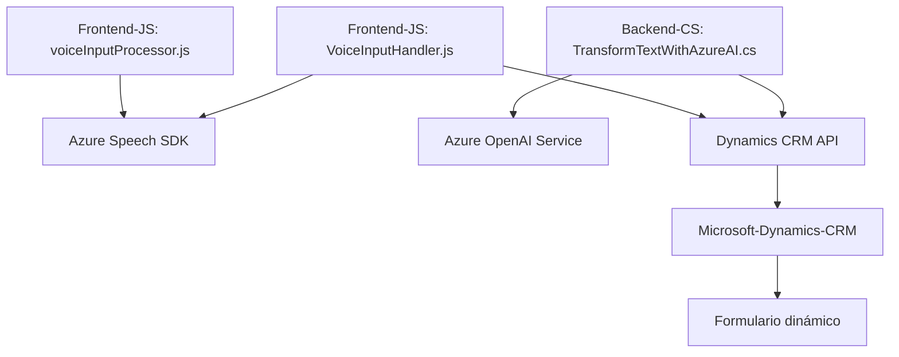

### Resumen técnico

Los archivos proporcionan una solución integrada para la manipulación de formularios en Microsoft Dynamics CRM con capacidades avanzadas como reconocimiento de voz, síntesis de audio, y transformación de texto mediante inteligencia artificial externa (Azure OpenAI). El enfoque combina funcionalidades frontend y backend para optimizar la experiencia del usuario al interactuar con los formularios.

---

### Descripción de arquitectura

La solución sigue patrones de arquitectura distribuidos con las siguientes características principales:
1. **Arquitectura de n capas**:
   - **Frontend (JS):** Implementa la interfaz de usuario y la interacción directa con el formulario.
   - **Backend (C# Plugin):** Maneja lógica empresarial avanzada y gestiona la comunicación con APIs externas de Azure OpenAI.
   - **Servicios externos:** Azure Speech SDK y Azure OpenAI ofrecen capacidades de síntesis de voz y transformación avanzada del texto.
   
2. **Modularidad:** Los componentes están bien separados en frontend (procesos de formularios, reconocimiento y síntesis de voz) y backend (lógica del plugin para interacción en Dynamics).

3. **Integración API externa:** Servicios de Azure son el núcleo funcional de la solución. Especialmente los SDK (Speech y OpenAI) ofrecen una capa de abstracción para las operaciones avanzadas.

4. **Carga dinámica de dependencias:** El frontend implementa carga dinámica del SDK necesario para mejorar la modularidad y minimizar la carga inicial.

---

### Tecnologías utilizadas

#### **Frontend**:
1. **JavaScript**:
   - Implementa la lógica para reconocimiento, síntesis de voz y manipulación dinámica de formularios.
2. **Azure Speech SDK**:
   - Utilizado para convertir texto a audio y reconocimiento de voz.
3. **Microsoft Dynamics CRM API (Xrm.WebApi)**:
   - Manipulación y actualización de datos en los formularios.

#### **Backend (Plugins)**:
1. **C# con Dynamics CRM Plugin**:
   - Extensión para lógica de negocio en el servidor CRM.
2. **Azure OpenAI Service**:
   - API de transformación avanzada de texto mediante inteligencia artificial.
3. **Librerías estándar de .NET**:
   - `System.Net.Http`, `Newtonsoft.Json`, entre otras, para envío y recepción de datos.

---

### Dependencias o componentes externos

#### **Externos**:
- **Azure Speech SDK**:
  - Reconocimiento de voz y síntesis de audio.
- **Azure OpenAI API**:
  - Transformación avanzada de texto con capacidades IA.
- **Dynamics CRM API**:
  - Conexión CRUD para datos del CRM.
- **Librerías externas**: 
  - `Newtonsoft.Json`.

#### **Internas**:
- Formulario dinámico de Microsoft Dynamics CRM (`executionContext`, `formContext`).

---

### Diagrama Mermaid

---

### Conclusión final

La solución combina arquitectura de n capas con integración API externa para lograr una experiencia avanzada en Microsoft Dynamics CRM. Las funcionalidades de transformación de texto con IA (Azure OpenAI) y de síntesis/reconocimiento de voz con Azure Speech SDK garantizan accesibilidad y flexibilidad. La modularidad y el uso adecuado de SDKs posicionan este sistema como una solución escalable y extensible.