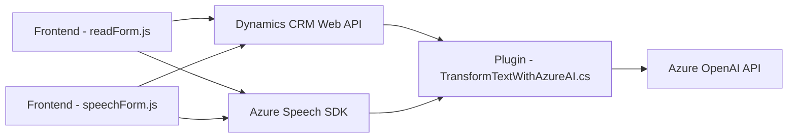

### Breve resumen técnico

El repositorio parece ser un conjunto de soluciones que integran dinámicamente tecnologías relacionadas con el reconocimiento de voz, síntesis de texto a voz, procesamiento de transcripciones, y transformación de texto utilizando servicios de **Azure** como **Speech SDK** y **OpenAI API**. Todos los archivos están orientados a trabajar dentro del ecosistema y formularios dinámicos de **Microsoft Dynamics CRM**.

---

### Descripción de arquitectura

1. El repositorio tiene una arquitectura **modular** con diferentes componentes (Frontend, Backend y Plugins) que se integran como módulos especializados. Específicamente:
   - **Frontend** trabaja con Dynamics formulando interfaces y lógica para reconocimiento de voz y síntesis de voz.
   - **Plugins** integran procesamiento con Azure OpenAI para transformar texto o transcripciones, ejecutándose directamente como eventos dentro de Microsoft Dynamics CRM.
   
2. El uso de servicios externos como **Azure Speech SDK** y **Azure OpenAI API** implica una arquitectura que acopla varias soluciones pasarela como APIs y SDKs. No es monolítico, ya que se separan los módulos en distintos puntos de responsabilidad bajo una arquitectura **orientada a servicios**.

3. De acuerdo con el diseño y su implementación:
   - La arquitectura sigue principalmente **n cap layers** (vista, lógica y servicios) con integración a APIs para tareas específicas.
   - En el caso del plugin (C#), podría clasificarse como **microservicio** debido a su enfoque aislado y conectividad REST hacia Azure OpenAI.

---

### Tecnologías usadas

1. **Frontend**:
   - **JavaScript**: Lenguaje principal para la lógica de reconocimiento de voz y síntesis de datos en formularios dinámicos.
   - **Azure Speech SDK**: Usado para TTS (Text to Speech) y STT (Speech to Text).

2. **Plugin**:
   - **C#**: Implementación de un controlador dinámico para tareas específicas de procesamiento textual.
   - **Azure OpenAI API**: Integración del modelo GPT-4 mediante solicitudes HTTP.
   - **Microsoft Dynamics SDK**: Comunicación e integración directa con el entorno CRM.

3. **Generales**:
   - **REST API**: Llamadas externas a Azure para IA y OpenAI.
   - **HTML DOM Manipulation**: Creación dinámica de elementos dentro de la interfaz.
   - **JSON**: Serialización y manipulación de datos estructurados.

---

### Diagrama Mermaid válido para GitHub

---

### Conclusión final

El repositorio es un ejemplo sólido de una solución basada en la integración de servicios inteligentes de **Azure** dentro de un ecosistema corporativo como **Microsoft Dynamics CRM**. Aprovecha tanto tecnologías orientadas al frontend (JavaScript) como microservicios en plugins (C#) para ampliar la funcionalidad empresarial, incluyendo reconocimiento y síntesis de voz, así como transformación inteligente de texto con IA.

En términos de arquitectura:
- Predomina una estructuración de **n capas**, donde cada capa tiene una responsabilidad bien definida.
- Se observa acoplamiento con servicios externos como Azure Speech SDK y OpenAI API, lo cual puede exigir configuración e infraestructura específica.
