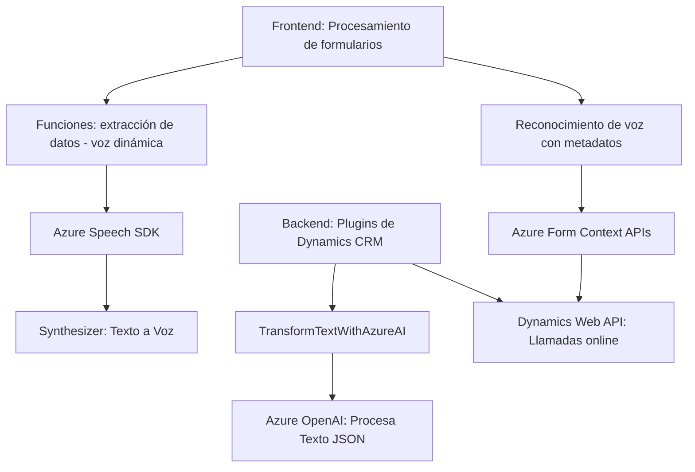

### Resumen técnico
El repositorio describe una solución integrada basada en tecnologías de frontend (JavaScript), servicios de reconocimiento de voz y síntesis de texto (Azure Speech SDK), e integración avanzada con Dynamics CRM utilizando un plugin en C#. La funcionalidad combina interacción de formularios y datos con servicios de inteligencia artificial de Azure OpenAI.

---

### Descripción de arquitectura
La arquitectura del sistema indica una estructura **modular de n capas** que combina:
1. **Frontend**: Facilita la interacción del usuario para hablar o convertir texto en voz, y viceversa, además de manejar campos del formulario dinámicamente. Se basa en JavaScript y se conecta con servicios externos (Azure Speech SDK).
2. **Backend o Plugins**: Logran una integración directa con Dynamics 365 mediante plugins especializados en C#. Estos plugins amplían la funcionalidad nativa del CRM, conectándose con Azure OpenAI para transformar texto según reglas específicas.
3. **Externo**: Servicios como Azure Speech y Azure OpenAI actúan como elementos de la capa externa que proveen capacidades de IA.

Se trata de una arquitectura **distribuida**, donde los módulos de negocio (Dynamics CRM y plugins) están integrados con servicios de inteligencia y están ligados a un frontend dinámico. Esto implementa una variación híbrida entre lo modular y dependencias externas.

---

### Tecnologías usadas
1. **Frontend**:
   - **JavaScript**: Para lógica de interacción y procesamiento de formularios.
   - **Azure Speech SDK**: Para reconocimiento de voz y síntesis de texto a voz.
   - **Dynamics 365 Context APIs**: Para manipular datos de formularios desde el contexto del CRM.

2. **Backend**:
   - **C#**: Usado en el plugin para extender funciones del CRM.
   - **Dynamics 365 API**: Interacción con datos del CRM.
   - **Azure OpenAI Service**: Procesamiento avanzado de texto mediante modelos GPT.

3. **Dependencias externas**:
   - **Azure Speech SDK** (JavaScript): Para voz y reconocimiento.
   - **Azure OpenAI**: IA potente para interpretación y generación de datos textuales.
   - **HTTP Services** (C#): Llamadas REST hacia recursos de Azure en los plugins.

---

### Diagrama Mermaid

---

### Conclusión final
Este sistema es una implementación híbrida de **n capas**, donde el frontend basado en JavaScript interactúa con una capa externa (Azure) para facilitar reconocimiento, síntesis de voz y manipulación dinámica de formularios. Por otro lado, los plugins escritos en C# funcionan como capa de backend, extendiendo las capacidades de Dynamics CRM al integrar servicios de IA avanzados como Azure OpenAI. El uso de tecnologías de Microsoft ofrece cohesión y escalabilidad, sin dejar de lado la modularidad y flexibilidad en la arquitectura.