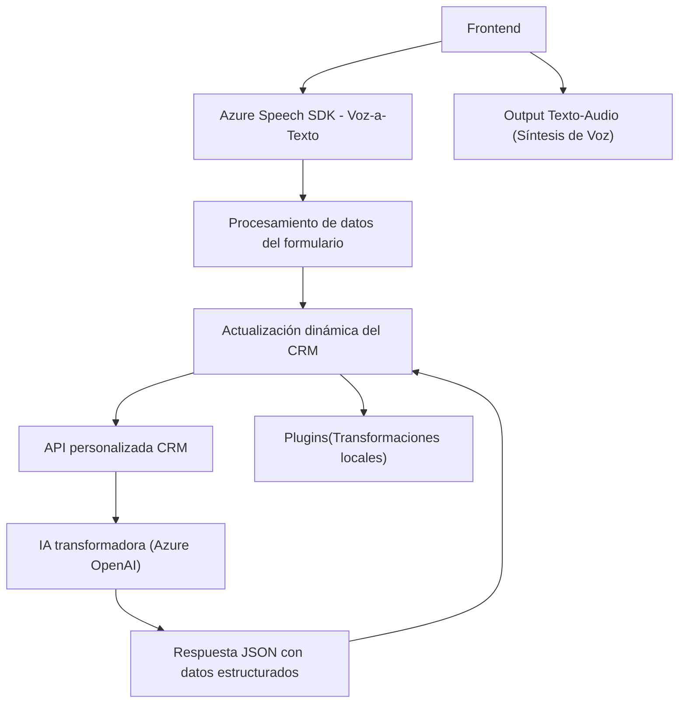

### Breve resumen técnico
Los archivos analizados corresponden a un repositorio que combina integraciones de backend, frontend y plugins con funcionalidad centrada en formularios de Dynamics CRM. Utilizan Azure Speech SDK para reconocimiento y síntesis de voz, además de Azure OpenAI para transformaciones avanzadas del texto. Está diseñado para enriquecer las aplicaciones de CRM mediante herramientas de interacción de voz e inteligencia artificial profunda.

---

### Descripción de arquitectura
1. **Frontend:**
   - JavaScript se utiliza para interactuar con la interfaz del CRM, capturar voz, procesar transcripciones y actualizar formularios en tiempo real a través del SDK y APIs externas.
   
2. **Backend/Plugins:**
   - Un plugin C# extiende la funcionalidad del CRM con procesamiento de texto basado en Azure OpenAI. Este sigue una arquitectura basada en eventos (integración de Dynamics CRM) y actúa como puente con el microservicio de Azure.

3. **Patrones de arquitectura:**
   - **Monolito extendido:** Aunque el sistema tiene integraciones con APIs externas (Azure Speech SDK y Azure OpenAI), su arquitectura está centralizada y depende del contexto CRM.
   - **Plugins:** Enfocados en ejecutar transformación y tareas específicas del flujo de trabajo del CRM.
   - **Código modular:** Funciones aisladas para tareas específicas, como reconocimiento de voz o actualización de formularios.

---

### Tecnologías usadas
1. **Frontend (JavaScript):**
   - Azure Speech SDK: Control de síntesis y reconocimiento de voz.
   - Dynamics CRM JavaScript API (`formContext`, `Xrm.WebApi`): Acceso y manipulación de formularios.
   - DOM API: Dinamismo en carga de dependencias y actualización de datos.
   - JSON: Formateo y procesamiento de datos.

2. **Backend (C# Plugin):**
   - Dynamics CRM SDK (`IPluginExecutionContext`, etc.): Integración y manipulación de eventos en la plataforma CRM.
   - Azure OpenAI: Transformación de texto de entrada.
   - System.Net.Http y System.Text.Json: Peticiones HTTP y serialización JSON.

---

### Dependencias o componentes externos
1. **Azure Speech SDK:** Biblioteca cargada dinámicamente para reconocimiento y síntesis de texto a voz.
2. **Azure OpenAI API:** Servicios de inteligencia artificial para transformación de texto.
3. **Dynamics CRM SDK:** Herramientas de desarrollo para el entorno Microsoft Dynamics CRM.
4. **HTTP Libraries:** En C#; para integraciones con la API de Azure OpenAI.

---

### Diagrama Mermaid

---

### Conclusión final
Este repositorio implementa una solución integral que potencia el manejo de datos en formularios de Microsoft Dynamics CRM usando reconocimiento y síntesis de voz con Azure Speech SDK, acompañado de procesamiento del lenguaje natural mediante Azure OpenAI. La arquitectura es predominantemente monolítica, enfocada en Dynamics CRM, aunque utiliza microservicios externos para extender funcionalidad. Es técnicamente sólido, pero la inclusión de credenciales en el código es un riesgo considerable en términos de seguridad frente al acceso no autorizado. Añadir un sistema seguro de manejo de secretos como Azure Key Vault sería sumamente recomendable.