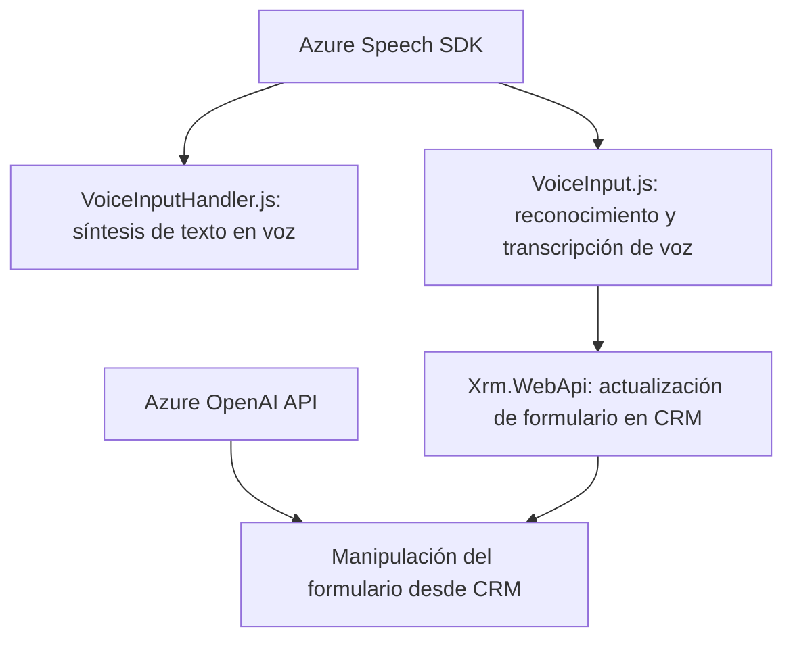

### Breve Resumen Técnico
El repositorio describe una solución integrada que combina reconocimiento de voz, procesamiento de texto y manipulación de formularios en un sistema de Microsoft Dynamics CRM. Se apoya en servicios externos como Azure Speech SDK y Azure OpenAI para manejar la entrada de voz, realizar transformaciones avanzadas de texto y actualizar datos estructurados en el CRM. La arquitectura mezcla patrones front-end y back-end con modularidad y orquestación de servicios externos.

---

### Descripción de Arquitectura
La solución tiene una arquitectura híbrida orientada a servicios:
1. **Componentes del Frontend**: Utilizan lógica avanzada para reconocimiento de voz (VoiceInput.js), síntesis de texto en voz (VoiceInputHandler.js), y procesamiento en tiempo real. Está diseñado como una **aplicación de cliente enriquecido** (Rich Client).
2. **Plugin en CRM**: Opera como un componente especializado para transformación de texto mediante Azure OpenAI, siguiendo el patrón **Plugin Architecture** de Dynamics CRM y **Service-Oriented Architecture**.
3. **Servicios externos**: El SDK de Azure Speech para síntesis/reconocimiento y aplicaciones con Azure OpenAI API definen un patrón **Service Architecture**.

Por tanto, la solución es una aplicación híbrida. Mientras el **front-end** utiliza patrones modulares y event-driven, el CRM integra una capa de servicios (comunicación dinámica con Azure). Aunque cada módulo es autónomo, están conectados como parte de una solución que se acerca al enfoque de arquitectura **n-capas** en el CRM.

---

### Tecnologías Usadas
#### **Frontend**
- **JavaScript**: Lógica principal para manipulación del SDK, formularios y programación event-driven.
- **Azure Speech SDK**: Implementación en cliente para reconocimiento y síntesis de voz.
- **Xrm.WebApi**: API nativa de Dynamics CRM para manipular datos del formulario.

#### **Backend (CRM Plugin)**
- **C# con .NET**: Desarrollo del plugin mediante el SDK de Dynamics CRM.
- **Azure OpenAI API**: Externalización del procesamiento avanzado de texto.
- **Newtonsoft.Json**: Procesamiento de estructuras JSON.
- **HttpClient**: Comunicación con la API de Azure.

#### **Patrones**
- Modularización: Funciones específicas separadas por preocupación.
- Event-Driven: Respuesta ante reconocimiento/transcripción y API callbacks.
- Service-Oriented Architecture: Conexión constante con servicios de Azure.
- Plugin Architecture: Cumple estándares de extensión de Dynamics CRM.

---

### Diagrama Mermaid (100 % compatible con GitHub Markdown)

---

### Conclusión Final
La solución descrita constituye una arquitectura integrada de reconocimiento de voz, procesamiento avanzado de texto mediante AI y manipulación del CRM en Microsoft Dynamics. Es una solución **orientada a servicios**, altamente modular, diseñada para trabajar tanto en cliente mediante JavaScript como en backend a través del plugin. Las dependencias con Azure subrayan su capacidad para aprovechar los servicios en la nube de Microsoft y aplicarlos directamente en ejecución del cliente y en procesos internos del CRM.

Desafíos potenciales incluyen:
1. **Dependencia de servicios externos**: Uso intensivo del ecosistema Azure podría generar fallas ante interrupciones en estos servicios.
2. **Performance y tiempos de respuesta**: Especialmente en lógica de plugins que depende de múltiples llamadas a APIs remotas.
3. **Gestión y seguridad de las claves de API en ambos entornos** (cliente y servidor).

Aunque la arquitectura brinda escalabilidad, integrabilidad y modularidad, sería ideal explorar técnicas avanzadas, como mecanismos para eventos asíncronos en el cliente y procesos más optimizados en el backend.