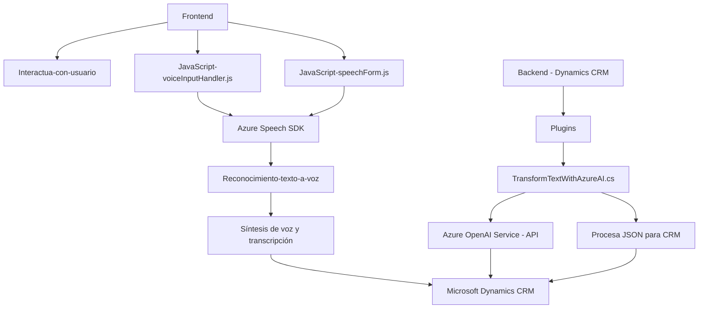

### Breve resumen técnico
El repositorio analiza la integración entre módulos de frontend y backend, enfocándose en una solución que unifica el reconocimiento de voz (text-to-speech/speech-to-text) con servicios de Microsoft Dynamics CRM y Azure AI. Especialmente se destacan el uso de Azure Speech SDK y el servicio Azure OpenAI para tareas de reconocimiento, síntesis de voz y procesamiento texto-a-estructurado. Las funcionalidades están diseñadas para optimizar procesos dentro de entornos CRM.

---

### Descripción de arquitectura
La arquitectura propuesta está basada en una **multi-capa**, donde encontramos:
1. **Frontend-web** para manejar interacciones y eventos relacionados al usuario (e.g., reconocimiento de voz, síntesis de texto hablado).
2. **Microservicios externos**, representados por el uso del Azure Speech SDK (para integración con reconocimiento/síntesis de voz) y Azure OpenAI Service.
3. **Plugins backend**, mediante `TransformTextWithAzureAI.cs`, que implementa una estructura típica de plugin en Microsoft Dynamics CRM, conectándose a módulos CRM y disparadores específicos.

Predomina una separación de preocupaciones mediante patrones como **capa de servicios** y **modularidad**, reforzando escalabilidad en el diseño de integración.

---

### Tecnologías y frameworks usados
1. **Frontend**:
   - JavaScript: Lidia con eventos del DOM y la interacción entre formularios.
   - Azure Speech SDK: Maneja reconocimiento y síntesis de voz.
2. **Backend**:
   - Microsoft Dynamics CRM SDK: Manejo del estándar de plugins y eventos.
   - Azure OpenAI Service (GPT-4): Procesa texto transformando información según reglas predefinidas.
   - Dependencias .NET: Manejo de solicitudes HTTP (`System.Net.Http`) y JSON (`Newtonsoft.Json.Linq`, `System.Text.Json`).
3. **Patrones**:
   - Modularidad: Asegura componentes desacoplados y fáciles de reutilizar.
   - Plugin-based architecture: Facilita extensibilidad en Dynamics CRM al vincular funcionalidad personalizada.
   - Event-driven architecture: Interacción dependiente de eventos en ambos niveles.

---

### Diagrama **Mermaid** válido para GitHub

---

### Conclusión final
Este repositorio plantea una solución basada en reconocimiento de voz, procesamiento de texto con AI y extensibilidad CRM. Su diseño modular asegura una excelente separación de responsabilidades, mientras que el uso de servicios como Azure Speech SDK y OpenAI garantiza escalabilidad y capacidad de procesamiento avanzada. Sin embargo, ciertas áreas podrían mejorar, como la gestión de excepciones y la configuración dinámica para mayor seguridad en claves y endpoints.

Recomendaciones sugeridas:
1. Implementar configuraciones dinámicas para gestionar claves API y endpoints.
2. Introducir mayor tolerancia a errores en interacción con servicios externos.
3. Ampliar casos de prueba tanto para frontend como para el plugin.