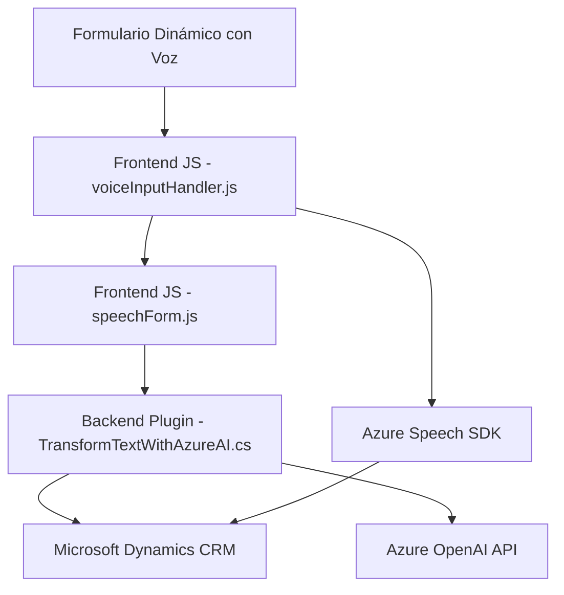

# Análisis y Descripción Detallada

## Breve Resumen Técnico
El repositorio analizado presenta una solución orientada a la interacción entre usuarios y formularios mediante procesamiento de voz (Azure Speech SDK) y transformación de texto con inteligencia artificial (Azure OpenAI). Consta de tres archivos clave:
1. **Frontend:** Scripts en JavaScript enfocados en manejar formularios y automatizar la interacción por voz dentro de entornos web o Dynamics CRM.
2. **Backend/Plugins:** Código en C# que utiliza la interfaz de Plugins de Dynamics CRM para consumir APIs externas (Azure OpenAI) y transformar texto conforme a reglas específicas.
3. **Dependencias Entre Capas:** La solución está diseñada para integrar servicios externos de Azure y facilitar la manipulación de datos dinámicos.

---

## Descripción de Arquitectura
La solución sigue **una arquitectura basada en n capas**, dividida principalmente en:
1. **Capa de Presentación (Frontend):** Scripts para interacción de usuarios con el formulario basado en voz.
2. **Capa de Lógica de Negocio:** Controladores en JavaScript para manejar el flujo de datos dinámicos y solicitudes dependientes de APIs.
3. **Capa Api-Externa/Servicios:** Plugins en C# con integración directa a Microsoft Dynamics CRM, que conectan el sistema de CRM a servicios de Azure OpenAI.

Adicionalmente, hay un enfoque claro hacia **modularización**, donde cada función y archivo aborda una preocupación específica, siguiendo principios del **single responsibility**.

---

## Tecnologías y Frameworks Usados
1. **Frontend:**
   - **JavaScript:** Enfocado en manipulación de formularios y flujo de entrada/salida basada en voz.
   - **Azure Speech SDK:** Utilizado para la transformación de voz en texto y síntesis de voz.
   - **Dynamics CRM Context API (Xrm.WebApi):** Para consumo dinámico de APIs del CRM en tiempo real.

2. **Backend/Plugins:**
   - **C#:** Para implementar plugins como parte de Dynamics CRM.
   - **Microsoft Dynamics SDK:** Para integración directa con el entorno CRM.
   - **Azure OpenAI API (GPT-4):** Para procesamiento de texto basado en inteligencia artificial.
   - **JSON Libraries:** Uso de `Newtonsoft.Json` y `System.Text.Json` para manipulación estructurada de datos.

---

## Patrones Detectados
1. **Patrón n Capas:**
   - Separación de lógica de negocio (JavaScript), servicios (Azure API), y presentación (formularios dinámicos).
2. **Modularización:** Cada componente se especializa en un conjunto reducido de tareas.
3. **Callback y Event Handling:** Amplio uso de callbacks en integración con SDK externos como Azure Speech SDK y manejo de eventos.
4. **Microservicios:** En el caso de los plugins, cada método opera como un microservicio autónomo para interactuar con Azure OpenAI.
5. **Dependencia a Servicios de Azure:** Explotación de Azure Speech y OpenAI como servicios de AI externalizados.

---

## Diagrama Mermaid

---

## Conclusión Final
La solución muestra una arquitectura **modular y orientada a servicios**, con integración de tecnologías cloud como **Azure Speech SDK** y **Azure OpenAI API**. Está diseñada para mejorar la interacción con formularios dinámicos mediante reconocimiento y síntesis de voz, así como el procesamiento avanzado de texto utilizando inteligencia artificial.

La separación funcional entre frontend y backend permite escalabilidad y adaptabilidad. Sin embargo:
1. **Atención a seguridad:** Las credenciales de Azure deben ser gestionadas mediante variables de entorno.
2. **Compatibilidad en entornos locales:** Los servicios de voz y AI pueden depender de configuraciones específicas en Azure y CRM, lo que implica adaptaciones conforme al ambiente.

En general, es una solución eficaz para automatizar tareas rutinarias en sistemas empresariales como Dynamics CRM.