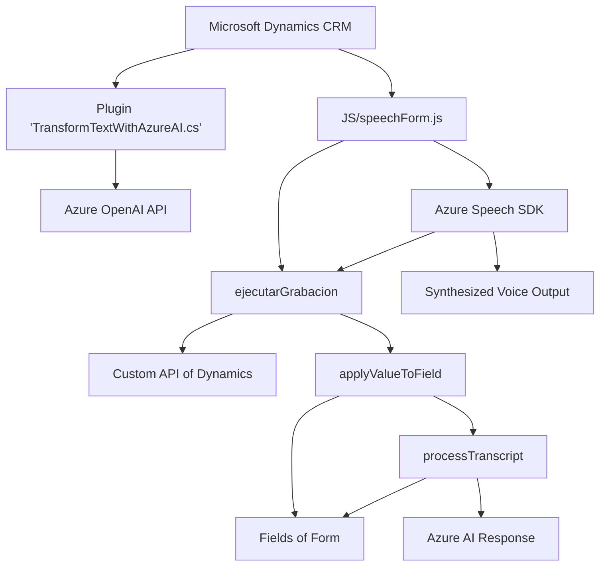

### Breve resumen técnico:

El repositorio presenta una solución de software que integra diversas tecnologías para desarrollar un sistema de interacción mediante voz y texto con formularios dinámicos en un entorno de Microsoft Dynamics CRM. Utiliza el **Azure Speech SDK** para síntesis y reconocimiento de voz, **Azure OpenAI API** para procesamiento de lenguaje natural, y plugins de **Microsoft Dynamics CRM** para extensión de funcionalidad.

---

### Descripción de arquitectura:

1. **Tipo de solución:**  
   - Esta es una solución híbrida que utiliza una combinación de un **frontend modular** en **JavaScript** y **plugins (back-end)** escritos en **C#** para la plataforma **Microsoft Dynamics CRM**. Se integra con servicios externos, principalmente **Azure Speech SDK** y **Azure OpenAI API**, para incorporar inteligencia artificial y procesamiento de voz avanzada.

2. **Tipo de arquitectura:**  
   - El diseño es de **arquitectura orientada a servicios**, con aspectos que se alinean con un modelo de **n capas**. La lógica se divide en tres capas principales:  
     1. **Interfaz de usuario:** Archivo `JS/speechForm.js` y `JS/voiceInputHandler.js` que administran la interacción con el usuario.  
     2. **Proceso y validación de datos:** Funciones en `JS` para validar campos y entidades dinámicas en los formularios, así como ejecutar la lógica de reconocimiento de voz y síntesis.  
     3. **Integración con servicios externos:** Plugins (`.cs`) que conectan la aplicación con **Azure OpenAI API** y estructuras de mensajes entre el frontend y backend.

---

### Tecnologías y patrones detectados:

1. **Tecnologías:**
   - **Frontend:** JavaScript (Node.js-like structure).
   - **Backend:** C# (Microsoft Dynamics CRM Plugin & .NET Framework).
   - **Cloud SDKs:** **Azure Speech SDK** y **Azure OpenAI API**.
   - **HTTP requests:** Para comunicación con Azure APIs y demás microservicios.

2. **Frameworks:**
   - **Microsoft Dynamics CRM SDK:** Para gestion de datos y operaciones dentro del entorno CRM.
   - **Newtonsoft.Json** para el manejo de JSON.
   - **Azure SDKs** para IA y voz.

3. **Patrones observados:**
   - **Fachada:** El frontend se abstrae en módulos específicos (`readForm.js`, `speechForm.js`) que encapsulan la funcionalidad del SDK de Azure Speech y la lógica de procesamiento.
   - **Inyección de dependencias:** Configuración dinámica de SDKs y APIs externas como parámetros.
   - **Separación de responsabilidades:** Cada archivo (o módulo/función) tiene una tarea específica (ej. extracción de datos visibles, reconocimiento de voz, síntesis).
   - **Encadenamiento de procesos:** Las funciones se ensamblan usando jerarquías de dependencias y múltiples funciones `async` y promesas.

---

### Dependencias externas y componentes:

1. **Servicios externos y APIs:**
   - Azure Speech SDK: Utilizado tanto para reconocimiento como síntesis de voz.
   - Azure OpenAI API (GPT-4o): Para transformación avanzada de textos.
   - Microsoft Dynamics Custom API: Para integrar la funcionalidad de IA con los datos y formularios del CRM.

2. **Librerías externas:**
   - `Newtonsoft.Json`: Para manejo de JSON en el plugin de Dynamics (.NET).
   - Dynamically loaded Azure Speech SDK from: `https://aka.ms/csspeech/jsbrowserpackageraw`.

3. **Otros componentes:**
   - Microsoft Dynamics-specific APIs (`Xrm.WebApi.online.execute`, `Xrm.WebApi.retrieveMultipleRecords`) para conexión y operaciones dinámicas con los formularios/entidades.
   - Configuration-sensitive elements: Azure API Key and region must be securely handled for the services to function correctly.

---

### Diagrama Mermaid (estructural):

---

### Conclusión final:

La solución representa un sistema orientado al uso de **inteligencia artificial**, **procesamiento de voz** y **modularización de formularios dinámicos** para mejorar la experiencia de los usuarios en un entorno empresarial basado en Microsoft Dynamics CRM. La arquitectura sigue un modelo de **n capas** apoyado por **servicios en la nube** para la IA y el reconocimiento de voz.

La integración de **Azure Speech SDK** para habilitar synthesis y recognition, junto con la API de **Azure OpenAI** para la personalización de mensajes, sugiere una intención de proporcionar una interacción avanzada y flexible. El uso de plugins de Dynamics y APIs personalizadas asegura que las modificaciones sean alineadas a los requisitos del CRM. Sin embargo, garantizar la seguridad en el manejo de claves y datos sensibles es crítico.