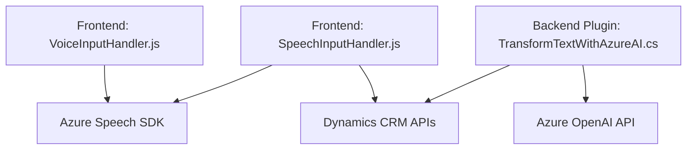

### Breve resumen técnico
Este repositorio contiene múltiples archivos que implementan funcionalidades para integrar soluciones basadas en voz, automatización de formularios en **Microsoft Dynamics 365 CRM**, y casos de uso con IA mediante **Azure Speech SDK** y **Azure OpenAI API**. La solución parece estar diseñada como una aplicación basada en la interacción por voz y texto con un backend de CRM.

### Descripción de arquitectura
1. **Tipo de solución:**
   - La solución parece ser una combinación de **frontend web** (en JavaScript, desplegado para una interfaz de usuario) y una **backoffice API/plugin** (en C# para el backend de Dynamics CRM) que conecta con servicios externos como **Azure AI** y Azure Speech SDK.
   - Aunque el plugin está en un entorno monolítico (Dynamics CRM), el código externo (frontend y plugins) utiliza servicios cloud en un estilo cercano a **arquitectura microservicios**, ya que consume servicios remotos alojados en Azure.

2. **Estructura del repositorio:**
   - Los archivos están organizados en carpetas según el contexto que atienden, por ejemplo, para el frontend (`FRONTEND/JS`) y los plugins de backend (`Plugins/TransformTextWithAzureAI.cs`).

3. **Patrones y enfoques de arquitectura usados:**
   - **Estructura modular:** Cada archivo está diseñado definiendo funciones o clases independientes para tareas específicas.
   - **Microservicios y APIs:** La solución hace uso intensivo de servicios externos, como el SDK de Azure Speech para texto a voz y la API de Azure OpenAI para el procesamiento inteligente de texto.
   - **Plug-in Pattern:** Aprovecha el pipeline nativo del CRM para ejecutar plugins en eventos específicos.
   - **Facade Pattern:** En el frontend, las llamadas al SDK de Azure Speech están abstraídas en funciones específicas que sirven de intermediarias entre el cliente y el SDK (e.g., `ensureSpeechSDKLoaded`).
   - **Service Layer:** Las funciones de frontend actúan como una capa de servicio que centraliza el manejo de datos y el consumo de servicios externos.

### Tecnologías usadas
1. **Frontend (JavaScript):**
   - **Azure Speech SDK:** Para síntesis y reconocimiento de voz.
   - **Dynamics 365 CRM SDK:** Para interactuar con formularios y campos del CRM.

2. **Backend (C#):**
   - **Microsoft Dynamics 365 SDK:** Implementación de plugins en el pipeline del CRM.
   - **Azure OpenAI API (GPT-4):** Procesa texto según normas personalizadas.
   - Librerías .NET para operaciones web:
     - `System.Net.Http`
     - `Newtonsoft.Json.Linq` y `System.Text.Json` para manejo de JSON.

### Dependencias o componentes externos
1. **Azure Speech SDK:** Usado en el frontend para texto a voz y reconocimiento de voz.
2. **Dynamics 365 CRM APIs:** Manipulación de estructuras del formulario, campos visibles y valores.
3. **Azure OpenAI API:** Para transformar texto con inteligencia artificial en el backend (plugin `TransformTextWithAzureAI.cs`).
4. **HttpClient y Newtonsoft.Json:** Para hacer peticiones y procesar la respuesta JSON de la API.

### Diagrama Mermaid válido para GitHub

### Conclusión final
La arquitectura de esta solución es una combinación de un **sistema modular** con integración hacia servicios externos. Aunque no es estrictamente una arquitectura de microservicios, incluye elementos de servicio distribuido para consumir funcionalidades de Azure Speech y OpenAI con responsabilidad separada. Es parte de un ecosistema CRM que automatiza tareas en formularios mediante inteligencia artificial y voz, lo que es ideal para flujos de trabajo integrados con Microsoft Dynamics 365.