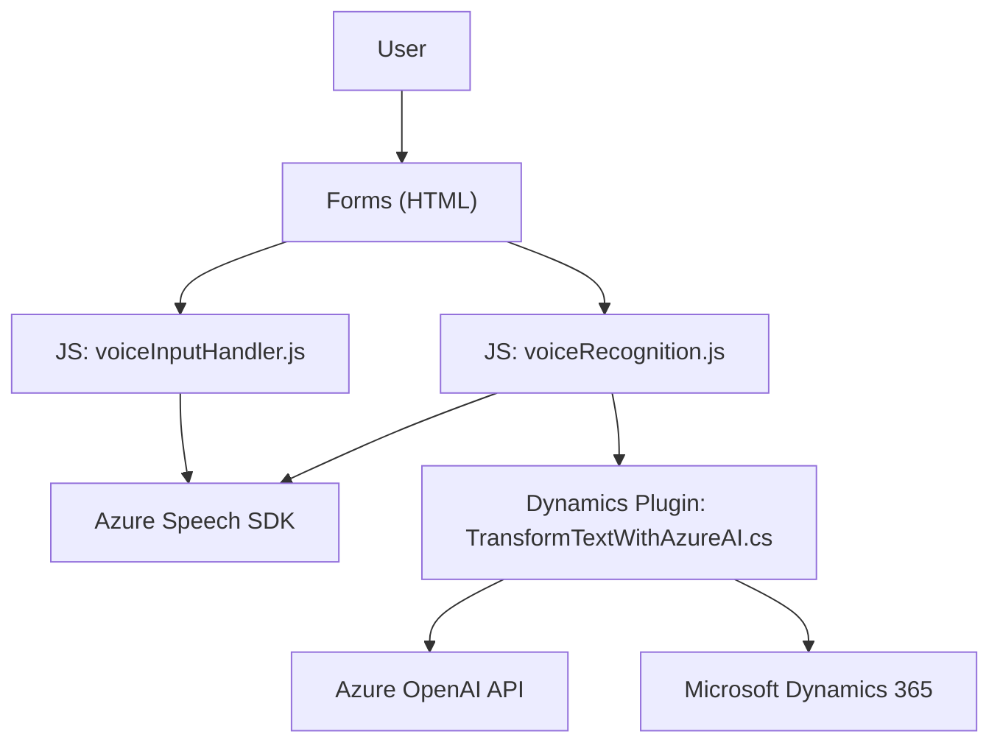

### Breve resumen técnico:
El repositorio parece ser una solución híbrida orientada a formularios con integración en **Microsoft Dynamics 365**, habilitando funcionalidades de reconocimiento y síntesis de voz mediante **Azure Speech SDK**. También posee componentes que interactúan con **Azure OpenAI** para transformar texto en estructuras JSON semánticamente enriquecidas a través de un complemento (`Plugin`).

---

### Descripción de arquitectura:
1. **Tipo de solución**: La solución incluye múltiples componentes:
   - **Frontend interactivo**: `voiceInputHandler.js` y `voiceRecognition.js` utilizan **JavaScript** para manejar formularios y ofrecen interacción dinámica mediante reconocimiento y síntesis de voz.
   - **Backend Dynamics Plugin**: `TransformTextWithAzureAI.cs` es un plugin **backend** para Dynamics CRM que utiliza **Azure OpenAI** y actúa como middleware para transformar texto según reglas preestablecidas.
   
   En general, la solución puede clasificarse como una **integración entre frontend interactivo y capacidades backend habilitadas por servicios en Dynamics 365**.

2. **Tipo de arquitectura**:
   - **Frontend**:
     - Procedural con funciones modulares orientadas a la manipulación de datos en formularios.
   - **Plugin Backend**:
     - **Plugin-Based Architecture**, diseñada específicamente para Dynamics CRM.
     - **Service-Oriented Architecture (SOA)** con llamadas a Azure Speech SDK y Azure OpenAI API.
   - **Globalmente**:
     - Aunque hay componentes distribuidos (Azure, Dynamics, APIs), no puede categorizarse completamente como una **arquitectura de microservicios**. El sistema es más bien una arquitectura **n capas (multitier)**, con separación de responsabilidades entre frontend, backend de Dynamics y APIs externas.

3. **Patrones arquitectónicos observados**:
   - **Lazy Loading**: El SDK de Speech se carga de forma dinámica cuando es necesario.
   - **Cliente-API**: Se emplean SDKs de Azure para interactuar con servicios externos.
   - **Encapsulación Funcional**: Las responsabilidades están distribuidas en funciones específicas para el frontend y backend.
   - **Plugin Middleware**: Transformación y manejo de datos por el backend con Dynamics.

---

### Tecnologías usadas:
- **Frontend**:
  - **JavaScript**: Manipulación de formularios, interactividad, integración con servicios externos.
  - **Azure Speech SDK**: Para síntesis y reconocimiento de voz.
  - **Dynamics Web API (`Xrm.WebApi`)**: Para interacciones con Microsoft Dynamics 365.
- **Backend**:
  - **C# (ASP.NET)**: Para desarrollo de plugins en Dynamics CRM.
  - **Microsoft Dynamics CRM SDK**: Permite la integración del plugin dentro de Dynamics CRM.
  - **Azure OpenAI Services**: Utilizados para transformar contenido textual.
  - **HTTP Client (System.Net.Http)**: Realiza solicitudes REST hacia APIs externas.
  - **JSON Libraries**: Uso de `System.Text.Json` para trabajar con estructuras JSON.

---

### Diagrama Mermaid válido para GitHub:

---

### Conclusión final:
La solución representa una integración especializada entre un **frontend moderadamente interactivo** y un **backend robusto basado en Dynamics 365**, aprovechando las capacidades de **Azure AI** (Speech SDK, OpenAI) para mejorar la experiencia del usuario mediante reconocimiento de voz, síntesis de texto e inteligencia artificial para la transformación de datos. Aunque se compone de distintos niveles y servicios, su organización se asemeja más a una arquitectura **n capas** que a una moderna arquitectura de microservicios.