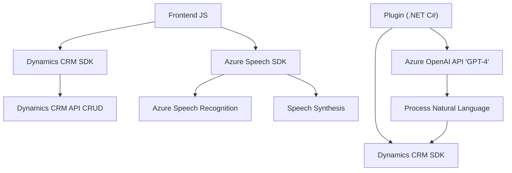

### Breve resumen técnico:

El repositorio facilitado contiene archivos que colaboran para crear una solución tecnológica basada en la integración con servicios **Azure** (Speech SDK y Azure OpenAI). Se deducen las siguientes características clave:

- La solución implementa un **frontend** basado en JavaScript para manejar la interacción del usuario con formularios y permite procesamiento tanto de entrada como de salida de datos por medio de voz (usando **Azure Speech SDK**).
- Un módulo adicional, orientado al backend (plugin), está diseñado en **C#** para extender Dynamics CRM mediante lógica personalizada para transformar texto en JSON estructurado con **Azure OpenAI** GPT-4.
- Se utiliza una combinación de integración API (Azure) y la habilidad de manipular datos del framework CRM (Dynamics).

---

### Descripción de la arquitectura

#### Tipo:
- **Frontend** basado en JavaScript—procesamiento de formularios mediante voz.
- **Backend Plugin** en Dynamics CRM—procesamiento de texto mediante Azure OpenAI.
- **Modelo híbrido**: Mezcla de interacción en frontend (procesamiento dinámico) y backend (lógica extensible del CRM).

#### Estilo arquitectónico:
- **Frontend**:
  - Distribuido con responsabilidades modulares mediante funciones individuales.
  - Utiliza integración puntual con Azure SDK mediante mecánicas de carga dinámica.
  - Patrones basados en responsabilidades (extracción de datos, síntesis de voz).
- **Backend Plugin**:
  - **Arquitectura extensible de plugins** conectados a Microsoft Dynamics. 
  - Seguimiento de patrones de integración API externos (Azure OpenAI). 
  - Diseño centrado en procesamiento de texto con habilitación JSON estructurado.
- **Global**:
  - Aunque distribuido (JS Frontend + Plugin C#), se percibe una arquitectura **orientada a capas**:
    - Capa de presentación (Frontend JavaScript).
    - Capa de lógica personalizada (Plugin C# con IA).
    - Dependencia de servicios externos (Azure Speech SDK/OpenAI y Dynamics APIs).

---

### Tecnologías usadas

- **Frontend**:
  - **JavaScript** nativo: Realización de reconocimiento de voz y síntesis.
  - **Azure Speech SDK**: Procesamiento de voz (entrada/salida).
  - Framework/crm probable: **Dynamics CRM Frontend SDK** (uso de `executionContext`, `formContext`, etc.).
  
- **Backend Plugin**:
  - **C#:** Desarrollo y extensión de Dynamics CRM (`Microsoft.Xrm.Sdk`).
  - **Azure OpenAI GPT-4**: Procesamiento y transformación de texto en JSON.
  - **System.Net.Http, Newtonsoft.Json**: Manejo de comunicación con API.

---

### Dependencias y componentes externos

1. **Azure Speech SDK**:
   - Proporciona soporte para texto a voz (TTS) y voz a texto (STT) en el frontend.
   - URL: `"https://aka.ms/csspeech/jsbrowserpackageraw"`.

2. **Azure OpenAI API**:
   - GPT-4 como servicio para procesamiento y transformación de texto.
   - URL ejemplo: `https://openai-netcore.openai.azure.com/`.

3. **Microsoft Dynamics CRM SDK**:
   - Extensión del CRM mediante plugins (frontend + backend):

4. **Otros frameworks/librerías**:
   - `Newtonsoft.Json`: Serialización de JSON en el Plugin (C#).
   - `System.Net.Http`: Comunicación API en el Plugin.

---

### Diagrama **Mermaid**

---

### Conclusión final

Esta solución implementa una arquitectura híbrida de capas que combina un frontend en JS y un backend plug-and-play para Dynamics CRM en C#. El principal objetivo es habilitar funcionalidades avanzadas de reconocimiento, síntesis de voz y transformación de texto mediante **Azure Speech SDK** y **OpenAI GPT-4**. Como resultado, el sistema permite una interacción dinámica con formularios de CRM utilizando tecnologías modernas integradas en la nube.

Es una arquitectura bien definida para crear soluciones empresariales que interactúan con datos mediante voz e inteligencia artificial. Su escalabilidad y modularidad hacen viable extender la funcionalidad hacia otros servicios de Azure o entornos CRM sin modificar la estructura nuclear.