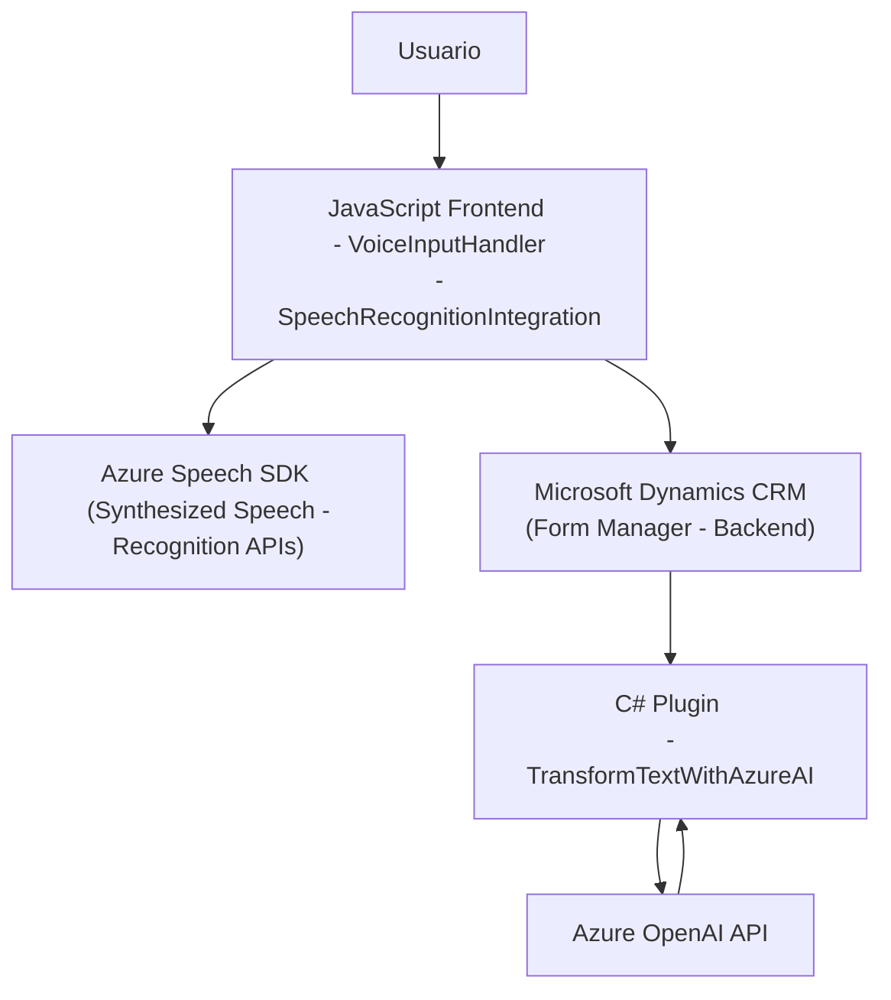

### Breve resumen técnico
El repositorio analiza tres archivos que forman parte de un sistema integrado que utiliza **Microsoft Dynamics CRM**, **Azure Speech SDK**, y **Azure OpenAI** para agregar capacidades de interacción por voz (reconocimiento, síntesis y procesamiento) a un sistema de gestión de formularios.

---

### Descripción de arquitectura
La arquitectura del sistema es **n capas**, específicamente del tipo cliente-servidor:
1. **Capa de presentación (Frontend)**: Scripts como `VoiceInputHandler.js` y `SpeechRecognitionIntegration.js` gestionan la interacción del usuario con los formularios del sistema. Estos archivos permiten convertir datos visuales en voz y permitir entrada de voz que se traduce en comandos actualizados en los campos del formulario.
2. **Capa de lógica**: Representada por un **plugin** en el servidor CRM `TransformTextWithAzureAI.cs`. Este código se ejecuta como extensiones en el servidor, utilizando la API de Azure OpenAI para transformar los datos.
3. **Capa de datos (Backend/Infraestructura)**: Establecida a través de las conexiones con Microsoft Dynamics CRM para acceso y manipulación de datos en tiempo real, además de usar las capacidades del Microsoft Azure Speech y Azure OpenAI para reconocimiento y procesamiento avanzado.

El sistema implementa una **arquitectura n-capas** clásica, con fuerte integración entre cliente, servidor de aplicaciones (CRM y su plugin), y servicios API en la nube para soporte de inteligencia artificial.

---

### Tecnologías, frameworks y patrones usados:
1. **Lenguajes y Frameworks:**
   - **Frontend:** JavaScript.
   - **Backend:** C# .NET Framework.
   
2. **APIs y SDK externos:**
   - **Azure Speech SDK:** Para sintetizar texto a voz y realizar reconocimiento de voz en los scripts del frontend.
   - **Microsoft OpenAI API:** Para transformar texto en json estructurado en el plugin del backend.
   
3. **Infraestructura y Servicios:**
   - Integración con **Microsoft Dynamics CRM** para manejo de formularios por medio de **Xrm.WebApi**.
   - **Azure cloud services** para la implementación de reconocimiento de voz y procesamiento de texto avanzado.

4. **Patrones arquitectónicos:**
   - **Modularidad:** Cada archivo y su conjunto de funciones implementan una responsabilidad específica, conforme al patrón de diseño **single responsibility**.
   - **Delegación de tareas:** Los callbacks garantizan la ejecución de procesos posteriores (como la carga del SDK).
   - **Orquestación de servicios:** Coordina entre múltiples servicios (Azure y Dynamics CRM) utilizando APIs REST.
   - **Facade:** Simplificación de interacciones con APIs externas y CRM mediante métodos enfocados en capas de abstracción.
   - **Event-driven Architecture:** El sistema reacciona a eventos del usuario, como interacción con formularios o entrada de voz.
   - **Pluggable architecture (Dynamics CRM Plugins):** Desarrollo basado en extiende funcionalidades del CRM mediante código conectado a eventos específicos.

---

### Dependencias o componentes externos
Dado el análisis y la implementación, los componentes externos más relevantes son:
- **Azure Speech SDK:** Cargado dinámicamente en el archivo JavaScript para sintetizar voz y realizar reconocimiento de voz.
- **Azure OpenAI API:** Consumido desde el plugin C# mediante solicitudes HTTP POST para procesamiento avanzado de texto en formato JSON.
- **Microsoft Dynamics CRM:** Usado como plataforma de backend para formularios.
- **Microsoft Web API (Xrm.WebApi):** Para la integración directa con el backend de Dynamics CRM.
- **HTTP client libraries (`System.Net.Http`)**: Usado por el plugin para consumo de APIs externas.
- **Serialización JSON:** Dependencia de `System.Text.Json` y `Newtonsoft.Json.Linq` en el backend para manejo de datos estructurados (JSON).

---

### Diagrama Mermaid válido para GitHub

---

### Conclusión Final
El sistema está diseñado como una solución integrada que combina reconocimiento de voz, síntesis de texto, y procesamiento de formularios mediante inteligencia artificial. Utiliza una arquitectura de **n capas** para separar responsabilidades entre cliente, middleware y backend. Las tecnologías clave incluyen JavaScript para el frontend, C# para el plugin del backend y las capacidades de cloud computing de Azure Speech SDK y OpenAI API, junto con la integración directa con Microsoft Dynamics CRM. Este diseño es modular y robusto, pero podría beneficiarse de separaciones más claras entre lógica de negocio y lógica de presentación, además de una estructura más parametrizada para mayor flexibilidad y seguridad en el manejo de claves y endpoints sensibles.