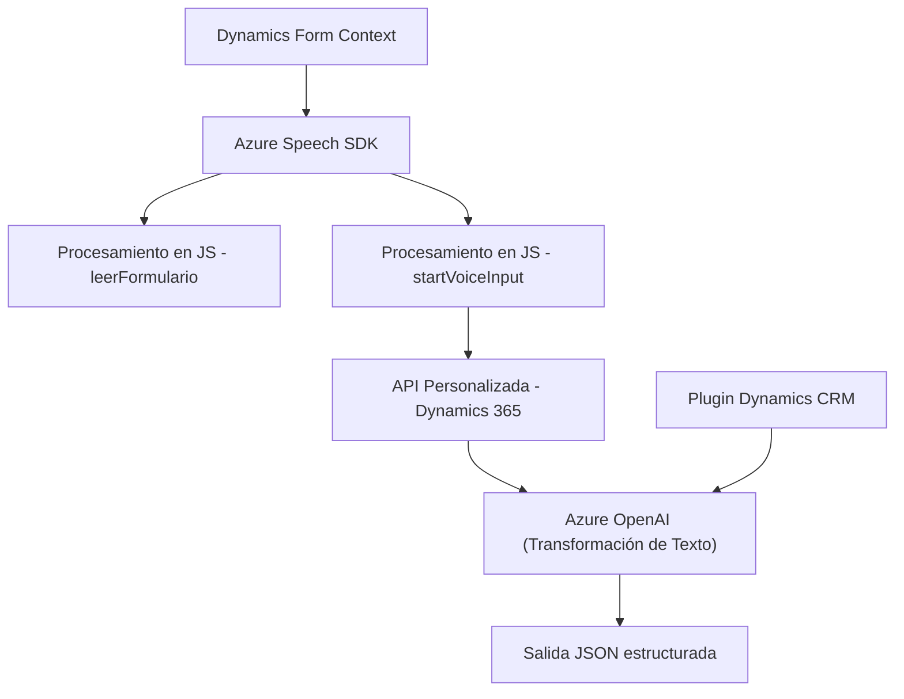

### Breve resumen técnico:
La solución es un sistema de integración avanzado que utiliza el SDK de Azure Speech y Azure OpenAI para habilitar funcionalidades de entrada y salida de voz, así como procesamiento avanzado de texto dentro de formularios en Dynamics 365. Incluye archivos frontend en JavaScript y un plugin backend en C# orientado al procesamiento basado en IA.

---

### Descripción de arquitectura:
1. **Tipo de solución**: La solución combina funcionalidades de una **API backend** con procesos de una **aplicación frontend**. Los diferentes módulos gestionan entrada/salida de datos de voz y texto en un entorno basado en Dynamics 365.
2. **Arquitectura**:
   - **Frontend (JavaScript)**: Procesos del lado cliente usando funciones independientes para gestionar la integración con el SDK de Azure Speech.
   - **Backend (C#)**: Plugin desarrollado como un componente extensible de Dynamics CRM, implementando la interfaz `IPlugin` con lógica empresarial en el backend para interactuar con servicios de Azure OpenAI.
   - **Patrón N capas**:
     - **Capa de presentación** (JavaScript en formularios Dynamics).
     - **Capa lógica de negocio** (modulo del plugin C# con validaciones y transformación de texto).
     - **Capa de persistencia** (uso de Dynamics CRM para datos de formularios y campos lookup).

---

### Tecnologías usadas:
1. Frontend:
   - **Azure Speech SDK**: Integración para entrada y salida de voz.
   - **DOM Manipulation**: Métodos nativos para gestionar contenido dinámico en formularios.
   - **JSON Handling**: Extracción y transferencia de datos, incluidos JSONs de APIs personalizadas.
2. Backend:
   - **Dynamics CRM SDK (Microsoft.Xrm.Sdk)**: Implementación extensible para plugins.
   - **Azure OpenAI**: Transformación de texto utilizando modelos de IA.
   - **HTTPClient para APIs**: Solicitudes web mediante `System.Net.Http`.
   - **Newtonsoft.Json para manipulación JSON**.
3. Patrones:
   - **Carga dinámica de dependencias**.
   - **Separación de responsabilidades**.
   - **Event-driven programming** para interacciones asíncronas.
   - **Integración API** entre frontend/backend y servicios externos.

---

### Diagrama Mermaid:

---

### Conclusión final:
La solución destaca por su capacidad para integrar servicios avanzados como la síntesis de voz, reconocimiento de entrada de voz y procesamiento de texto basado en IA. La arquitectura está dividida en capas con un frontend fácil de extender y un backend robusto, gracias a los patrones estándar de integraciones de Dynamics CRM. La elección de una arquitectura basada en N capas, combinada con la integración API, es ideal para escenarios que demandan escalabilidad y reutilización en entornos empresariales.