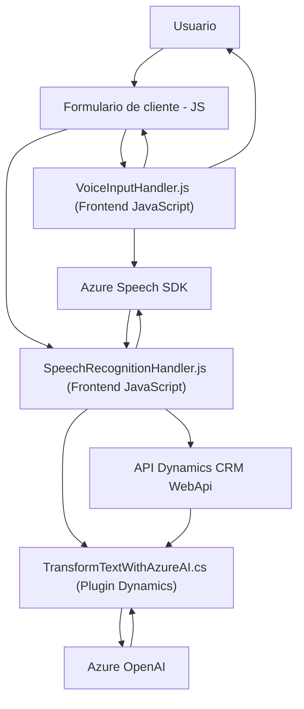

### Breve Resumen Técnico
El repositorio presentado tiene componentes esenciales que utilizan funcionalidades de reconocimiento de voz, síntesis de voz y procesamiento de datos con AI aplicados a formularios en un sistema probablemente integrado a Dynamics CRM. Los archivos están divididos en frontend (JavaScript) para manejo de datos en formularios visuales y plugins backend (C#) que interactúan con Dynamics CRM y Azure OpenAI. 

---

### Descripción de Arquitectura
La arquitectura es híbrida. El frontend utiliza JS para interacción con el cliente (navegador), cargando dinámicamente dependencias como Azure Speech SDK. El backend trabaja con Dynamics CRM utilizando plugins y delegando ciertas tareas complejas a servicios de IA como Azure OpenAI. De esta forma, se define una arquitectura de **n capas** donde cada componente tiene responsabilidades bien delimitadas:
1. **Capa de presentación:** Frontend interactúa con el usuario para entrada/salida de voz y forma datos entendibles.
2. **Capa de lógica de negocio:** Plugins procesan texto con normas específicas.
3. **Capa de integración:** Llamadas API a servicios externos (Azure Speech y OpenAI).

Patrones relevantes:
- **Carga dinámica de dependencias:** El SDK de Azure se carga en tiempo de ejecución.
- **Delegación de responsabilidades:** Frontend delega procesamiento complejo al plugin backend que, a su vez, delega a Azure OpenAI (encapsulación de servicios).
- **Acoplamiento e integración RESTful:** Plugins y módulos trabajan dependientes de SDKs y llamadas API.

---

### Tecnologías Usadas
- **Frontend:** JavaScript, Azure Speech SDK, Dynamics CRM Web API.
- **Backend:** C# (Dynamics CRM SDK), Azure OpenAI Services, HTTP Client, JSON Libraries (`Newtonsoft.Json`, `System.Text.Json`).
- **Integraciones:** Servicios de Azure (Speech, OpenAI).

---

### Diagrama Mermaid

---

### Conclusión Final
Este repositorio implementa una solución orientada al manejo de formularios con interacción por voz. Está diseñado para integrarse con sistemas como Dynamics CRM y aprovecha servicios de Azure, como Speech SDK y OpenAI, logrando una arquitectura modular y extensible en n capas con orientación a servicios. Es una muestra de cómo combinar tecnologías frontend y backend con servicios en la nube para crear un ecosistema ágil y funcional.