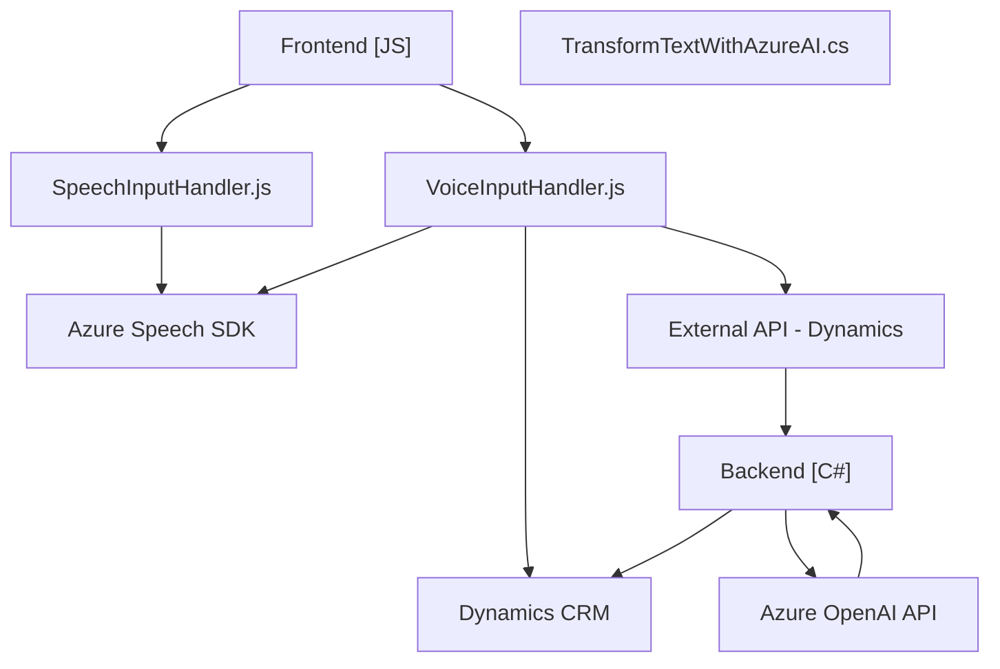

### Breve resumen técnico
El repositorio contiene múltiples archivos que conforman una solución destinada a implementar la funcionalidad de síntesis y reconocimiento de voz, integrada con Azure Speech SDK, y procesamiento de datos mediante un plugin basado en Azure OpenAI en la plataforma Dynamics CRM. Los scripts presentan una arquitectura modular y patrones que facilitan la integración con servicios externos y aseguran la reutilización del código.

---

### Descripción de arquitectura
La solución tiene características de **arquitectura orientada a servicios (SOA)**, donde los diferentes componentes cumplen roles específicos y se integran con APIs externas. Los servicios principales utilizados son Azure Speech SDK para el reconocimiento y síntesis de voz, y Azure OpenAI para procesamiento de texto. Además, incluye integración con Dynamics CRM mediante plugins (.NET) y APIs personalizadas.

La arquitectura parece ser **multicapas**, con una separación básica entre las responsabilidades de front-end (interacción con el usuario y captura de datos) y back-end (procesamiento de texto y comunicación con servicios externos). Un plugin en C# funciona como puente entre Dynamics CRM y Azure OpenAI, mientras que los archivos JavaScript gestionan la lógica del cliente en el navegador.

---

### Tecnologías usadas
1. **Frontend**:
   - **JavaScript**: Para la interacción con el usuario y el manejo de la lógica en el navegador.
   - **Azure Speech SDK**: Para la síntesis de voz y reconocimiento de entrada de voz.
   - **Dynamics CRM UI API (`Xrm.WebApi` y `formContext`)**: Modificación de formularios y manejo de datos en Dynamics CRM.

2. **Backend**:
   - **C#**: Lenguaje principal usado para el plugin de Dynamics CRM.
   - **Microsoft.Xrm.Sdk**: Librería de integración con la API de Dynamics CRM.
   - **Azure OpenAI**: Servicio para procesamiento avanzado de texto y generación de JSON.
   - **HTTP Client**: Para comunicación con la API de Azure OpenAI.
   - **Newtonsoft.Json.LINQ**: Manipulación y serialización de JSON.
   
3. **Patrones de diseño**:
   - Modularización.
   - Service Layer.
   - Integration with Cloud Services.

---

### Diagrama Mermaid válido para GitHub Markdown

---

### Conclusión final
La solución es una integración avanzada entre una **interfaz web embebida en Dynamics CRM**, que permite a los usuarios interactuar con formularios mediante **reconocimiento y síntesis de voz**, y un **plugin backend que emplea inteligencia artificial de Azure OpenAI** para transformar datos. La arquitectura es **modular y multicapa** con interfaces bien definidas, orientada hacia la integración con servicios externos. El uso de tecnologías modernas como Azure Speech SDK y Azure OpenAI plantea una integración con la nube para aprovechar capacidades avanzadas de procesamiento de voz e IA.