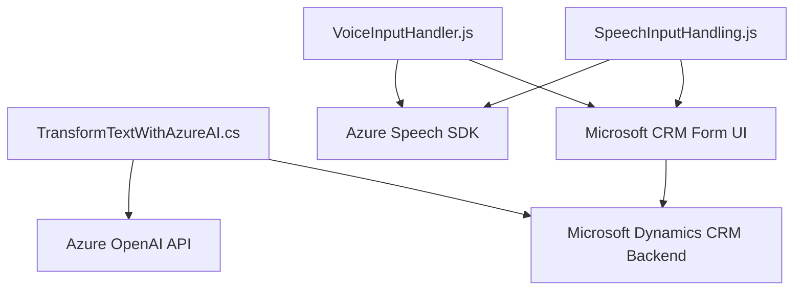

### Breve Resumen Técnico

El repositorio define una solución centrada en integrar servicios de voz y procesamiento de texto con formularios en un CRM (Dynamics 365). Incluye un conjunto de archivos que manejan tanto entrada como salida de voz a través del **Azure Speech SDK**, además de un plugin que utiliza **Azure OpenAI API** para transformar texto con reglas específicas.

---

### Descripción de la Arquitectura

La estructura observada utiliza una arquitectura **modular e híbrida** basada en:
1. **Frontend Modular:** Archivos JavaScript dentro de la carpeta `FRONTEND/JS` actúan como módulos independientes que:
   - Interactúan con servicios externos como **Azure Speech SDK**.
   - Manipulan formularios en el CRM mediante mapeos y reglas.
2. **Plugin Backend (C#):** El archivo `TransformTextWithAzureAI.cs` funciona como una capa de integración en el backend utilizando el patrón `Plugin Design Pattern`, permitiendo extender la lógica de Dynamics CRM con servicios de Azure OpenAI.
3. **Hybrid Integration Patterns:** Uso intensivo de APIs remotas para integrar servicios de Microsoft Azure, ejecutando comunicación asincrónica para funciones avanzadas como reconocimiento de voz, síntesis y transformación de texto mediante IA.

---

### Tecnologías Usadas

1. **Frontend:**
   - **JavaScript**: Para la lógica de manipulación de formularios y llamadas a servicios como `Speech SDK`.
   - **Framework CRM Dynamics (Xrm.WebApi)**: Para interactuar con datos del CRM.
   - **Azure Speech SDK (JS)**: Para el reconocimiento de voz y síntesis de texto a audio.

2. **Backend Plugin (C#):**
   - **Microsoft Dynamics CRM SDK**: Para implementación de plugins.
   - **Azure OpenAI API**: Para procesamiento avanzado de texto.
   - **HttpClient** para invocar servicios externos.
   - **Newtonsoft.Json** y **System.Text.Json** para manejo de JSON.

3. **Patrones:**
   - **Carga dinámica de SDKs:** Con `ensureSpeechSDKLoaded()` para mejorar eficiencia en el frontend.
   - **Mapping Strategy:** Convertir etiquetas visibles de formularios a nombres internos.
   - **Plug-in Design Pattern:** Extensiones basadas en lógica disparada en respuesta a eventos del CRM.

---

### Diagrama Mermaid Compatible con GitHub Markdown

---

### Conclusión Final

La solución integra funcionalidad avanzada para procesamiento de voz y texto en formularios del CRM, utilizando principalmente **Azure Speech SDK** y **Azure OpenAI API**. La base técnica está bien diseñada en torno a una arquitectura modular híbrida, que abarca:
- **Frontend interactivo:** Gestión de formularios y entrada/salida de audio.
- **Backend extensible:** Un plugin que conecta la lógica del CRM con servicios externos mediante el patrón `IPlugin`.

Aunque la arquitectura actual proporciona flexibilidad, se podría optimizar agregando una capa de abstracción para desacoplar la lógica específica de Azure y los datos del frontend/backend del CRM, permitiendo así una mayor reutilización y mantenibilidad.