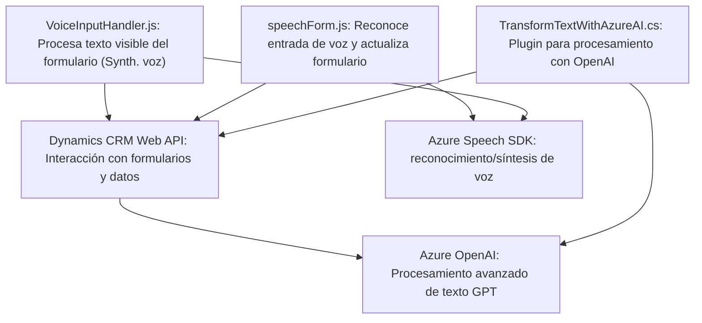

### Breve resumen técnico
El repositorio presenta una solución híbrida que incluye:
1. **Frontend:** Implementación en JavaScript para la interacción con formularios y generación/reconocimiento de voz usando Azure Speech SDK.
2. **Backend Plugin:** Desarrollado en C#, para integrar la transformación y procesamiento del texto con Azure OpenAI y Dynamics CRM.

Principalmente, la solución está centrada en integrar capacidades de síntesis de voz, reconocimiento de voz y procesamiento de datos utilizando AI en una plataforma Dynamics CRM.

---

### Descripción de arquitectura
La arquitectura es **n capas**, en donde:
1. **Presentación (Frontend):**
   - Los archivos `readForm.js` y `speechForm.js` facilitan la interacción de los usuarios con los formularios en Dynamics CRM y realizan la integración con Azure Speech SDK. Los módulos están diseñados para capturar datos de un formulario, sintetizar texto en voz, o reconocer voz para completar automáticamente los campos correspondientes.
2. **Capa de aplicación (Backend Plugin):**
   - El archivo `TransformTextWithAzureAI.cs` representa una capa de negocio que extiende las capacidades de Dynamics CRM. El plugin se ejecuta como parte de los eventos del sistema (como actualizaciones de registros) y utiliza Azure OpenAI para procesar textos complejos.
3. **Integración con servicios externos:**
   - Dependencia directa del Azure Speech SDK para voz y del Azure OpenAI para la transformación de texto. Estas integraciones permiten extender las capacidades de Dynamics CRM a través de AI y servicios cognitivos.

---

### Tecnologías usadas
1. **Frontend:**
   - **JavaScript:** Para lógica cliente (interacción con formularios).
   - **Dynamics CRM Web API:** Métodos y eventos específicos del framework.
   - **Azure Speech SDK:** Para la síntesis y reconocimiento de voz.
   - **Document Object Model (DOM):** Manipulación de elementos HTML dinámicamente.

2. **Backend Plugin:**
   - **C# (Microsoft.NET Framework):** Lenguaje elegido para desarrollar el plugin.
   - **Microsoft.Xrm.Sdk:** SDK para integrar la lógica con Dynamics CRM.
   - **Azure OpenAI Service:** Para transformar texto con inteligencia artificial.
   - **Newtonsoft.JSON:** Para manejar JSON.
   - **System.Net.Http:** Para llamadas REST API.

3. **General Patterns:**
   - Delegate Pattern: Uso de funciones de callback para manejar la disponibilidad de dependencias (ej. Speech SDK) y ejecución asíncrona.
   - Modular Programming: Separación de funciones y código según las responsabilidades específicas.
   - Plugin Architecture: Extensiones basadas en `IPlugin` para responder a eventos en Dynamics CRM.
   - Repository/Mapper: Implementación de mapeo de atributos formulario.

---

### Diagrama **Mermaid** para GitHub Markdown

---

### Conclusión final
La solución presentada es una integración avanzada que combina capacidades de Azure (Speech SDK y OpenAI) con Dynamics CRM para manejar formularios y proporcionar asistentes interactivos con soporte de reconocimiento de voz y síntesis de voz. Utiliza una arquitectura de **n capas** que separa las responsabilidades del frontend, el backend y las APIs externas. Este diseño modular facilita tanto el mantenimiento como la extensión futura para nuevas integraciones o funcionalidades. Sin embargo, la dependencia de servicios en la nube (Azure) puede ser un factor crítico de rendimiento y disponibilidad.