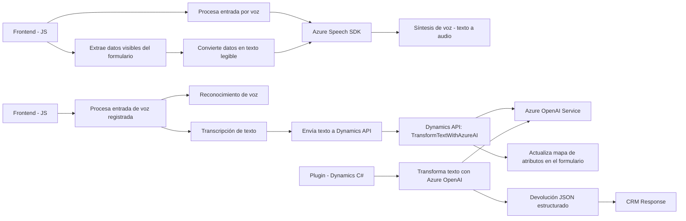

### Breve Resumen Técnico:

El repositorio contiene principalmente tres componentes:
1. **Frontend (JavaScript)**: Scripts para síntesis de voz (Azure Speech SDK) y entrada por voz, integrados con formularios interactivos en un sistema CRM (Dynamics 365).
2. **Backend Plugin (C#)**: Un plugin que transforma texto mediante Azure OpenAI dentro del ecosistema Dynamics 365 CRM.
3. **Servicios Externos**: Interacción con Azure Speech SDK y Azure OpenAI Service para procesos de voz y texto avanzados.

---

### Descripción de Arquitectura:

La arquitectura es **Cliente-Servidor** con elementos de **Integración de Servicios** y componentes modulares. Es un híbrido entre el frontend (operando en el navegador con SDK dinámico cargado) y un backend/plugin especializado para interactuar directamente dentro de Dynamics 365 CRM. El sistema tiene características de arquitectura en capas:
- **Capa frontend**: Presentación e interacción del usuario, con integración del SDK de voz y conexión API.
- **Capa backend**: Gestión y ejecución de procesos avanzados (transformación de texto, lógica de negocio específica) dentro del plugin Dynamics 365.

---

### Tecnologías usadas:

1. **SDKs y APIs**:
   - **Azure Speech SDK**: Reconocimiento de voz y síntesis.
   - **Azure OpenAI Service**: Procesamiento avanzado de texto.
   - **Dynamics 365 CRM SDK/WebApi**.
   
2. **Lenguajes y Frameworks**:
   - Frontend: JavaScript/ES6 (por sintaxis avanzada).
   - Backend: C# (Dynamics plugins y llamadas HTTP).

3. **Otros**: 
   - JSON para datos estructurados entre servicios.
   - HttpClient (`System.Net.Http`) para interacción API.

4. **Patrones de diseño**:
   - **Modular**: Funciones independientes en el frontend, clases específicas para el plugin backend.
   - **Cliente-Servidor**: Comunicación entre frontend, backend, y servicios externos.
   - **Carga dinámica**: Los SDK se cargan en tiempo de ejecución, reduciendo sobrecarga inicial.

---

### Diagrama **Mermaid** válido para GitHub:

---

### Conclusión Final:

La solución está orientada hacia la mejora de experiencia de usuario en sistemas CRM mediante herramientas avanzadas de síntesis y procesamiento de voz y texto. La arquitectura resulta flexible y extensible debido a la integración de servicios externos (Azure Speech y OpenAI) y la modularidad de sus componentes. Sin embargo, la funcionalidad podría beneficiarse de una revisión de seguridad (gestión de claves Azure) y posibles mejoras en la eficiencia de procesamiento (optimización solicitudes API).