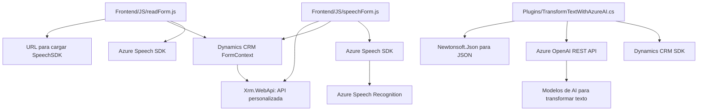

### Breve resumen técnico:
El repositorio contiene implementaciones para integrar capacidades de Azure Speech y OpenAI con Microsoft Dynamics CRM. Los archivos en diferentes capas muestran un enfoque modular y extensible para manejar APIs y SDKs, procesar datos, y actualizar formularios CRM. Las soluciones incluyen reconocimiento de voz, síntesis de texto a voz y transformación de texto mediante inteligencia artificial.

---

### Descripción de arquitectura:
La arquitectura combina una **n-capas** con integración de servicios externos. Se detecta la siguiente disposición arquitectónica:
- **Frontend (JavaScript)**: Responsable de capturar el contexto del formulario, realizar reconocimiento de voz, sintetizar texto a voz y coordinar la interacción del usuario.
- **Backend (Plugins en C#)**: Implementa lógica de transformación avanzada utilizando APIs externas (Azure OpenAI), procesando datos y generando respuestas estructuradas.
- **Servicios externos**:
  - Azure Speech SDK para reconocimiento y síntesis de voz.
  - Azure OpenAI para procesamiento avanzado de texto (transformación en JSON estructurado).

El acceso a cada capa está bien abstraído mediante patrones como fachada, separación de responsabilidades y configuración dinámica.

---

### Tecnologías usadas:
1. **Frontend**:
   - Lenguaje: JavaScript.
   - Dependencias:
     - Azure Speech SDK.
     - Microsoft Dynamics CRM APIs.
     - Métodos específicos de `formContext` en Dynamics CRM.
   - Frameworks: No hay framework específico, pero el diseño modular habilita extensibilidad.

2. **Backend**:
   - Lenguaje: C#.
   - Dependencias:
     - Microsoft Dynamics SDK (Xrm).
     - Azure OpenAI REST API.
     - Librerías como `Newtonsoft.Json.Linq`, `System.Net.Http`, `System.Text`.

3. **Secundarios**:
   - Azure Key y Region como configuraciones para Speech SDK.
   - API Key para servicios de Azure OpenAI.

---

### Diagrama Mermaid válido para GitHub:

---

### Conclusión final:
Este repositorio implementa una **solución híbrida**: la integración entre **Frontend** y **Backend** permite facilitar la interacción del usuario con Microsoft Dynamics CRM mediante reconocimiento de voz, síntesis y transformación textual usando APIs avanzadas de Azure. Utiliza una arquitectura **n-capas** que abstrae la lógica del cliente, el servidor y los servicios externos, combinando patrones como fachada y SOA. La modularidad del diseño aseguran la extensibilidad y el mantenimiento futuro.