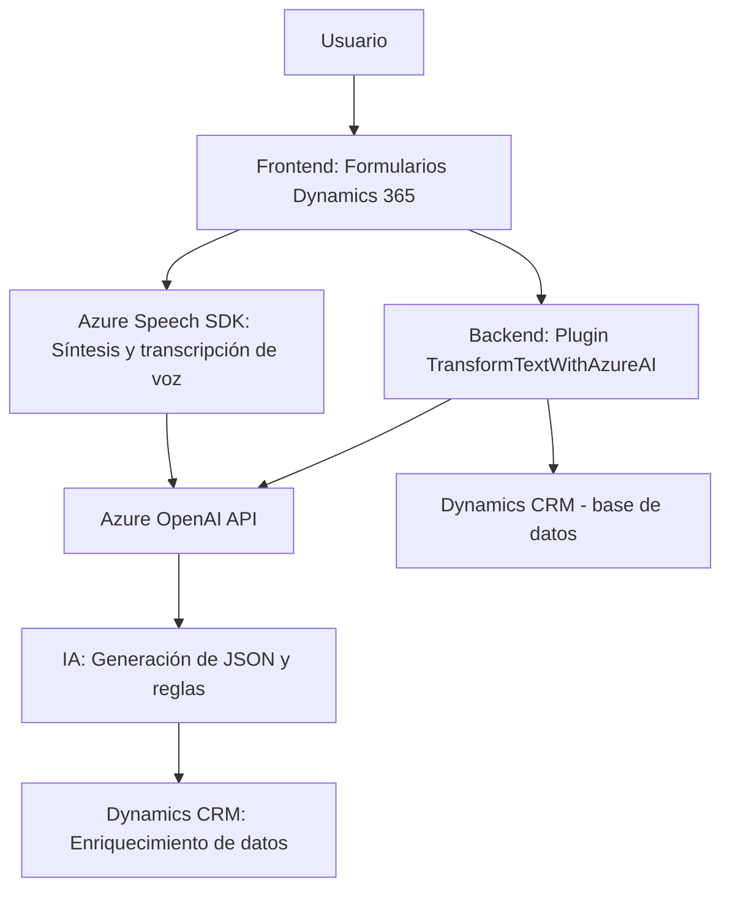

### Breve resumen técnico

La solución presentada corresponde a una integración entre Microsoft Dynamics 365 CRM y varios servicios de Microsoft Azure, principalmente Azure Speech SDK y Azure OpenAI. Se enfoca en dos principales funcionalidades: manipulación de formularios en el frontend (`readForm.js`, `speechForm.js`) y lógica para transformar texto a través de un plugin integrado (`TransformTextWithAzureAI.cs`).

---

### Descripción de la arquitectura

La arquitectura se puede clasificar como **"n capas"** con un enfoque modular y colaborativo entre tres componentes principales:
1. **Frontend**: Implementación en JavaScript para interactuar con formularios de Dynamics 365 mediante la API específica del sistema. También, genera integraciones con Azure Speech SDK para sintetizar texto a voz y convertir comandos de voz a texto.
2. **Backend**: Plugin en .NET que agrega lógica de negocio y transforma texto mediante la API de Azure OpenAI.
3. **Servicios Externos**: Integración con herramientas de IA como Azure Speech SDK y Azure OpenAI para habilitar capacidades avanzadas de voz y texto.

**Capas identificadas:**
1. **Capa de presentación**: Integración en la interfaz de Dynamics 365 CRM para interactuar con los usuarios mediante formularios HTML + JavaScript.
2. **Capa de negocio**: Contiene lógica principal representada por el plugin `TransformTextWithAzureAI.cs`, que gestiona reglas de procesamiento y comunicación con servicios cloud.
3. **Capa de servicios externos**: Consume APIs de Microsoft Azure (Speech SDK y OpenAI).

Este enfoque asegura modularidad, separación de responsabilidades y escalabilidad.

---

### Tecnologías, frameworks y patrones utilizados
1. **Tecnologías/servicios**:
   - **Microsoft Dynamics 365 CRM**: Plataforma que proporciona el sistema de formularios y lógica empresarial.
   - **Azure Speech SDK**: Para conversión de texto a voz y transcripción de comandos de voz.
   - **Azure OpenAI API**: Procesamiento de texto y transformación avanzada con modelos de IA de Microsoft.
   - **Microsoft .NET Framework**: Backend de plugins en C#.

2. **Frameworks y bibliotecas utilizadas**:
   - Frontend: JavaScript, Dynamics 365 Web API.
   - Backend:
     - `.NET`, con clases como `HttpClient` y `JsonSerializer`.
     - `Newtonsoft.Json.Linq` para trabajar con JSON.

3. **Patrones utilizados**:
   - **Dependency Injection**: Carga dinámica de recursos (e.g., Speech SDK).
   - **Data Mapper**: Uso de mapas para vincular datos del formulario con nombres internos.
   - **Event-Driven Programming**: Uso de callbacks en el manejo asíncrono.
   - **Factory Pattern**: Creación de configuraciones para usar Azure Speech SDK.
   - **Plugin Design Pattern**: Integración de lógica basada en plugins para Dynamics CRM.

---

### Dependencias o componentes externos presentes
1. **Azure Speech SDK**: Para síntesis de voz y transcripción.
2. **Azure OpenAI API**: Para transformar texto utilizando IA avanzada.
3. **Dynamics 365 Web API**: Gestión de formularios y datos CRM.
4. **Newtonsoft.Json**: Para parseo y manipulación de JSON en el lado backend.
5. **HttpClient**: Manejo de solicitudes hacia servicios Azure (en el plugin).

---

### Diagrama Mermaid

---

### Conclusión final

El análisis del repositorio revela una solución que integra servicios avanzados de Microsoft Azure con el sistema CRM Dynamics 365. La arquitectura modular permite una comunicación efectiva entre el frontend y el backend, así como la flexibilidad para trabajar con servicios externos. La implementación hace uso de patrones de diseño como Plugin Design Pattern, Dependency Injection, y Data Mapper, lo que refleja un diseño técnico sólido y escalable.

Sin embargo, existen puntos de mejora, como la evaluación de casos para el manejo de errores en los servicios externos o la descripción más clara de configuraciones predeterminadas en los archivos. A nivel general, la solución está diseñada para extender las capacidades de Dynamics 365 mediante funciones innovadoras como síntesis y procesamiento de voz y texto.