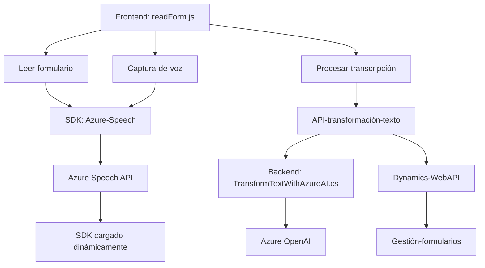

### Resumen técnico
El repositorio parece estar enfocado en la integración de capturas de voz, síntesis de texto, procesamiento de datos dinámicos en formularios, y transformación de textos mediante inteligencia artificial. Sus funcionalidades principales giran en torno a la interacción entre **Azure Speech SDK**, **Azure OpenAI**, y **Dynamics CRM**, brindando capacidades avanzadas para la gestión de formularios con reconocimiento de voz y respuestas transformadas.

---

### Descripción de arquitectura
El sistema tiene una arquitectura segmentada en componentes clave:
1. **Frontend (JavaScript):** Brinda la interfaz y lógica para trabajar con los formularios (captura de voz, síntesis de texto).
2. **Backend (C# plugins):** Los plugins en Dynamics CRM ejecutan lógica empresarial orientada a la transformación de texto vía **Azure OpenAI API**.
3. **Dependencias externas:** Integración directa con APIs (Azure Speech y OpenAI) y Dynamics Web API establecen un flujo distribuidos de datos y procesamiento.

La arquitectura general puede clasificarse como "n capas":
- **Capa de presentación:** Codificada en **JavaScript** interaccionando directamente con los formularios.
- **Capa de lógica empresarial:** Implementada en los plugins de Dynamics CRM en **C#**, que procesan y transforman datos.
- **Capa de datos:** Dynamics Web API y Azure permiten el acceso a servicios externos.

---

### Tecnologías utilizadas
1. **Frontend:**
   - **JavaScript:** Principal lenguaje para la lógica y manipulación del DOM.
   - **Azure Speech SDK:** Para síntesis y reconocimiento de voz.
   - **Dynamics CRM API (XRM.WebAPI):** Gestor de formularios y datos relacionados.

2. **Backend:**
   - **C#:** Lenguaje principal para los plugins de Dynamics CRM.
   - **Azure OpenAI:** API para transformar texto avanzado basado en IA.

3. **Dependencias adicionales:**
   - **Newtonsoft.Json:** Para manipulación y parsing de JSON en C#.
   - **HttpClient:** Clase en .NET para realizar solicitudes HTTP.

---

### Diagrama Mermaid

---

### Conclusión final
El sistema implementa una solución robusta para capturas de voz, síntesis de texto en voz, procesamiento avanzado mediante IA y actualización dinámica de formularios interactivos en **Dynamics CRM**. Utiliza tecnologías modernas como **Azure Speech SDK** y **OpenAI API**, lo que garantiza capacidades avanzadas de interacción usuario-sistema. Su arquitectura "n capas" es eficaz para separar responsabilidades y facilitar integración con servicios externos. Podría ser mejorado agregando pruebas más robustas y manejo de excepciones en las API externas.