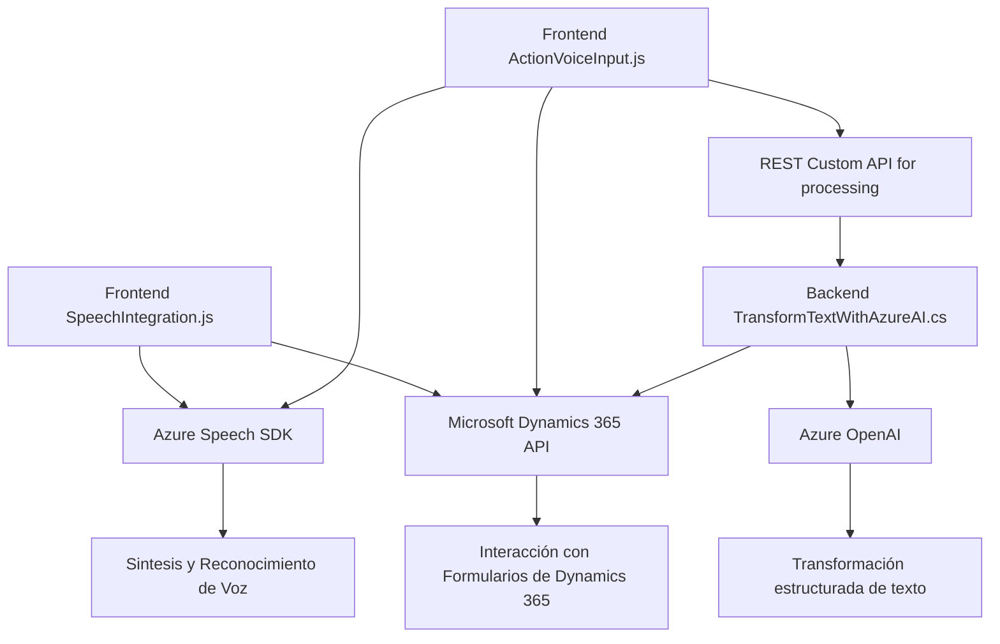

### Breve resumen técnico
El repositorio incluye una implementación modular que integra servicios externos como el **Azure Speech SDK** y **Azure OpenAI API** con **Microsoft Dynamics 365**. Se trata de una solución centrada en la interacción de voz y procesamiento de texto en formularios. La estructura del código sugiere que se trata de una solución híbrida que abarca frontend (JavaScript) y backend (.NET plugins), con una arquitectura basada en integración de servicios externos.

---

### Descripción de la arquitectura
La solución está orientada a la integración modular de servicios externos (Azure Speech SDK y Azure OpenAI API) con Microsoft Dynamics 365. Incluye componentes frontend que interactúan con los usuarios para capturar datos del formulario mediante la voz y componentes backend (plugins) que transforman el texto usando Azure OpenAI y Dynamics CRM.

#### Tipo de arquitectura:
- **Híbrida de N capas y SOA (Service-Oriented Architecture)**:
  - La capa **presentación** se implementa usando JavaScript en el frontend (`SpeechIntegration.js` y `speechForm.js`) y proporciona interacción con formularios.
  - La capa **lógica de negocio** incluye plugins en **C#** dentro de Dynamics CRM que procesan datos y gestionan la interacción con el servicio externo de Azure OpenAI API.
  - La capa **servicio externo (API)** utiliza la comunicación con los endpoints de Azure (Speech SDK y OpenAI) para realizar tareas avanzadas como síntesis de voz y transformación de texto.

---

### Tecnologías utilizadas
1. **Frontend**:
   - **JavaScript**: Lenguaje principal del frontend para implementación en el navegador.
   - **Dynamics 365 SDK**: Acceso a datos relacionados con formularios (contexto del usuario, atributos, etc.).
   - **Azure Speech SDK**: Sintetización y reconocimiento de voz.

2. **Backend**:
   - **C#**: Lenguaje principal en el desarrollo de plugins de Dynamics CRM.
   - **Microsoft Dynamics CRM SDK**: Para la interacción con la base de datos y extensibilidad del CRM.
   - **Azure OpenAI API**: Transformaciones avanzadas de texto utilizando inteligencia artificial.
   - **Web APIs**: Integración con Dynamics 365 y Azure API para manejo de datos transcritos.

3. **Patrones arquitectónicos**:
   - **Modularidad**: El código está dividido en funciones o métodos especializados por responsabilidades.
   - **Integración de servicios externos**: Uso del SDK de Azure Speech y comunicación con APIs externas como Azure OpenAI.
   - **Lazy Load (carga diferida)**: Backend y frontend cargan dependencias solo en caso de necesidad.
   - **Single Responsibility Principle (SRP)**: Cada función/clase tiene una tarea específica e independiente.

4. **Dependencias/Componentes externos**:
   - **Azure Speech SDK**: Para la síntesis y reconocimiento de voz.
   - **Azure OpenAI API**: Procesa textos mediante inteligencia artificial.
   - **Dynamics 365 API/WebApi**: Interactúa con los formularios y sus datos mediante la capa de lógica de negocio.

---

### Diagrama **Mermaid** válido 100% para **GitHub Markdown**

---

### Conclusión final
Esta solución integra de manera eficiente módulos frontend con el SDK de Azure Speech, APIs personalizadas y plugins backend para interactuar con Dynamics 365 y Azure OpenAI. Siguiendo principios de modularidad y SRP, además de emplear patrones como la carga diferida y la orientación a servicios externos, facilita funcionalidades avanzadas de interacción por voz y procesamiento de texto estructurado con inteligencia artificial, optimizando la experiencia de usuario en entornos CRM.

