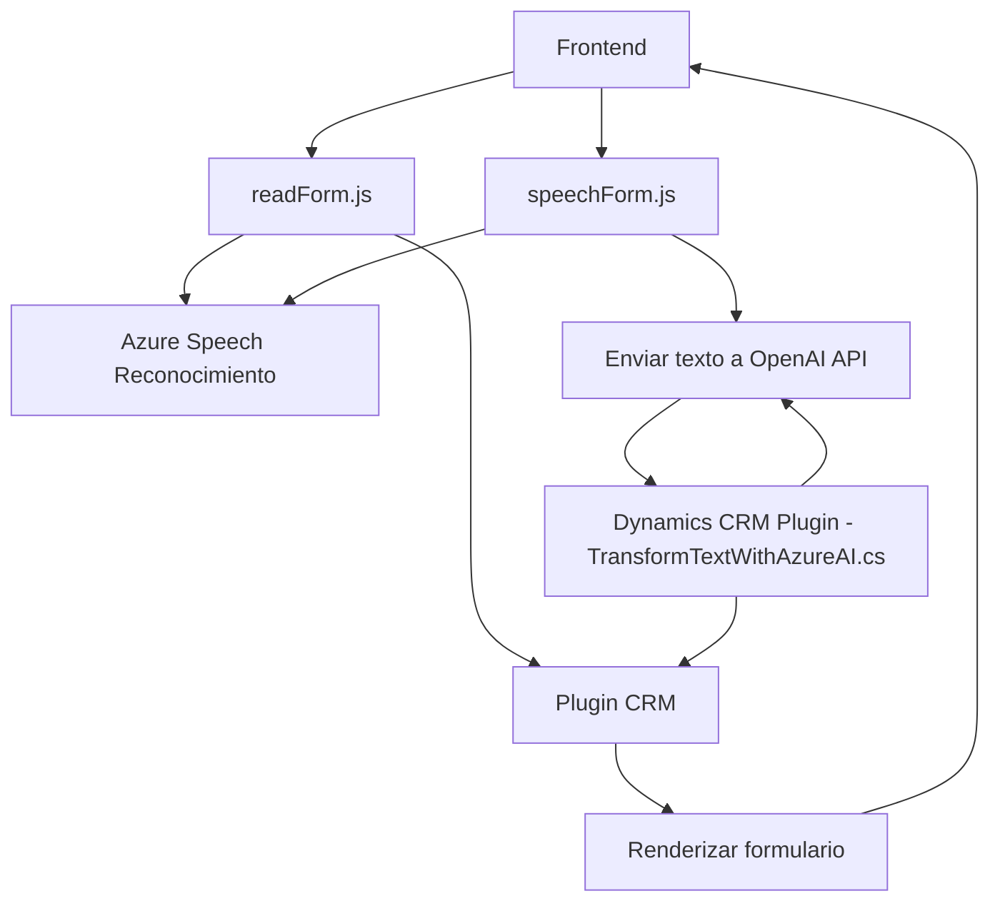

# Análisis y Evaluación Técnica de la Solución

## 1. Breve resumen técnico  
El repositorio ofrece tres archivos principales: dos del frontend (`readForm.js` y `speechForm.js`) y uno relacionado con una extensión de Dynamics CRM (`TransformTextWithAzureAI.cs`). Parece ser un sistema diseñado para interactuar con formularios de Dynamics CRM mediante entrada de voz, procesamiento de texto y generación de audio usando los servicios de Azure, particularmente el **Azure Speech SDK** y **Azure OpenAI Service**.

---

## 2. Descripción de arquitectura  
La solución está diseñada como un híbrido entre un sistema integrado servidor/cliente y un servicio externo. Su arquitectura combina elementos de **n capas** y **hexagonal** en integración con servicios externos.

### Cliente (frontend)
Este módulo maneja la funcionalidad de captura de texto mediante reconocimiento de voz (esta última proporcionada por **Azure Speech SDK**) y los datos obtenidos son usados para actualizar elementos de un formulario en Dynamics CRM.  
El frontend sigue un patrón **modular**, dividiendo las funcionalidades específicas como la carga de scripts externos, la extracción de datos visibles, la síntesis de voz del formulario y reconocimiento de entrada de voz. También usa **callbacks** para manejar eventos asincrónicos con la biblioteca de Azure.

### Servidor (plugin en C#)
El servidor es un **plugin de Dynamics CRM**, modelado bajo una arquitectura **orientada a eventos** (Dynamics ejecuta automáticamente los plugins en respuesta a ciertas operaciones). Además, utiliza una **integración externa** con la API de **Azure OpenAI** para transformar texto en JSON estructurado, que se usa para rellenar formularios automáticamente. El plugin implementa la interfaz `IPlugin`, siguiendo las prácticas estándar de Dynamics.  

---

## 3. Tecnologías y patrones usados  
### **Tecnologías**
1. Frontend:
   - **JavaScript (ES6+)**: Lenguaje base para la funcionalidad cliente.
   - **Azure Speech SDK**: Reconocimiento de voz y síntesis de texto a voz.
   - DOM API: Para manipulación de formularios en HTML y leer atributos visibles.

2. Backend:  
   - **C# con .NET Framework**: Usado para programar el plugin.
   - **Dynamics CRM SDK**: Interacción con objetos y eventos específicos de Dynamics CRM.  
   - **Azure OpenAI Service**: Transformación cognitiva del texto mediante servicios avanzados de inteligencia artificial.

### **Patrones**
1. **Modular**: Cada archivo descompone operaciones en funciones reutilizables según la responsabilidad específica.  
2. **Async/Promesas**: Uso de funciones asíncronas para manejar SDK externos y servicios de API remotos.  
3. **Delegate (Delegación)** para encapsular dependencias e integraciones de servicios en métodos independientes.  
4. **Event-driven**: El plugin y la interacción con el frontend están diseñados para reaccionar a eventos en Dynamics CRM.  
5. **External Dependency Loading**: El SDK de Azure Speech se carga dinámica y condicionalmente para evitar recursos innecesarios.  
6. **Service Layer**: Integración entre el frontend y el backend mediante una capa abstracta de servicios como el Azure OpenAI.  
7. **Clean Code Principles** para mantener funciones pequeñas y específicas con claridad en parámetros, retorno y propósito.  

---

## 4. Componentes y dependencias externas posiblemente presentes  
1. **Para el frontend:**
   - **JavaScript Libraries**:
     - Azure Speech SDK (cargado dinámicamente desde CDN).
     - Posibilidad de modulación adicional con frameworks como React, Angular o libraries de UI (no se confirma pero es posible debido al contexto del CRM).  
   - Dependencias de formularios basadas en DOM API del navegador.

2. **Para el Backend**:
   - **Microsoft Dynamics CRM SDK**: Para la gestión de eventos y mapeo de datos.
   - **Azure OpenAI Service**: Para la integración con GPT-4.
   - **Newtonsoft.Json** para manejo extendido de JSON.
   - **Net.Http** Framework para integración REST con servicios externos.  

3. **Configura elementos sensibles como claves API y regiones de Azure**:
   - `apiKey` y `azureRegion` deben ser guardados en un entorno seguro como Azure Key Vault o archivos de configuración cifrados.

---

## 5. Diagrama Mermaid 100 % compatible con GitHub Markdown  

---

## Conclusión final  
La solución está orientada a mejorar la interacción con formularios en Dynamics 365 mediante entrada de voz y síntesis de texto a voz, utilizando servicios de Azure. La arquitectura se basa en un sistema modular de frontend y backend, combinando patrones de **event-driven**, **modularización** y **servicios externos**. Sin embargo, deben mejorarse prácticas de seguridad para proteger claves API sensibles y reducir el acoplamiento rígido hacia servicios de Azure.

La solución muestra un enfoque eficiente al combinar capacidades de procesamiento de datos y AI, pero debería evaluarse la escalabilidad en contextos de mayor carga y complejidad.