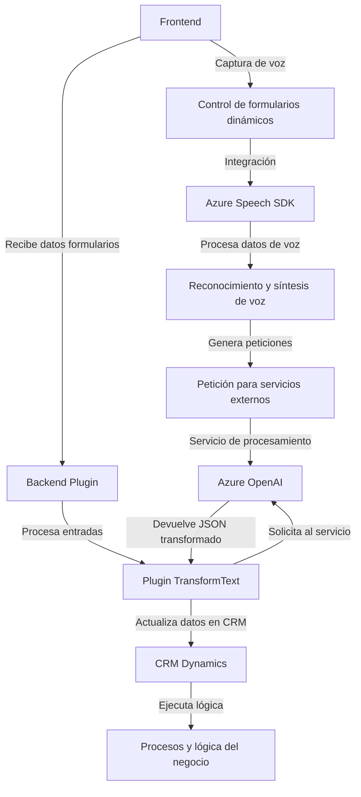

## Resumen Técnico
La solución se compone de varios componentes destinados a integrar funcionalidades de voz y procesamiento de texto mediante servicios de Azure y APIs. Combina un frontend en JavaScript para la interacción de usuario con formularios y un backend basado en plugins dinámicos para integración con Microsoft Dynamics CRM y servicios externos como Azure OpenAI.

---

## Descripción de Arquitectura
La arquitectura de esta solución parece seguir el patrón de **n capas**, donde distintas capas realizan tareas específicas:  
- **Frontend**: Interacción de usuario vía navegador, permite captura de voz y actualización de formularios.  
- **Backend Plugin**: Proporciona lógica de negocio para Dynamics CRM y delega procesamiento avanzado de texto a servicios externos.  
- **Servicios Externos**: Integración de SDK y APIs como Azure Speech SDK y Azure OpenAI.  

Si bien no usa una arquitectura de microservicios explícita, está orientada a servicios externos y APIs dinámicas que extienden las capacidades del sistema.

---

## Tecnologías Usadas
1. **Frontend**: JavaScript, Azure Speech SDK.  
   - Captura de voz y síntesis mediante SDK integrado.  
   - Modularidad en funciones para gestión de inputs y actualizaciones.  

2. **Backend Plugin**: C#, Dynamics CRM Plugin SDK, Azure OpenAI, manejo de JSON (`Newtonsoft.Json`, `System.Text.Json`).  
   - Gestión de Logic Apps plugin para transformación de texto en formatos estructurados.  

---

## Diagrama Mermaid (100 % válido para GitHub)

---

## Conclusión Final
1. **Tipo de solución**: Un sistema compuesto por componentes frontend y backend, enfocado en la integración de reconocimiento y síntesis de voz con interacción dinámica de formularios en sistemas CRM.  
2. **Tecnologías y patrones**: Uso de JavaScript para manejo frontend, SDK de Azure Speech para voz, plugins en C# para la lógica en CRM y APIs avanzadas de AI mediante Azure OpenAI. Aplica un patrón modular en frontend y separación de responsabilidades en el plugin.  
3. **Arquitectura**: Sistema de n capas con dependencias de servicios externos (componente del frontend, backend y servicios AI).  
4. **Servicios externos presentes**: Azure Speech SDK, Azure OpenAI, APIs del navegador (como micrófono), y Microsoft Dynamics SDK para interacción con CRM.

Se trata de una solución bien estructurada, aunque puede beneficiarse de mejores estrategias de desacoplamiento y manejo de dependencias (p.ej., configuraciones externas).