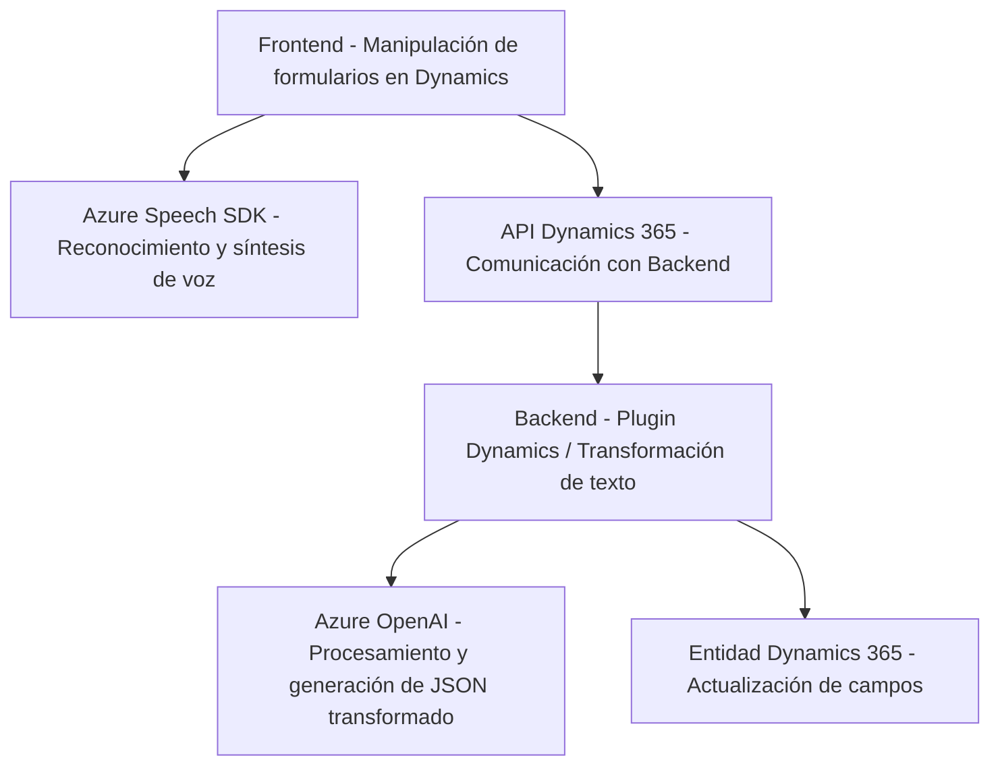

### Breve resumen técnico
El repositorio integrando los archivos mencionados está destinado a habilitar funcionalidades avanzadas en Microsoft Dynamics CRM utilizando tecnologías de reconocimiento de voz y procesamiento de lenguaje natural. La solución incluye:
1. **Frontend**: Scripts en JavaScript para integrar Azure Speech SDK y manipular datos en formularios model-driven.
2. **Backend**: Plugin en C# que usa Azure OpenAI para procesar, transformar y estructurar texto en formato JSON.

---

### Descripción de arquitectura
La solución implementa una **arquitectura híbrida** y está basada en:
1. **Modelo n-capas dentro de Dynamics CRM**:
   - Presentación/configuración: Perfiles de usuario, formularios CRM model-driven.
   - Lógica de negocio: Manipulación de datos y ejecución del plugin para transformación de texto.
   - Persistencia: Integración directa con CRM (utilizando entidades y contexto del sistema).
2. **Componentes externos de servicios cognitivos**:
   - Azure Speech SDK: Utilizado en el frontend para reconocimiento y síntesis de voz en formularios.
   - Azure OpenAI: Utilizado en el backend para transformar texto y generar JSON estructurado.

También se evidencia el uso de patrones como:
- **Dependencia de servicios externos**: Para tareas específicas que no requieren lógica de negocio interna (voz y texto).
- **Función orquestadora**: Coordinación estructurada dentro de la lógica de los métodos principales.
- **Desacoplamiento de capacidades específicas**: Por ejemplo, la función `GetOpenAIResponse` encapsula la lógica de comunicación con Azure.
- **Configuración en tiempo de ejecución**: La carga dinámica de SDK de Azure Speech mediante DOM (frontend).

---

### Tecnologías, frameworks y patrones usados
1. **Frontend**:
   - **Tecnologías**: JavaScript.
   - **Frameworks**: Dynamics CRM, Azure Speech SDK.
   - **Patrones destacados**:
     - *Carga dinámica*: Garantiza que el SDK esté disponible antes de ejecutarlo.
     - *Transformación de datos basada en atributos*: Valores del formulario se procesan y manipulan empleando atributos comunes (ex. Lookup y transcripciones).
     - *Separación de preocupaciones*: Fragmentación de tareas en métodos específicos.

2. **Backend**:
   - **Lenguaje**: C#.
   - **Frameworks/API**: Azure OpenAI, Dynamics CRM SDK.
   - **Patrones destacados**:
     - *Plugin CRM*: Lógica encapsulada para ejecutar el procesamiento a nivel del servidor.
     - *Encapsulación de lógica externa*: `GetOpenAIResponse` desacopla interactuar con Azure OpenAI desde la lógica de Dynamics.
     - *Uso de HTTP client*: Dinámica en llamadas a servicios remotos.

### Dependencias y componentes externos
1. Azure Speech SDK: Para funciones de síntesis de voz y reconocimiento de la entrada del usuario.
2. Microsoft Dynamics 365:
   - Contextos de formulario (`executionContext`, `formContext`).
   - API personalizada en Dynamics como medio de comunicación entre frontend y backend.
3. Azure OpenAI: Utilizado en el backend para procesamiento avanzado del texto, específicamente la generación de JSON según reglas específicas.
4. Librerías de soporte:
   - `System.Text.Json` y `Newtonsoft.Json.Linq`, para serialización/deserialización en C#.
   - `System.Net.Http`, utilizada para la comunicación de backend hacia Azure.

---

### Diagrama Mermaid válido para GitHub Markdown

---

### Conclusión final
Este repositorio combina tecnologías de Microsoft Dynamics CRM, Azure Speech SDK y Azure OpenAI para ofrecer una solución integrada de voz y procesamiento de texto. La estructura del sistema está orientada hacia un modelo **n-capas**, donde cada componente atiende una tarea específica: frontend gestiona la interfaz y entrada del usuario; el backend procesa y transforma los datos fidedignamente utilizando servicios de Azure OpenAI.

- **Fortalezas**:
  - Se integra bien con Dynamics CRM y aprovecha servicios cognitivos modernos, como OpenAI y Speech SDK.
  - Modularidad y desacoplamiento en la estructura (frontend y backend), permitiendo mantenimiento o actualizaciones independientes.
  
- **Áreas de mejora**:
  - Gestión de claves API: Se deben considerar mecanismos seguros (como Key Vault) para evitar exposición.
  - Control de errores y validación: Detallar el manejo de estados de la API o SDK en fallos críticos.

El diseño es robusto para aplicaciones empresariales donde reconocimiento de voz y transformación de texto son productos clave para eficiencia operativa.