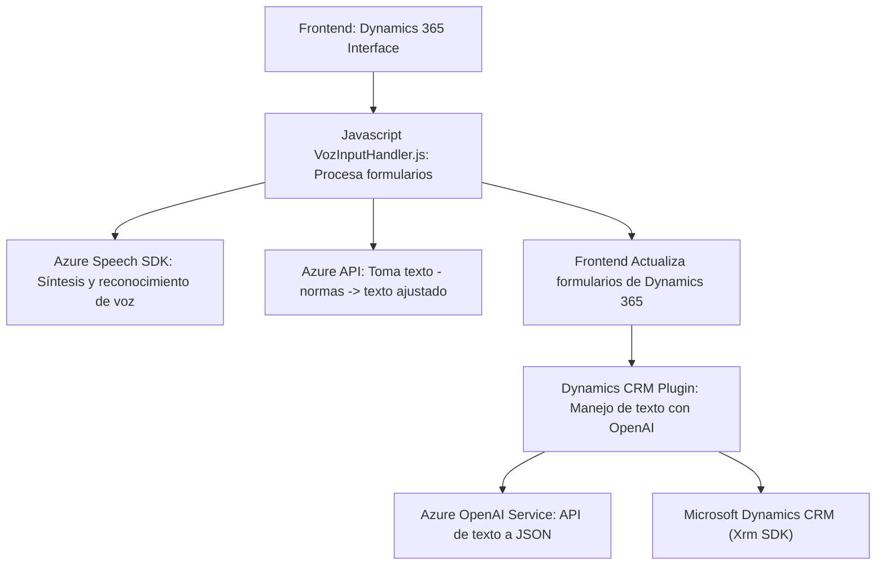

### Breve Resumen Técnico

El repositorio analiza y maneja datos provenientes de formularios en Microsoft Dynamics 365 utilizando funcionalidades avanzadas de reconocimiento de voz y transformación de texto. Se basa en tecnologías como Azure Speech SDK para interacción por voz y Azure AI para procesamiento avanzado de datos. Su arquitectura muestra características de integración modular y pone énfasis en la desacoplamiento, reutilización y scalability.

---

### Descripción de la Arquitectura

1. **Tipo de solución:** La solución integra varios componentes:
   - *Frontend:* Manejo de voz y procesamiento de datos en el navegador (JavaScript).
   - *Backend/plugin:* Procesamiento y transformación de datos mediante un plugin en Dynamics CRM (C#).
   - *Terceros:* Dependencias externas como Azure Speech SDK y Azure AI para proporcionar funcionalidades de síntesis de voz y manipulación de texto.

2. **Tipo de arquitectura:**
   - La solución implementa arquitectura de *n capas*:
     - **Frontend (Capas):** Interfaces de usuario en Dynamics 365 y procesamiento por voz en el navegador.
     - **Lógica intermedia (Plugins):** Transformaciones y manejo en Dynamics CRM.
     - **Servicios externos:** APIs de Azure (Speech SDK y OpenAI).
   - Integra patrones de arquitectura orientados a servicios (SOA), dado el uso extensivo de APIs externas.

3. **Tecnologías y frameworks utilizados:**
   - **Frontend:**
     - **JavaScript (ES6):** Para la lógica de procesamiento del formulario y voz.
     - **Azure Speech SDK:** Gestión dinámica de síntesis y reconocimiento de voz.
     - **Microsoft Dynamics CRM SDK:** Contexto del formulario.
   - **Backend:**
     - **C#:** Para la lógica de plugins en Microsoft Dynamics.
     - **Azure OpenAI Service:** Para transformaciones avanzadas de texto.
     - **Newtonsoft.Json:** Para serialización de JSON en plugins.
     - **Microsoft.Xrm.Sdk:** Manejo de servicios en la plataforma CRM.

4. **Dependencias y componentes externos:**
   - Azure Speech SDK.
   - Azure OpenAI Service (`openai-netcore.openai.azure.com`).
   - Microsoft Dynamics CRM SDK.
   - Framework para HTTP Requests (`HttpClient`).
   - Newtonsoft.Json para manipulación de datos JSON.

---

### Diagrama Mermaid válido para GitHub Markdown

---

### Conclusión Final

La solución es una arquitectura robusta que combina el procesamiento por voz (Azure Speech SDK), interacción directa con formularios en Dynamics CRM, y transformación de datos mediante Azure OpenAI. Su diseño muestra una correcta implementación de los principios de modularidad y desacoplamiento. Pueden identificarse áreas para optimización (ej., pruebas automatizadas o refactorización según patrones como la arquitectura hexagonal) dependiendo de la ampliación futura del alcance.