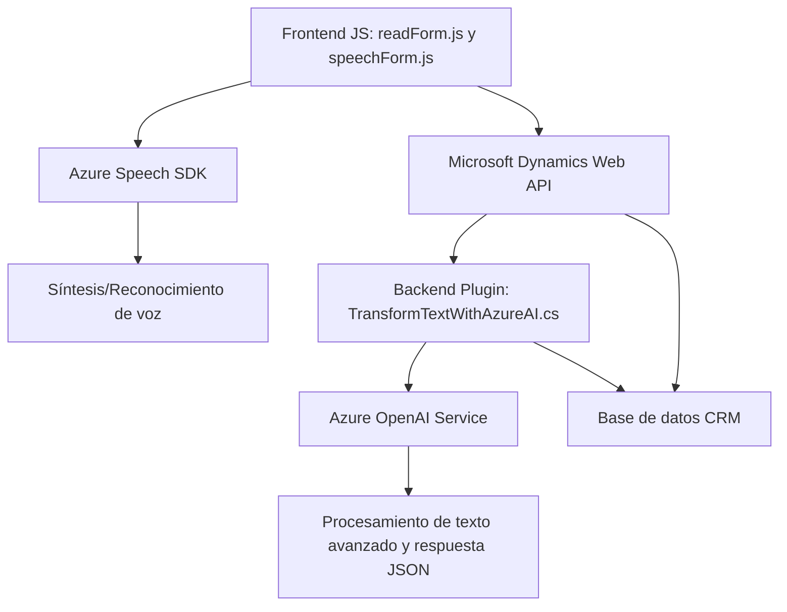

### Breve resumen técnico:
El repositorio se centra en la integración entre Microsoft Dynamics CRM y varios servicios de inteligencia artificial de Azure, como Azure Speech SDK y Azure OpenAI. Su objetivo principal es extender la funcionalidad de CRM permitiendo interacciones mediante voz (reconocimiento de comandos hablados y síntesis de voz) y procesamiento avanzado de texto con reglas específicas.

---

### Descripción de arquitectura:
1. **Tipo de solución:** Es una solución híbrida donde se incluyen:
   - Una capa **frontend** en JavaScript para manejo de interacción de usuario (voz e interpretación de datos de formularios).
   - Una capa **plugin** sobre Dynamics CRM en C#, que implementa procesamiento de texto mediante Azure OpenAI.
   - Utilización de inteligencia artificial como servicio externo (Azure Speech SDK y OpenAI).

2. **Arquitectura general:** 
   - **N capas:** El código muestra una arquitectura de tres capas - presentación (frontend en JS), lógica de negocio (plugins sobre Dynamics CRM), y servicios externos (Azure Speech SDK y OpenAI). Sigue una separación estricta de responsabilidades.
   - **Hexagonal:** Las dependencias externas se encapsulan y comunican mediante adaptadores o interfaces (como servicios de voz y AI), que minimizan el acoplamiento.

3. **Flujo arquitectónico:** 
   - El **frontend** interactúa con Dynamics CRM y los servicios de Azure para procesar voz y texto.
   - Los plugins procesan texto mediante métodos personalizados, invocando servicios externos como OpenAI para enriquecer la funcionalidad.

---

### Tecnologías usadas:
1. **Frontend (JavaScript):**
   - **Azure Speech SDK:** Para síntesis y reconocimiento de voz.
   - **Microsoft Dynamics CRM Web API:** Manipulación y actualización de datos en formularios de Dynamics CRM.
   - **Patrones:** Modularidad, cargadores dinámicos.

2. **Backend (C#):**
   - **Azure OpenAI**: Para el procesamiento de texto avanzado y generación de datos JSON.
   - **Microsoft Dynamics CRM Plugin Model:** Extensión de lógica de negocio del CRM.
   - **Newtonsoft.Json:** Procesamiento de JSON.
   - **HttpClient**: Interacción con la API de OpenAI.

---

### Dependencias y componentes externos:
1. **Azure Speech SDK**: Para la síntesis y el reconocimiento de voz.
2. **Azure OpenAI**: Para procesamiento de texto avanzado.
3. **Microsoft Dynamics CRM Web API**: Para manipulación de datos y contexto en formularios.
4. **Newtonsoft.Json / System.Text.Json**: Para manejar respuestas JSON.
5. **HttpClient**: Para integraciones de API externas.
6. **Microsoft Dynamics CRM Plugin Framework**: Extensión del sistema backend de CRM.

---

### Diagrama Mermaid válido para GitHub:

---

### Conclusión final:
La solución implementa una arquitectura basada en capas que permite interacción con voz y procesamiento avanzado de texto para mejorar la accesibilidad y funcionalidad de Microsoft Dynamics CRM. La modularidad del código es evidente, especialmente en las funciones de frontend y backend. Además, se emplean servicios externos de Azure que integran capacidades de inteligencia artificial y síntesis de voz, destacando un diseño orientado a servicios desacoplados con sistemas externos.