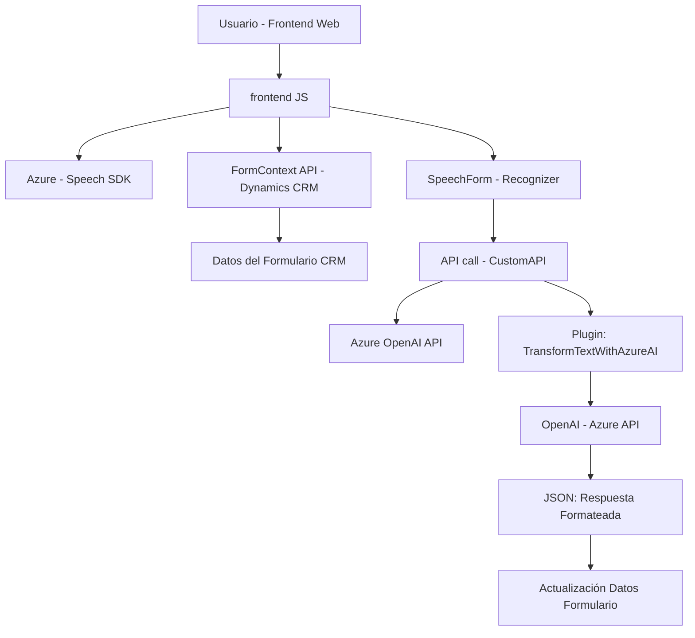

### Breve resumen técnico:
El repositorio contiene una solución que integra procesos de reconocimiento y síntesis de voz con Azure Speech SDK y el procesamiento de datos con Azure OpenAI en un entorno de Microsoft Dynamics CRM. Los archivos proporcionan la funcionalidad de interacción dinámica con formularios del CRM y análisis de texto estructurado mediante servicios externos (Azure).

---

### Descripción de arquitectura:
La solución parece seguir una arquitectura **n capas**, con separación clara entre funcionalidades según su propósito y el plano de operación:
1. **Capa de presentación (frontend):** Scripts JavaScript en la carpeta `FRONTEND/JS` interactúan directamente con los formularios del sistema para obtener datos y para capturar la interacción con el usuario mediante reconocimiento o síntesis de voz.
2. **Capa de lógica de negocio:** El plugin desarrollado en C# (`TransformTextWithAzureAI.cs`) implementa la lógica avanzada para el análisis y transformación de texto mediante Azure OpenAI, comunicándose con APIs externas y dando soporte a procesos específicos en Dynamics CRM.
3. **Capa de integración:** El uso de Azure SDKs (Speech y OpenAI) como servicios externos para reconocer voz, analizar texto y sintetizar voz posiciona estas dependencias como un layer adicional que conecta la funcionalidad interna con herramientas externas altamente especializadas.

Aunque la solución tiene dependencias de dos SDK (Speech para voz y OpenAI para procesamiento de texto), no muestra patrones típicos de arquitectura **de microservicios** directamente dentro del contexto del código proporcionado, sino más bien una integración con servicios en la nube desde el monolito.

---

### Tecnologías usadas:
1. **Microsoft Dynamics CRM Framework:**
   - Uso del interface `IPlugin` para personalizar lógicas de negocio del sistema CRM.
   - Utilización de APIs internas como `Xrm.WebApi` para manejo de datos organizacionales y llamadas a Custom APIs.
2. **Azure Speech SDK:**
   - Reconocimiento y síntesis de voz, junto con carga dinámica del SDK (patrón de dependencia condicional).
3. **Azure OpenAI API:**
   - Implementación de procesamiento avanzado de texto utilizando IA en el plugin mediante petición HTTP.
4. **Desarrollo web (frontend):**
   - Uso de `JavaScript` y `HTML` para el manejo dinámico del contenido del formulario.
5. **Serialización JSON:**
   - Uso de `System.Text.Json` y `Newtonsoft.Json` para la transformación y manejo de objetos JSON en el backend.

---

### Diagrama Mermaid:

---

### Conclusión final:
La solución consiste en un sistema híbrido que combina funcionalidades de frontend en JavaScript y lógica de backend desarrollada en C#. Su propósito es integrar reconocimiento de voz y procesamiento de texto con un sistema CRM basado en Microsoft Dynamics, usando Azure Speech SDK y Azure OpenAI API para potenciar la inteligencia del tratamiento de texto y voz. La arquitectura sigue un enfoque n capas con integración de servicios externos, logrando una solución funcional enfocada en la automatización de procesos y la mejora de la interacción del usuario mediante tecnologías avanzadas de IA.